# Wear OS Tile UI Components Catalog

This catalog provides a visual reference and code samples for various UI components supported by
Wear OS tiles using the Material 3 library.

## textButton

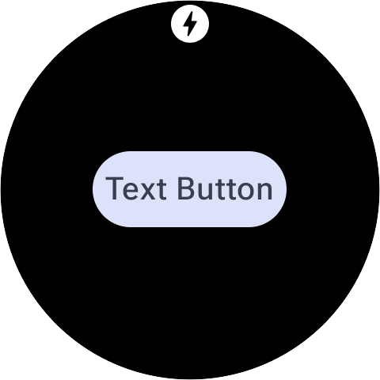

An oval-shaped button with the text "Text Button".

```kotlin
primaryLayout(
    mainSlot = {
        textButton(
            onClick = clickable(id = "text_button_click"),
            labelContent = { text("Text Button".layoutString) }
        )
    }
)
```

## iconButton

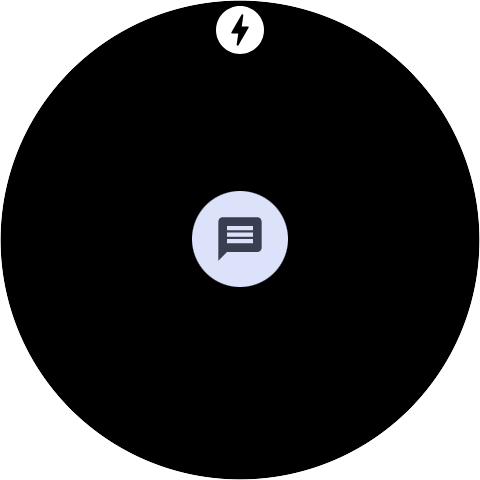

Text message icon in a light blue circle.

```kotlin
primaryLayout(
    mainSlot = {
        iconButton(
            onClick = clickable(id = "icon_button_click"),
            iconContent = {
                icon(
                    protoLayoutResourceId =
                    context.resources.getResourceName(R.drawable.ic_message_24)
                )
            }
        )
    }
)
```

## avatarButton

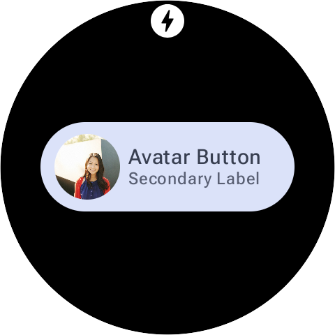

A rounded button with a circular avatar of a smiling woman on the left, and the text "Avatar Button"
and "Secondary Label" on the right.

```kotlin
primaryLayout(
    mainSlot = {
        avatarButton(
            onClick = clickable(id = "avatar_button_click"),
            avatarContent = {
                avatarImage(
                    protoLayoutResourceId = context.resources.getResourceName(R.drawable.ali),
                    contentScaleMode = CONTENT_SCALE_MODE_CROP
                )
            },
            labelContent = { text("Avatar Button".layoutString) },
            secondaryLabelContent = { text("Secondary Label".layoutString) }
        )
    }
)
```

## imageButton

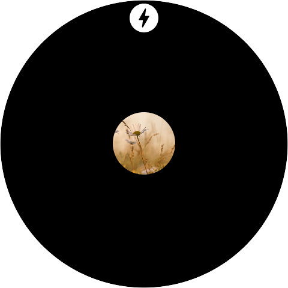

A circular image showing a white daisy in a field of tall, golden grass.

```kotlin
primaryLayout(
    mainSlot = {
        imageButton(
            onClick = clickable(id = "image_button_click"),
            backgroundContent = {
                backgroundImage(
                    protoLayoutResourceId =
                    context.resources.getResourceName(R.drawable.photo_14)
                )
            }
        )
    }
)
```

## compactButton

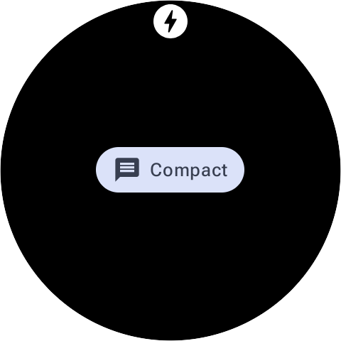

A button labeled "Compact" with a chat bubble icon.

```kotlin
primaryLayout(
    mainSlot = {
        compactButton(
            onClick = clickable(id = "compact_button_click"),
            iconContent = {
                 icon(
                    protoLayoutResourceId =
                    context.resources.getResourceName(R.drawable.ic_message_24)
                )
            },
            labelContent = { text("Compact".layoutString) }
        )
    }
)
```

## button

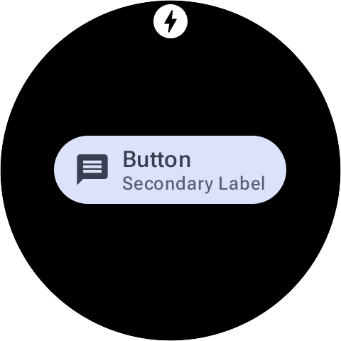

A light purple, rounded button with a speech bubble icon, "Button" as the primary label, and
"Secondary Label" below it.

```kotlin
primaryLayout(
    mainSlot = {
        button(
            onClick = clickable(id = "button_click"),
            labelContent = { text("Button".layoutString) },
            secondaryLabelContent = { text("Secondary Label".layoutString) },
            iconContent = {
                icon(
                    protoLayoutResourceId =
                    context.resources.getResourceName(R.drawable.ic_message_24)
                )
            }
        )
    }
)
```

## iconEdgeButton

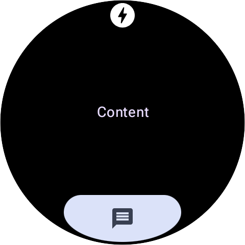

The word "Content" is centered on the screen. Below it, at the bottom, is a large, light purple-gray
pill-shaped button with a message icon.

```kotlin
primaryLayout(
    mainSlot = { text("Content".layoutString) },
    bottomSlot = {
        iconEdgeButton(
            onClick = clickable(id = "icon_edge_button_click"),
            iconContent = {
                icon(
                    protoLayoutResourceId =
                    context.resources.getResourceName(R.drawable.ic_message_24)
                )
            }
        )
    }
)
```

## textEdgeButton

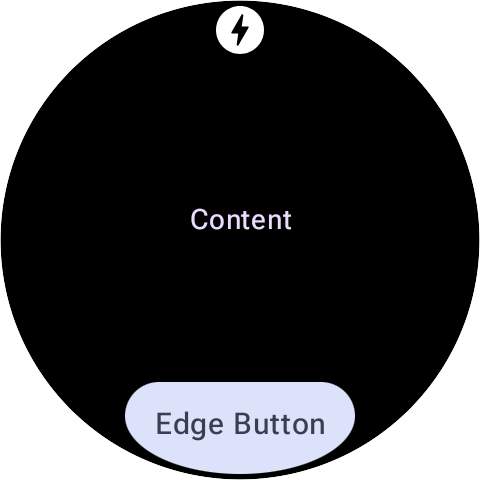

A rounded button labeled "Edge Button" at the bottom of the screen, with the word "Content" centered
above it.

```kotlin
primaryLayout(
    mainSlot = { text("Content".layoutString) },
    bottomSlot = {
        textEdgeButton(
            onClick = clickable(id = "text_edge_button_click"),
            labelContent = { text("Edge Button".layoutString) }
        )
    }
)
```

## titleCard

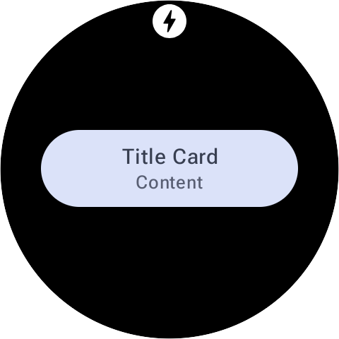

Rounded card with "Title Card" and "Content."

```kotlin
primaryLayout(
    mainSlot = {
        titleCard(
            onClick = clickable(id = "title_card_click"),
            title = { text("Title Card".layoutString) },
            content = { text("Content".layoutString) }
        )
    }
)
```

## appCard

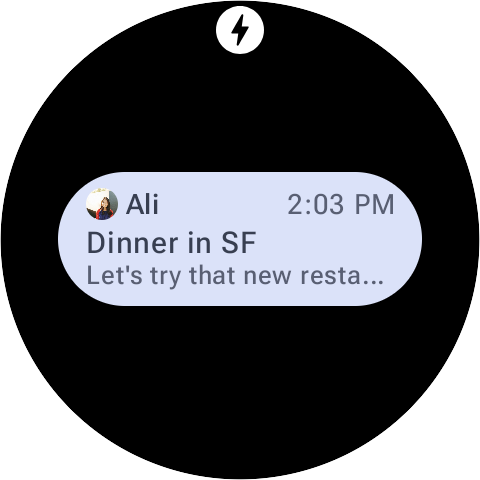

A message bubble from Ali, with her profile picture, at 2:03 PM. The message says 'Dinner in SF' and
'Let's try that new resta...' (truncated).

```kotlin
primaryLayout(
    mainSlot = {
        appCard(
            onClick = clickable(id = "app_card_click"),
            label = { text("Ali".layoutString) },
            title = { text("Dinner in SF".layoutString, maxLines = 1) },
            time = { text("2:03 PM".layoutString) },
            avatar = {
                avatarImage(
                    protoLayoutResourceId = context.resources.getResourceName(R.drawable.ali),
                    contentScaleMode = CONTENT_SCALE_MODE_CROP
                )
            },
            content = { text("Let's try that new restaurant.".layoutString) }
        )
    }
)
```

## textDataCard

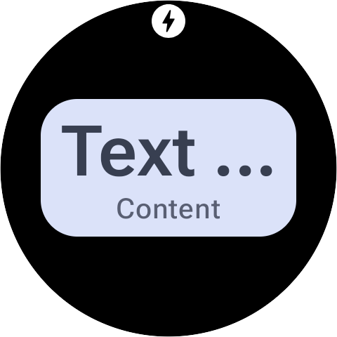

A light-colored, rounded rectangular UI component displaying "Text ..." as a title and "Content" as
a subtitle.

```kotlin
primaryLayout(
    mainSlot = {
        textDataCard(
            onClick = clickable(id = "text_data_card_click"),
            title = { text("Text Data".layoutString) },
            content = { text("Content".layoutString) }
        )
    }
)
```

## iconDataCard

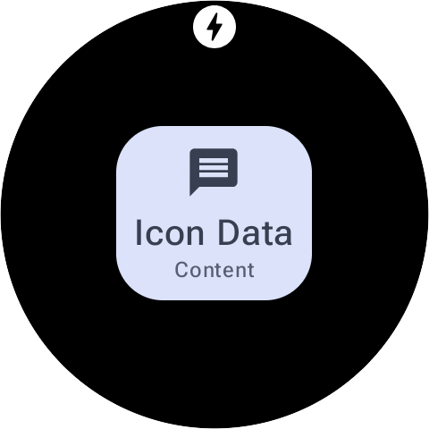

A rounded rectangular UI component with a chat bubble icon, labeled "Icon Data" with "Content" below
it.

```kotlin
primaryLayout(
    mainSlot = {
        iconDataCard(
            onClick = clickable(id = "icon_data_card_click"),
            title = { text("Icon Data".layoutString) },
            content = { text("Content".layoutString) },
            secondaryIcon = {
                icon(
                    protoLayoutResourceId =
                    context.resources.getResourceName(R.drawable.ic_message_24)
                )
            }
        )
    }
)
```

## graphicDataCard

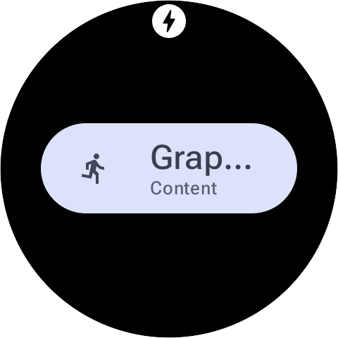

A pill-shaped button or chip with a running person icon, displaying "Graphic Data" and "Content"
below it.

```kotlin
primaryLayout(
    mainSlot = {
        graphicDataCard(
            onClick = clickable(id = "graphic_data_card_click"),
            graphic = {
                icon(
                    protoLayoutResourceId =
                    context.resources.getResourceName(R.drawable.ic_run_24)
                )
            },
            title = { text("Graphic Data".layoutString) },
            content = { text("Content".layoutString) }
        )
    }
)
```

## How this catalog was generated

This catalog is generated using a combination of a dedicated `CatalogService` and automated capture
tools.

### Involved Files

<!-- markdownlint-disable-next-line MD013 -->

- `app/src/main/java/com/example/wear/tiles/CatalogService.kt`: A `TileService` that provides the
layouts for each component. It uses a `materialScope` to select the layout based on the current
state.
<!-- markdownlint-disable-next-line MD013 -->
- `app/src/main/java/com/example/wear/tiles/CatalogReceiver.kt`: A `BroadcastReceiver` that listens
for `com.example.wear.tiles.SET_LAYOUT` intents to switch the active component.
<!-- markdownlint-disable-next-line MD013 -->
- `app/src/main/java/com/example/wear/tiles/CatalogDataStore.kt`: Uses Jetpack DataStore to persist
  the name of the currently displayed layout.

### Generation Process

1. **Trigger Switch**: Send an ADB broadcast to change the active layout:

   ```bash
   adb shell am broadcast -a com.example.wear.tiles.SET_LAYOUT \
     --es layout <COMPONENT_NAME> com.example.wear.tiles
   ```

2. **Monitor Update**: Wear OS typically enforces a delay (approx. 18 seconds) for background tile
   updates. Monitor the logs for the `tileRequest` to ensure the new layout is processed:

   ```bash
   adb logcat -s CatalogService
   ```

3. **Capture Screenshot**: Once the log confirms the request is processed, capture the screen:

   ```bash
   # Using the adb-screenshot skill tool
   scripts/adb-screenshot screenshots/components/<COMPONENT_NAME>.png
   ```

4. **Generate Description**: Use an AI-based tool to generate a concise description of the
   component, instructing it to ignore the system status bar elements:

   <!-- markdownlint-disable-next-line MD013 -->

   ```bash
   # Using the screenshot-describe skill tool with a custom prompt
   prompt="Generate concise alt text describing the UI component in the center or bottom of this screenshot. Ignore the white circle and lightning bolt icon at the top."
   scripts/screenshot-describe screenshots/components/<COMPONENT_NAME>.png "$prompt"
   ```
