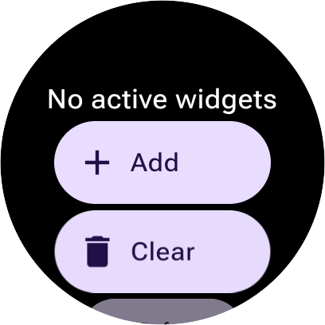
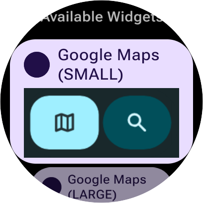
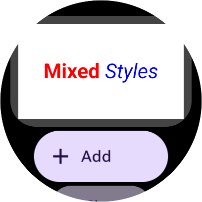
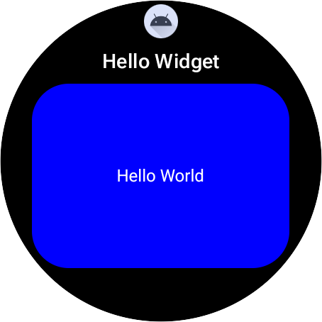

# Getting Started with Wear Widgets {#getting-started-with-wear-widgets}

**Version 1.2** Mar 24, 2026

**What are Wear Widgets?** Starting with select Wear 7 platforms, full-screen
Tiles will evolve into partial-height Widgets. Widgets are a new glanceable
surface for Wear OS, designed to complement apps and watch faces. Initially,
these widgets will be visible on a surface similar to the tile carousel,
providing users with effortless access to information and key actions.
Partial-height, vertically scrolling Widgets provide the flexibility to deploy
content in various sizes and deliver more focused value to the user.

Wear widgets leverage
[Remote Compose](https://developer.android.com/jetpack/androidx/releases/compose-remote),
which features a declarative DSL very similar to Compose that aligns them with
Modern Android Development.

**Why "Remote"?** In this context, "remote" means the UI is rendered in a
separate process—or even on a different device—than where the application code
runs. UI is defined by a "document" that is sent to a system-managed surface
(the "player") to be displayed. While the developer mental model remains
consistent, the remote architecture introduces nuances because the UI is
displayed by a separate system player. The specific nuances of this remote
model, particularly regarding how logic and interactions are handled, are
detailed in the [Remote UI Programming Model](#remote-ui-programming-model)
section.

**Choosing Your Implementation Strategy.** To ensure the best user experience
across all device generations, you must decide how your app will provide content
to the system. There are two primary approaches:

- **Recommended: Dual-Service (Tile \+ Widget):** You provide both a native Tile
  (for legacy devices) and a native Widget (for Wear OS 7+). This ensures an
  optimal, high-fidelity experience on every device.
- **Alternative: Single Service (Widget Only):** You provide only a Widget
  service. On older devices, the system "translates" your widget into a Tile.
  While simpler to implement, this may result in a less polished experience on
  legacy surfaces.

For a detailed technical breakdown of these strategies and how they affect
different Wear OS versions, see
[Implementation Strategies](#implementation-strategies).

## Prerequisites and Setup {#prerequisites-and-setup}

Before you begin, ensure your environment meets the following requirements.

### Runtime Requirements {#runtime-requirements}

This project requires `com.google.android.wearable.protolayout.renderer` version
**1.6.1.51.884843156.exp or later** on the target device.

To check what version you have installed, use the following command:

```shell
adb shell dumpsys package com.google.android.wearable.protolayout.renderer | \
  grep -m 1 versionName | \
  awk -F= '{print $2}'
```

If you don't have a compatible version installed, you must manually sideload the
appropriate renderer binary from [REDACTED].

(If you do not have access to the shared Drive, please email your Google contact
and provide the email addresses of the users who will be accessing the folder.)

To install the renderer:

1. **Download the appropriate binary**: Match the file to your system
   architecture (determined via `adb exec-out getprop ro.product.cpu.abi`) and
   build type. For physical Wear OS devices, the `armeabi-v7a` architecture is
   typically required. For emulators, use `arm64-v8a` for M-series Macs or the
   relevant `x86/x86_64` variant for other platforms. You should attempt to
   install the `releasekey` version first, and use the `testkey` variant only if
   that fails.

2. **Install via ADB**: Run the following command:

```shell
adb install -g -t -r <renderer_filename>.apk
```

1. **Restart the System UI**: Apply the update by forcing a restart of the
   service:

```shell
adb shell am force-stop com.google.android.wearable.sysui
```

### Gradle Configuration {#gradle-configuration}

Wear Widget libraries are available on **Google Maven**.

**1. Configure SDK Version**

Ensure your `compileSdk` and `targetSdk` are set to **37** or higher. Recent Jetpack alpha libraries enforce this requirement.

```kotlin
android {
    compileSdk = 37
    // ...
    defaultConfig {
        targetSdk = 37
        // ...
    }
}
```

**2. Add Dependencies**

Include the following dependencies in your app's `build.gradle.kts` file:

```kotlin
dependencies {
    // Core Wear Widget / Remote Compose libraries (ALPHA)
    implementation("androidx.compose.remote:remote-creation-compose:1.0.0-alpha08")
    implementation("androidx.compose.remote:remote-core:1.0.0-alpha08")
    implementation("androidx.glance.wear:wear:1.0.0-alpha07")
    implementation("androidx.glance.wear:wear-core:1.0.0-alpha07")
    implementation("androidx.wear.compose.remote:remote-material3:1.0.0-alpha02")

    // Tooling for previews (optional, but recommended)
    implementation("androidx.compose.remote:remote-tooling-preview:1.0.0-alpha08")
    implementation("androidx.wear.compose:compose-ui-tooling:1.5.6")
    implementation("androidx.wear.tiles:tiles-tooling-preview:1.5.0")
    debugImplementation("androidx.wear.tiles:tiles-renderer:1.5.0")
}
```

## Quick Start: Building a Hello World Widget {#quick-start-building-a-hello-world-widget}

A Wear Widget consists of a service extending `GlanceWearWidgetService` and a
widget class extending `GlanceWearWidget`. The UI is defined using
`@RemoteComposable` functions.

### Define the Service {#define-the-service}

The service is the entry point that the system binds to.

```kotlin
import android.annotation.SuppressLint
import androidx.glance.wear.GlanceWearWidget
import androidx.glance.wear.GlanceWearWidgetService

@SuppressLint("RestrictedApi")
class HelloWidgetService : GlanceWearWidgetService() {
    override val widget: GlanceWearWidget = HelloWidget()
}
```

### Define the Widget {#define-the-widget}

The widget class provides the data and layout for the widget.

```kotlin
import android.annotation.SuppressLint
import android.content.Context
import androidx.compose.ui.graphics.Color
import androidx.glance.wear.GlanceWearWidget
import androidx.glance.wear.WearWidgetData
import androidx.glance.wear.WearWidgetDocument
import androidx.glance.wear.WearWidgetParams

@SuppressLint("RestrictedApi")
class HelloWidget : GlanceWearWidget() {
    override suspend fun provideWidgetData(
        context: Context,
        params: WearWidgetParams,
    ): WearWidgetData {
        return WearWidgetDocument(backgroundColor = Color.Blue) {
            HelloWidgetContent()
        }
    }
}
```

### Define the Content {#define-the-content}

The content is built using Remote Compose components.

```kotlin
import android.annotation.SuppressLint
import androidx.compose.remote.creation.compose.layout.RemoteBox
import androidx.compose.remote.creation.compose.layout.RemoteComposable
import androidx.compose.remote.creation.compose.layout.RemoteAlignment
import androidx.compose.remote.creation.compose.layout.RemoteArrangement
import androidx.compose.remote.creation.compose.layout.RemoteText
import androidx.compose.remote.creation.compose.modifier.RemoteModifier
import androidx.compose.remote.creation.compose.modifier.fillMaxSize
import androidx.compose.remote.creation.compose.state.RemoteColor
import androidx.compose.remote.creation.compose.state.rc
import androidx.compose.runtime.Composable
import androidx.compose.ui.graphics.Color

@SuppressLint("RestrictedApi")
@RemoteComposable @Composable
fun HelloWidgetContent() {
    RemoteBox(
        modifier = RemoteModifier.fillMaxSize(),
        horizontalAlignment = RemoteAlignment.CenterHorizontally,
        verticalArrangement = RemoteArrangement.Center,
    ) {
        RemoteText(
            text = "Hello World",
            color = Color.White.rc
        )
    }
}
```

### Create the Widget Configuration XML {#create-the-widget-configuration-xml}

Create a new file `res/xml/hello_widget_info.xml` to define the widget's
properties and supported sizes. (This filename is just an example; you will
reference it in the `AndroidManifest.xml` in the next step.)

When defining your widget's metadata, follow these guidelines:

- **`label`**: A short title (1–3 words).
- **`description`**: A single-line sentence describing the widget.

```xml
<?xml version="1.0" encoding="utf-8"?>
<wearwidget-provider
    description="@string/hello_widget_description"
    icon="@mipmap/ic_launcher"
    label="@string/hello_widget_label"
    preferredType="SMALL">

    <container
        type="SMALL"
        previewImage="@drawable/tile_preview" />
    <container
        type="LARGE"
        previewImage="@drawable/tile_preview" />
</wearwidget-provider>
```

### Register in AndroidManifest.xml {#register-in-androidmanifestxml}

Register the service in your `AndroidManifest.xml` with the required intent
filters and metadata.

**Note:** You will need to provide a `@drawable/tile_preview` image resource.
For a quick start, you can create a simple vector drawable in
`res/drawable/tile_preview.xml` or temporarily reference an existing icon (e.g.,
`@mipmap/ic_launcher` if accessible as a drawable).

```xml
<service
    android:name=".HelloWidgetService"
    android:exported="true"
    android:icon="@mipmap/ic_launcher"
    android:label="@string/hello_widget_label"
    android:permission="com.google.android.wearable.permission.BIND_TILE_PROVIDER">

    <intent-filter>
        <action android:name="androidx.glance.wear.action.BIND_WIDGET_PROVIDER" />
        <!-- If you already have a Tile, omit the following line. -->
        <action android:name="androidx.wear.tiles.action.BIND_TILE_PROVIDER" />
    </intent-filter>

    <meta-data
        android:name="androidx.glance.wear.widget.provider"
        android:resource="@xml/hello_widget_info" />

    <meta-data
        android:name="androidx.wear.tiles.PREVIEW"
        android:resource="@drawable/tile_preview" />
</service>
```

### Build and Deploy {#build-and-deploy}

#### Build and Install {#build-and-install}

Build the project and install the debug APK onto your connected device or
emulator:

```bash
./gradlew :app:installDebug
```

#### Add and Preview your Widget {#add-and-preview-your-widget}

There are two primary ways to preview your widget during development.

##### Method A: Standalone Renderer (Development Tool) {#method-a-standalone-renderer-development-tool}

In production, `SMALL` and `LARGE` widgets will be visible via an OS-level
integration. Because this OS-level integration is not yet available in developer
environments, a standalone renderer app is provided as a development tool to
bridge this gap. This tool allows you to preview partial-height widgets natively
in a vertically scrolling list.

1. **Launch the Renderer:** Open the app drawer on your watch and tap **Widget
   Tray Viewer**. _(ADB shortcut:
   `adb shell monkey -p com.google.android.wearable.protolayout.renderer 1`)_
   
2. **Add a Widget:** Tap the **Add** button. You will see a list of available
   widgets, displaying the `previewImage` you defined in your XML provider file.
   Tap your widget (e.g., "Hello Widget (LARGE)") to add it to the tray.
   
3. **Refresh a Widget:** If you update your widget's internal state (for
   example, by running the `./widget-switch` script to change a layout), tap the
   **Refresh** button below the widget. This forces the renderer to fetch the
   latest UI without needing to remove and re-add the widget.
   
4. **Clear Widgets:** Tap the **Clear** button (trash icon) to remove all
   widgets from the tray.

_Note: Adding and clearing widgets in this tool is conceptually similar to using
the `adb-tile-add` and `adb-tile-remove` commands, but it operates specifically
on this standalone preview surface rather than the system Tile carousel._

##### Method B: System UI Tile Carousel (Compatibility Mode) {#method-b-system-ui-tile-carousel-compatibility-mode}

To test how your widget translates to a full-screen Tile on older Wear OS
versions, you can inject it directly into the system carousel using ADB.

**1. Add the tile:**

Replace `com.google.example.wear_widget` with your app's package name (e.g.,
`com.example.myapp`) and ensure the service path (`.HelloWidgetService`) is
correct.

```bash
adb shell am broadcast \
  -a com.google.android.wearable.app.DEBUG_SURFACE \
  --es operation add-tile \
  --ecn component com.google.example.wear_widget/.HelloWidgetService
```

**2. Show the tile:**

(Assuming this is the first tile added, it will be at index 0.)

```bash
adb shell am broadcast \
  -a com.google.android.wearable.app.DEBUG_SYSUI \
  --es operation show-tile \
  --ei index 0
```

Following these steps will add a new Hello World widget
([in compatibility mode](#current-and-future-renderers)) to your device. You can
verify it by swiping through the tile carousel.



If your widget does not appear as expected after following the steps above,
please consult the [Troubleshooting](#troubleshooting) section.

### Congratulations! What's Next? {#congratulations-whats-next}

You've successfully set up your environment, built a "Hello World" widget, and
got it running on a device. To continue your journey, we recommend the following
next steps:

- **Select Your Implementation Strategy**: Learn about the trade-offs between
  [Dual-Service and Unified Service](#implementation-strategies) architectures
  to ensure your app provides the best experience on every device generation.
- **Explore the Component Gallery**: Familiarize yourself with the building
  blocks of Wear Widgets, including layout samples for `RemoteBox`,
  `RemoteButton`, and `RemoteCanvas`, via the
  [Component Gallery](https://github.com/ithinkihaveacat/wear-os-samples/blob/wear-widgets/WearWidgetKotlin/docs/COMPONENTS.md).
  Consider that we are working on adding more components, so if you find that
  there is a Remote Material 3 component that you need please let us know.
- **Master the Core Concepts**: Deep dive into the
  [Technical Guide](#technical-guide) to understand the
  [Remote UI Programming Model](#remote-ui-programming-model) and how to handle
  interactions using [Declarative Actions](#event-handling-actions-vs-lambdas).
- **Define Your Provider Contract**: Reference the
  [Manifest and XML Reference](#manifest-and-xml-reference) to configure your
  widget's capabilities, such as supported sizes (`SMALL` and `LARGE`), and set
  up the necessary intent filters.
- **View the Renderer Roadmap**: See
  [Current and Future Renderers](#current-and-future-renderers) to learn
  how/what widgets can be previewed today and what's coming next, including
  upcoming support for the vertically scrolling carousel.

## Implementation Strategies {#implementation-strategies}

Wear OS 7 introduces support for partial-height vertical scrolling on select
devices. Because the platform supports a wide range of hardware—from legacy Wear
OS 3 devices to modern Galaxy and Pixel Watches—the system's behavior depends on
the services your app provides

### Dual-Service Implementation (Recommended) {#dual-service-implementation-recommended}

This approach involves maintaining both a native Tile and a Widget. It is the
recommended path for all apps that have an existing Tile version of the Widget
that's being added. Providing two distinct services provides the best possible
user experience across different devices.

- **Tile Service:** Extend `TileService` and declare an intent filter for
  `androidx.wear.tiles.action.BIND_TILE_PROVIDER`.
- **Widget Service:** Extend `GlanceWearWidgetService` and declare an intent
  filter for `androidx.glance.wear.action.BIND_WIDGET_PROVIDER`.
- **Logical Grouping:** Use the `group` attribute in the widget configuration to
  link the new implementation to your existing `TileService`. This allows the
  system to recognize them as a single logical component and automatically
  migrate the user's existing carousel slot to the new Widget on Wear OS 7+. For
  technical implementation details, see the
  [Manifest and XML Reference](#manifest-and-xml-reference).

**System Behavior for Dual-Service Setup:**

| OS / Device Capability                                       | Resulting Experience      |
| :----------------------------------------------------------- | :------------------------ |
| **Wear OS 3**                                                | Native **Tile** is used   |
| **Wear OS 4, 5, 6**                                          | Native **Tile** is used   |
| **Wear OS 7 (No partial-height support, e.g., Pixel Watch)** | Native **Tile** is used   |
| **Wear OS 7 (Partial-height support, e.g., Galaxy Watch)**   | Native **Widget** is used |

### Single Service Implementation (Alternative) {#single-service-implementation}

A single service handles both protocols. While faster to implement, it relies on
a compatibility mode to "translate" your widget into a Tile on older devices.

- **Widget Service:** Extend `GlanceWearWidgetService` and declare an intent
  filters for _both_ the `androidx.wear.tiles.action.BIND_TILE_PROVIDER` and
  `androidx.glance.wear.action.BIND_WIDGET_PROVIDER` protocols.

**System Behavior for Single Service Setup:**

| OS / Device Capability                    | Resulting Experience                          |
| :---------------------------------------- | :-------------------------------------------- |
| **Wear OS 3**                             | **Not supported**                             |
| **Wear OS 4, 5, 6**                       | Widget is **displayed as a full screen Tile** |
| **Wear OS 7 (No partial-height support)** | Widget is **translated to a Tile**            |
| **Wear OS 7 (Partial-height support)**    | Native **Widget** is used                     |

## Technical Guide {#technical-guide}

This section covers the architecture of building a Remote UI and how that UI
integrates with the Wear OS system.

### Remote UI Programming Model {#remote-ui-programming-model}

Wear widgets leverage Remote Compose, which features a declarative DSL that
aligns with Modern Android Development. To see these building blocks in
action—including visual samples and code for components like `RemoteBox`,
`RemoteButton`, and `RemoteCanvas`—please see the
[Component Gallery](https://github.com/ithinkihaveacat/wear-os-samples/blob/wear-widgets/WearWidgetKotlin/docs/COMPONENTS.md).

#### Event Handling: Actions vs. Lambdas {#event-handling-actions-vs-lambdas}

Because widgets run in a remote process, they cannot execute local code
(lambdas). Standard Compose syntax for event handling is replaced by
**Declarative Actions**. Instead of passing standard code lambdas to onClick
listeners, developers must provide serializable `Action` objects (such as
`ValueChange` or `PendingIntentAction`), as the logic must be packaged into the
UI 'document' before being sent to the remote process. This remote execution
model imposes several constraints:

1. **No Arbitrary Code Execution:** You cannot execute standard Kotlin code
   (e.g., `Log.d()`, `viewModel.update()`) inside the handler.
2. **Pre-calculated Logic:** Logic must be resolved at **composition time**.
   Instead of `onClick = { if (isActive) doThis() else doThat() }`, you must
   conditionally pass the correct action object:
   `onClick = if (isActive) ActionA else ActionB`.
3. **State vs. Computation:** Actions like `ValueChange` do not increment values
   dynamically; they send instructions to the remote host to update a state key
   to a new value (often a pre-calculated expression).
4. **Serialization of Side Effects:** Complex objects like `PendingIntent` are
   "captured" and serialized during composition, not at the moment of the click.

**Implementation Guide:**

1. **Use Declarative Actions:** Replace `{ ... }` with `Action` objects such as
   `ValueChange`.

2. **Handle Vararg Syntax:** When passing a single action to the named `onClick`
   parameter, wrap it in `arrayOf()`. Alternatively, pass it as the first
   positional argument to avoid the wrapper.

```kotlin
// 1. Wrapped in array (Named argument)
RemoteButton(
    modifier = RemoteModifier.padding(10.dp),
    onClick = arrayOf(ValueChange(count, count + 1))
) { ... }

// 2. Positional argument (No array needed)
RemoteButton(
    ValueChange(count, count + 1),
    modifier = RemoteModifier.padding(10.dp)
) { ... }
```

_Note: When passing an existing array of actions to the named parameter, pass it
directly without the spread operator (`_`).\*

#### Theming {#theming}

The visual presentation of Wear Widgets is governed by the `RemoteMaterialTheme`
composable. This system allows widgets to adapt to the user's system theme
(Dynamic Theming) or enforce a specific brand identity (Custom Theming).

#### Dynamic Theming (System Theme) {#dynamic-theming-system-theme}

By default (when no `colorScheme` is provided), `RemoteMaterialTheme` uses the
system's dynamic color scheme. This is the **recommended approach** to ensure
widgets feel like a native part of the user's experience.

#### Custom Theming (Fixed / Brand Colors) {#custom-theming-fixed-brand-colors}

If a specific brand identity is required, you can provide a custom
`RemoteColorScheme`.

```kotlin
val myCustomScheme = object : RemoteColorScheme() {
    override val primary: RemoteColor
        @RemoteComposable @Composable get() = Color(0xFF00008B).rc // Custom Blue
    // ... override other roles as needed
}

@RemoteComposable
@Composable
fun MyCustomWidget() {
    RemoteMaterialTheme(colorScheme = myCustomScheme) {
        // Content here uses the custom colors
    }
}
```

#### Semantic Typography {#semantic-typography}

Semantic typography styles are provided by `RemoteMaterialTheme.typography`. For
examples of how to apply standard Wear OS text styles (e.g., `titleLarge`,
`bodyMedium`), see the `SemanticStyleSample` or `TextSample1` in the Component
Gallery.

#### Type Conversions {#type-conversions}

When working with Remote UI components, you frequently need to convert standard
Kotlin/Compose types (like `Color`, `Dp`, `String`, `Int`) into their `Remote`
equivalents. Consider using extension functions from
[the `androidx.compose.remote.creation.compose.state` package](https://android.googlesource.com/platform/frameworks/support/+/refs/heads/androidx-main/compose/remote/remote-creation-compose/src/main/java/androidx/compose/remote/creation/compose/state/)

to reduce boilerplate:

- **Colors:** `Color.Red.rc` (instead of `RemoteColor(Color.Red)`)
- **Dimensions:** `10.rdp` or `10.dp.asRdp()` (instead of `RemoteDp(...)`)
- **Strings:** `"Hello".rs` (instead of `RemoteString("Hello")`)
- **Booleans:** `true.rb` (instead of `RemoteBoolean(true)`)
- **Integers:** `1.ri` (instead of `RemoteInt(1)`)
- **Floats:** `1f.rf` (instead of `RemoteFloat(1f)`)

#### Understanding Remote Dimensions (`RemoteDp`) {#understanding-remote-dimensions-remotedp}

Remote Compose introduces `RemoteDp` to distinguish between **immediate** and
**deferred** layout resolution. Developers should specify `RemoteDp` where
possible to ensure dimensions are resolved correctly by the renderer at display
time, maintaining visual consistency.

- **`Dp` (Immediate):** Standard Compose `Dp` values are resolved to raw pixels
  _immediately_ during composition, using the app's current `LocalDensity`. This
  "bakes" the specific pixel value into the document sent to the System UI.
- **`RemoteDp` (Deferred):** `RemoteDp` values (e.g., `10.rdp`) are serialized
  as **data instructions** (e.g., "apply 10dp spacing" or even more dynamic "if
  width > 200 apply 15dp else 10dp"). The final pixel value is calculated by the
  _System UI_ (the renderer) at display time, ensuring it matches the exact
  density of the viewing surface.

**Why is `RemoteDp` needed?** It separates the _definition_ of the UI from its
_execution_. This allows the System UI to cache, resize, or adapt the layout
(e.g., for different screen densities) without constantly waking up your
application to recalculate pixels.

**Best Practice:** Use `.rdp` (e.g., `10.rdp`) for structural layout modifiers
like `.size()`, `.width()`, and `.border()` whenever possible.

_Note: As mentioned in "Known Issues", some modifiers like `.padding()`
currently only accept `Dp`. These will resolve to absolute pixel units at
composition time._

#### Component Gallery {#component-gallery}

For a visual overview of the available components and layout samples (including
`RemoteBox`, `RemoteButton`, `RemoteCanvas`, and more) along with their
corresponding code, please refer to the
**[Widget Component Gallery](../screenshots/SAMPLES.md)**.

#### Triggering Updates from App Code {#triggering-updates-from-app-code}

While client-side state changes can update the widget instantly, you often need
to push new data from your application (e.g., from a background worker or after
a network response). You can request a widget refresh using the `triggerUpdate`
method on your `GlanceWearWidget` implementation.

```kotlin
// In an Activity, Worker, or other app component
val componentName = ComponentName(context, HelloWidgetService::class.java)
HelloWidget().triggerUpdate(context, componentName)
```

Calling this will cause the system to re-bind to your `GlanceWearWidgetService`
and call `provideWidgetData` again to fetch the latest UI.

### Manifest and XML Reference {#manifest-and-xml-reference}

Once you have selected an implementation strategy (Dual- or Single-Service), you
must establish the contract between your app and the Wear OS surface. This
contract establishes your widget's supported configurations and tells the system
how to connect to your service.

#### Defining Capabilities (XML) {#defining-capabilities-xml}

The `wearwidget-provider` XML file serves as the source of truth for your
widget's supported configurations. It tells the system which container types
your implementation can handle.

**File:** `res/xml/hello_widget_info.xml`

```xml
<wearwidget-provider
    label="@string/widget_label"
    description="@string/widget_desc"
    group="com.example.foo"
    icon="@drawable/ic_widget"
    preferredType="SMALL">

    <!-- Defines supported sizes. -->
    <container type="SMALL" />
    <container type="LARGE" />

</wearwidget-provider>
```

- **`container`:** Declares a supported size. `SMALL` (around 70dp height) and
  `LARGE` (around 100dp height) are the standard Widget sizes.
- **`group`**: (Optional) For **Dual-Service** setups, in most cases you should
  set this to the fully qualified name of your `TileService`.
  - On devices running Wear OS 7+, this value links the `TileService` and
    `WidgetService` together as a single logical component—important to preserve
    a user's carousel state if they upgrade their OS or device.
  - If `group` is not provided, it defaults to the fully-qualified service name
    of the Widget service, since it won't be part of a group.
  - Avoid specifying the `group` multiple times, or changing its name, etc. This
    feature is designed to create a one-time link from a single `WidgetService`
    to a legacy `TileService`. Using it in other ways (for example to create
    long alias "chains") has undefined behavior.
  - `group` is ignored on Wear OS 6 and below.
- **`preferredType`:** Specifies the default size used if the system/user
  doesn't request a specific one (e.g., when falling back from a legacy
  surface).

#### The Binding Contract (Manifest) {#the-binding-contract-manifest}

The system binds to your widget through a Service. To support the transition
from legacy Tiles to modern Widgets, this service supports two different
protocols.

**File:** `AndroidManifest.xml`

```xml
<service
    android:name=".HelloWidgetService"
    android:permission="com.google.android.wearable.permission.BIND_TILE_PROVIDER"
    ...>

    <intent-filter>
        <!-- Protocol 1: The Modern Widget Interface -->
        <action android:name="androidx.glance.wear.action.BIND_WIDGET_PROVIDER" />
        <!-- Protocol 2: The Legacy Tile Interface (Backward Compatibility) -->
        <action android:name="androidx.wear.tiles.action.BIND_TILE_PROVIDER" />
    </intent-filter>

    <meta-data
        android:name="androidx.glance.wear.widget.provider"
        android:resource="@xml/hello_widget_info" />
    ...
</service>
```

- **Permissions:** The `BIND_TILE_PROVIDER` permission is required for security;
  only authorized system services holding this permission can bind to your
  provider.
- **Intent Filters:** Only include
  `androidx.wear.tiles.action.BIND_TILE_PROVIDER` if you _don't_ have a Tile.

### Current and Future Renderers {#current-and-future-renderers}

The Wear Widget ecosystem is currently in an Early Access phase. The renderer
available today allows you to render Widgets in a fullscreen tile compatibility
mode. A standalone renderer is also available as a development tool to preview
partial height widgets (`SMALL` and `LARGE`). This provides a preview of your
widgets as they will appear natively on devices running Wear OS 7+.

While you define capabilities for both `SMALL` and `LARGE`, the actual runtime
behavior depends on the device's capabilities and the stage of the rollout.

#### Developer Support Roadmap {#developer-support-roadmap}

| Platform                                       | Jan 2026                                                                            | Feb 2026                                                                                                          |
| :--------------------------------------------- | :---------------------------------------------------------------------------------- | :---------------------------------------------------------------------------------------------------------------- |
| **Emulators, Pixel Watch 2+, Galaxy Watch 5+** | **Tile Mode Only:** Renders as a Tile in compatibility mode (Icon \+ Label header). | **Widget Support:** A standalone renderer app is available, which enables testing of `SMALL` and `LARGE` Widgets. |

## Developer Workflow and Tools {#developer-workflow-and-tools}

### Previews {#previews}

To enable Compose Previews, use `RemotePreview` combined with
`@WearPreviewDevices`. Note that preview dependencies must be included in the
`implementation` configuration (not just `debugImplementation`) if your preview
code resides in the `main` source set.

```kotlin
@WearPreviewDevices
@Composable
fun HelloWidgetPreview() {
    val content: @Composable @RemoteComposable () -> Unit = { HelloWidgetContent() }
    RemotePreview(RcPlatformProfiles.WEAR_WIDGETS, content)
}
```

**Note:** Android Studio currently has known issues when rendering multiple
previews in a single file. While you may use these previews where functional, we
recommend verifying your widget's appearance and behavior on an emulator or
physical device for the most reliable experience and highest fidelity.

## Troubleshooting {#troubleshooting}

### Build Failure: minSdk version conflict {#build-failure-minsdk-version-conflict}

**Symptom:** The build fails with a manifest merger error indicating that a
library's `minSdk` (e.g., 29) is higher than the application's `minSdk` (e.g.,
26).

**Resolution:**

1. **Option 1 (Recommended):** Increase the app's `minSdk` to 29 or higher in
   `build.gradle.kts`.
2. **Option 2:** If you can't increase your app's `minSdk`, use the
   `overrideLibrary` marker to suppress the error at build time, _and_
   conditionally enable widgets using resource qualifier checks at runtime.

To use `overrideLibrary`, add the `tools` namespace and the attribute to your
`AndroidManifest.xml`. You may need to list multiple libraries if the conflict
propagates.

```xml
<manifest xmlns:android="http://schemas.android.com/apk/res/android"
    xmlns:tools="http://schemas.android.com/tools">

    <uses-sdk tools:overrideLibrary="androidx.wear.compose.remote.material3, androidx.glance.wear.core, androidx.glance.wear"/>
    ...
</manifest>
```

For more information, see
[Override uses-sdk for imported libraries](https://developer.android.com/build/manage-manifests#override_uses-sdk_for_imported_libraries).

To conditionally enable or disable the widget service at runtime, define a
boolean resource that defaults to `false` in the main `values` folder. You then
override this value to `true` in a version-specific folder (e.g., `values-v33`).
By referencing this boolean in the `android:enabled` attribute, the system
automatically disables the service on older devices, preventing them from
loading incompatible classes.

**Disable by default (`res/values/bools.xml`)**

```xml
<resources>
    <bool name="is_widgets_enabled">false</bool>
</resources>
```

**Enable for specific API level (`res/values-v33/bools.xml`)** _Replace `v33`
with your target API level._

```xml
<resources>
    <bool name="is_widgets_enabled">true</bool>
</resources>
```

**Apply to Manifest (`AndroidManifest.xml`)**

```xml
<service
    android:name=".WidgetCatalogService"
    android:enabled="@bool/is_widgets_enabled"
    ...>
</service>
```

For more details on how this attribute controls the instantiation of components,
see the documentation for
[android:enabled](https://developer.android.com/guide/topics/manifest/application-element#enabled).

### Runtime Issue: Blank Screen {#runtime-issue-blank-screen}

**Symptom:** The widget adds successfully but displays as a completely black
screen or fails to appear.

#### Cause 1: Package name not allowlisted {#cause-1-package-name-not-allowlisted}

The renderer enforces a package name allowlist. If your package is not on the
list, the UI will not render.

**Diagnosis:** Check the device logs for the error "Provider is not allowlisted
for Remote Compose".

**Resolution:** Provide to Google the package name you are using if it is
different from the one used from the main app (which has been allowlisted for
you).

**Log Extract:**

```text
01-08 06:21:02.164 10032 28409 28409 E ProtoTilesTileRendererImpl: Error getting tile response com.example.android.wearable.composestarter/.HelloWidgetService
01-08 06:21:02.164 10032 28409 28409 E ProtoTilesTileRendererImpl: java.util.concurrent.ExecutionException: awk: Provider is not allowlisted for Remote Compose. com.example.android.wearable.composestarter/.HelloWidgetService
01-08 06:21:02.164 10032 28409 28409 E ProtoTilesTileRendererImpl: Caused by: awk: Provider is not allowlisted for Remote Compose. com.example.android.wearable.composestarter/.HelloWidgetService
```

#### Cause 2: DataStore Conflict {#cause-2-datastore-conflict}

This is often caused by a DataStore conflict during rapid re-deployment; see
[Multiple DataStores Active Crash](#multiple-datastores-active-crash-datastore-conflict)
for more details.

## Feature Comparison: Tiles vs. Widgets {#feature-comparison-tiles-vs-widgets}

While Wear Widgets share some conceptual similarities with Tiles (both render on
a remote system surface), their capabilities and development models differ
significantly.

| Feature                   | Wear OS Tiles (ProtoLayout)                                                                                                                                                                                               | Wear Widgets (Remote Compose)                                                                                                                                                                                 |
| :------------------------ | :------------------------------------------------------------------------------------------------------------------------------------------------------------------------------------------------------------------------ | :------------------------------------------------------------------------------------------------------------------------------------------------------------------------------------------------------------ |
| **Development Model**     | Imperative Builder Pattern (`LayoutElementBuilders`)                                                                                                                                                                      | Declarative, Compose-like DSL (`RemoteText`, `RemoteColumn`)                                                                                                                                                  |
| **State & Interactivity** | Server-side driven. Interactions (`LoadAction`) trigger a full service callback to refresh the UI.                                                                                                                        | Client-side driven. Declarative state (`rememberRemoteIntValue`) and actions (`ValueChange`) allow instant UI updates without app round-trips.                                                                |
| **Dynamic Data**          | **Streaming Support.** Can bind directly to platform data (e.g., Heart Rate) via `DynamicBuilders` for real-time updates.                                                                                                 | **State Driven.** Updates are driven by state changes or app pushes. No direct platform sensor binding yet.                                                                                                   |
| **Update Scheduling**     | **Timeline Support.** Can pre-schedule future layouts (e.g., calendar events) to update automatically without waking the app.                                                                                             | **Real-time.** Updates are immediate and must be initiated by app code. No native mechanism to pre-cache future layouts.                                                                                      |
| **Curved Layouts**        | **Native Support.** dedicated `Arc` containers and components (`ArcText`) for circular screens.                                                                                                                           | **Not Required.** Widgets use standard linear layouts (`RemoteRow`) and do not aim to hug the screen curvature.                                                                                               |
| **Transitions**           | **Granular Control.** Explicit APIs for `EnterTransition` and `ExitTransition`.                                                                                                                                           | **Animation Specs.** Uses generic `animationSpec` on modifiers. Granular transition control is less relevant in this model.                                                                                   |
| **Advanced Animations**   | **Lottie Supported.** Natively supports Lottie via `AndroidLottieResourceByResId`.                                                                                                                                        | **Support Planned.**                                                                                                                                                                                          |
| **Tween Animations**      | **Developer or Renderer Controlled.** Developers can provide an `AnimationSpec` but can also arrange for interpolation to be handled automatically by the renderer when dynamic values change.                            | **Developer Controlled.** Explicit `animationSpec` allows precise control over duration, delay, and easing curves (e.g. `tween`, `spring`).                                                                   |
| **Text Formatting**       | **Spannable Support.** Supports mixed styles (bold, italic) and inline images via `Spannable`.                                                                                                                            | **Uniform Style.** `RemoteText` accepts a single string. Styles apply to the whole text. No `AnnotatedString` support.                                                                                        |
| **Lifecycle**             | **Manual.** Developers must override `onTileAddEvent` for initialization (e.g., state setup, starting components) and `onTileRemoveEvent` for cleanup. Rendering requires handling separate layout and resource requests. | **Automated.** `GlanceWearWidgetService` manages session lifecycles internally. Optional `onAdded`/`onRemoved` hooks are available. Content and resources are resolved in a unified `provideWidgetData` pass. |
| **Resource Management**   | **Versioned.** Uses `onTileResourcesRequest` to serve and version resources (images) independently of the layout in the older versions of Tiles library.                                                                  | **Direct Binding.** Resources are handled transparently within the composition, similar to standard Compose (e.g., `R.drawable`).                                                                             |
| **Telemetry / Tracking**  | **Built-in Callback.** `onRecentInteractionEventsAsync` provides a stream of recent click events.                                                                                                                         | **Support Planned.**                                                                                                                                                                                          |

## Migrating from Legacy Tiles {#migrating-from-legacy-tiles}

Adding modern Widget support to an existing `TileService` is a seamless process
for your users.

To maintain the highest quality experience, you should follow the **Dual-Service
Implementation** strategy described in
[Detailed Implementation Strategies](#implementation-strategies).

### Migration Checklist {#migration-checklist}

1. **Implement the widget**: Create a new `GlanceWearWidgetService` for your
   Widget.
   1. Declare an intent filter for
      `androidx.glance.wear.action.BIND_WIDGET_PROVIDER` only.
2. **Link services**: In your new widget's XML (see
   [Manifest and XML Reference](#manifest-and-xml-reference)), use the `group`
   attribute to point to your existing `TileService` class name .
3. **Keep both enabled**: Ensure both the original Tile and the new Widget
   services are enabled in your Manifest.

This setup allows the system to use the high-fidelity Widget on Wear 7+ surfaces
while falling back to your existing Tile on older platforms.

**Deprecating a tile? Reuse the service name.** If you decide to _replace_ an
existing Tile with a Widget (following the
[single service approach](#single-service-implementation)), be sure to reuse the
original Service name to ensure the Widget takes the place of the Tile in the
carousel. Wear OS 6 ignores the `group` attribute and identifies carousel
entries strictly by Service name. Reusing the name prevents your Tile from
disappearing from the carousel upon update.

## Known Issues and Limitations {#known-issues-and-limitations}

This section tracks technical hurdles and API limitations in the current
ALPHA/SNAPSHOT versions.

### [FIXED] Multiple APIs Are Restricted {#multiple-apis-are-restricted}

b/474354218

Many APIs (e.g., `.rs`, `.rf`, `RemotePainter`) are currently marked as
`@RestrictTo(LIBRARY_GROUP)`.

**Workaround:** Suppress the lint error by adding
`@file:SuppressLint("RestrictedApi")` at the top of each file (or
`@SuppressLint("RestrictedApi")` immediately above a function). This enables
access to the full API surface.

### `RemoteModifier.clip()` Requires Explicit Size for Relative Shapes {#remotemodifierclip-requires-explicit-size-for-relative-shapes}

b/477860914

**Symptom:** Shapes that rely on the component's layout size, such as
`RoundedCornerShape(percent = 50)` or `CircleShape`, may compile but fail to
clip correctly at runtime (often rendering as a square).

**Workaround:** Provide an explicit `DpSize` to the modifier. You should
typically ensure this matches the component's size to avoid clipping artifacts.

```kotlin
// Fails (renders as square)
RemoteModifier.clip(RoundedCornerShape(percent = 50))

// Works
RemoteModifier
    .size(60.rdp)
    .clip(CircleShape, DpSize(60.dp, 60.dp))
```

### [FIXED] `RemoteModifier.padding` Lacks `RemoteDp` Support {#remotemodifierpadding-lacks-remotedp-support}

> [!NOTE]
> Fixed in `1.0.0-alpha07`. `RemoteModifier.padding` now supports `RemoteDp` (e.g., `10.rdp`).

b/470964182

The `RemoteModifier.padding` extension functions previously did not accept
`RemoteDp` values. They only supported `RemoteFloat` or standard Compose `Dp`.
Now they fully support `RemoteDp`.

```kotlin
RemoteModifier.padding(10.rdp)
```

### [FIXED] `RemoteArrangement.Center` Can Only Be Used in Vertical Contexts {#remotearrangementcenter-can-only-be-used-in-vertical-contexts}

> [!NOTE]
> Fixed in `1.0.0-alpha07`. `RemoteArrangement.Center` now implements `HorizontalOrVertical` and can be used in both `RemoteRow` and `RemoteColumn`.

b/471153933


**Symptom:** A type mismatch error occurs when using `RemoteArrangement.Center`
in a `RemoteRow`.

**Workaround:** Use `RemoteArrangement.CenterHorizontally` for horizontal
centering.

```kotlin
// For horizontal centering (RemoteRow):
RemoteRow(horizontalArrangement = RemoteArrangement.CenterHorizontally) { ... }

// For vertical centering (RemoteColumn):
RemoteColumn(verticalArrangement = RemoteArrangement.Center) { ... }
```

**Context:** In standard Compose, `Arrangement.Center` implements
`HorizontalOrVertical`, allowing it to be used in both `Row` and `Column`. In
Remote Compose, `RemoteArrangement.Center` is typed as
`RemoteArrangement.Vertical` only. This limitation excludes `SpaceBetween`,
`SpaceEvenly`, and `SpaceAround`, which implement the `HorizontalOrVertical`
interface.

### [FIXED] `RemoteBox` Differs from Compose `Box` {#remotebox-differs-from-compose-box}

> [!NOTE]
> Fixed in `1.0.0-alpha07`. `RemoteBox` now uses `contentAlignment: RemoteAlignment` just like standard Compose `Box`.

> [!WARNING]
> This is a breaking change. Existing usages of `RemoteBox` with `horizontalAlignment` and `verticalArrangement` must be updated to use `contentAlignment`.

**Migration:**
Replace:
```kotlin
RemoteBox(
    horizontalAlignment = RemoteAlignment.CenterHorizontally,
    verticalArrangement = RemoteArrangement.Center,
)
```
With:
```kotlin
RemoteBox(
    contentAlignment = RemoteAlignment.Center,
)
```

For other alignments, use `RemoteAlignment` constants (e.g., `RemoteAlignment.BottomEnd`).

b/471212869

The `RemoteBox` API previously differed from standard Compose `Box` in two ways:

1. **Parameter count:** `Box` uses a single `contentAlignment` parameter;
   `RemoteBox` used separate `horizontalAlignment` and `verticalArrangement`
   parameters.
2. **Vertical axis type:** `RemoteBox` used `RemoteArrangement.Vertical` for
   vertical positioning. This was inconsistent with `RemoteRow`, which uses
   `RemoteAlignment.Vertical` for vertical positioning.

### `RemoteModifier.graphicsLayer` Rendering Failures {#remotemodifiergraphicslayer-rendering-failures}

[b/473745800](http://b/473745800)

**Symptom:** The tile fails to load and does not appear (or shows a black
screen) when using `RemoteModifier.graphicsLayer`. Logs indicate a "Failed to
render and attach the tile" error.

**Affected Properties:**

- `renderEffect` (used for Blur)
- `alpha` (used for Opacity)

**Workarounds:**

- **For Opacity:** Apply alpha directly to the color instead of using the
  modifier (e.g., `Color.Red.copy(alpha = 0.5f).rc`).
- **For Blur:** There is no known workaround at this time. Avoid using blur
  effects until supported by the library/renderer.

### [FIXED] Multiple DataStores Active Crash (DataStore Conflict) {#multiple-datastores-active-crash-datastore-conflict}

b/474292165

**Symptom:** The widget is blank, and the app process crashes with
`IllegalStateException: There are multiple DataStores active`. Various
conditions and states can cause this, including:

1. **Rapid Re-addition:** When using automated scripts to rapidly remove and
   re-add widgets (or switch widget types) via ADB.
2. **Configuration Changes:** When changing system display settings (such as
   "Display size" or "Font size").

In both cases, the widget may appear blank, show a loading state, or fail to
render.

**Workaround:** Force-stop the application process to release the file lock. For
automated testing, ensure a force-stop is included between the remove and add
commands:

```shell
# Remove the tile "$COMPONENT"
adb shell am broadcast \
  -a com.google.android.wearable.app.DEBUG_SURFACE \
  --es operation remove-tile \
  --ecn component "$COMPONENT"

# Force stop the application
adb shell am force-stop com.google.example.wear_widget

# Add the tile "$COMPONENT"
adb shell am broadcast \
  -a com.google.android.wearable.app.DEBUG_SURFACE \
  --es operation add-tile \
  --ecn component "$COMPONENT"
```

The system typically restarts the service automatically after configuration
changes, but a manual force-stop may be necessary if it remains blank.

### Android Studio Preview Limitations {#android-studio-preview-limitations}

b/431932822

**Symptom:** When using `@Preview` or `@WearPreviewDevices` with
`RemotePreview`, Android Studio may not display all defined previews correctly,
especially when multiple previews are in the same file. You might encounter
issues such as only the first preview rendering, or previews not updating as
expected.

**Workaround:** Deploying the widget to an emulator or physical device provides
the most reliable method to confirm the appearance and behavior.

### `drawArc` `useCenter` Parameter Requires Static Boolean {#drawarc-usecenter-parameter-requires-static-boolean}

**Symptom:** You encounter a compilation error when trying to pass a
`RemoteBoolean` to the `useCenter` parameter of `drawArc` in `RemoteCanvas` or
`RemoteDrawScope`.

**Workaround:** Use `drawConditionally` to toggle between two separate `drawArc`
calls with static `Boolean` values:

```kotlin
drawConditionally(isToggled) {
    drawArc(..., useCenter = true)
}
drawConditionally(isToggled.not()) {
    drawArc(..., useCenter = false)
}
```

### [FIXED] `RemoteMaterialTheme.typography` Does Not Expose Semantic Styles {#typography-does-not-expose-semantic-styles}

b/478828032

**Symptom:** `RemoteMaterialTheme.colorScheme` exposes the system's dynamic
colors (e.g., `RemoteMaterialTheme.colorScheme.primary`), however the
`RemoteMaterialTheme.typography` object does not expose its styles publicly. The
underlying `typography` property has `internal` visibility, so accessing
semantic text styles directly (e.g.,
`RemoteMaterialTheme.typography.titleLarge`) causes a compilation error. This
means you cannot use "semantic" text styles to `MaterialRemoteText` components.

#### Temporary Workaround: Use Local Typography Definitions {#temporary-workaround-use-local-typography-definitions}

Until semantic styles are officially exposed via
`RemoteMaterialTheme.typography`, you can unblock development by defining a
local helper object that exposes the standard
`androidx.wear.compose.material3.Typography` styles. This enables you to apply
semantic styling immediately and continue building your widget; these local
definitions should be similar enough to the system styles for testing and
previewing purposes on most devices.

Note that this is not a long-term solution. Local styles are not guaranteed to
match the system's typography, particularly across different OEMs or future OS
versions. Furthermore, using locally-defined styles in a "remote" environment
creates an architectural conflict, as it bypasses the core intent of the remote
UI model where the host (renderer) should be responsible for resolving
theme-specific constants. If you adopt this workaround, you'll need to migrate
to the official API prior to production deployment.

**1. Create a typography helper object:**

Add the following Kotlin object to your project. It creates a local instance of
the standard (non-remote) `Typography` class and exposes its styles for use in
your widget.

```kotlin
package com.google.example.wear_widget // Adjust to your package

import androidx.wear.compose.material3.Typography
import androidx.wear.compose.foundation.CurvedTextStyle
import androidx.compose.ui.text.TextStyle

/**
 * A local copy of the semantic typography styles from androidx.wear.compose.material3.Typography.
 *
 * This provides temporary access to standard text styles while the
 * RemoteMaterialTheme.typography API (b/478828032) has internal visibility.
 */
object MyWidgetTypography {
    private val defaultTypography = Typography()

    // Expose all standard text styles
    val displayLarge: TextStyle get() = defaultTypography.displayLarge
    val displayMedium: TextStyle get() = defaultTypography.displayMedium
    val displaySmall: TextStyle get() = defaultTypography.displaySmall
    val titleLarge: TextStyle get() = defaultTypography.titleLarge
    val titleMedium: TextStyle get() = defaultTypography.titleMedium
    val titleSmall: TextStyle get() = defaultTypography.titleSmall
    val labelLarge: TextStyle get() = defaultTypography.labelLarge
    val labelMedium: TextStyle get() = defaultTypography.labelMedium
    val labelSmall: TextStyle get() = defaultTypography.labelSmall
    val bodyLarge: TextStyle get() = defaultTypography.bodyLarge
    val bodyMedium: TextStyle get() = defaultTypography.bodyMedium
    val bodySmall: TextStyle get() = defaultTypography.bodySmall
    val bodyExtraSmall: TextStyle get() = defaultTypography.bodyExtraSmall
    val numeralExtraLarge: TextStyle get() = defaultTypography.numeralExtraLarge
    val numeralLarge: TextStyle get() = defaultTypography.numeralLarge
    val numeralMedium: TextStyle get() = defaultTypography.numeralMedium
    val numeralSmall: TextStyle get() = defaultTypography.numeralSmall
    val numeralExtraSmall: TextStyle get() = defaultTypography.numeralExtraSmall
}
```

**2. Apply the styles in your widget:**

Reference this object to apply semantic styling.

```kotlin
import com.google.example.wear_widget.MyWidgetTypography // Adjust import

//...

MaterialRemoteText(
    text = "12:34".rs,
    style = MyWidgetTypography.numeralLarge
)

MaterialRemoteText(
    text = "Session complete".rs,
    style = MyWidgetTypography.titleMedium
)
```

### `RemoteImage` Visibility and Duplication Issues {#remoteimage-visibility-and-duplication-issues}

b/483291287

**Symptom:** When multiple `RemoteImage` composables are used in the same
layout, the first image may fail to render (appearing invisible). In some
configurations, multiple images may incorrectly display the content of the
_last_ added image.

**Workaround:** Use `RemoteCanvas` combined with `drawScaledBitmap` instead of
the `RemoteImage` component.

```kotlin
// Define a helper composable
@RemoteComposable
@Composable
fun CanvasRemoteImage(
    bitmap: ImageBitmap,
    contentDescription: String,
    modifier: RemoteModifier = RemoteModifier,
    contentScale: ContentScale = ContentScale.Fit
) {
    val remoteBitmap = bitmap.rb
    RemoteCanvas(modifier = modifier) {
        drawScaledBitmap(
            image = remoteBitmap,
            dstSize = RemoteSize(remote.component.width, remote.component.height),
            scaleType = contentScale,
            contentDescription = contentDescription,
        )
    }
}

// Usage
CanvasRemoteImage(
    bitmap = ImageBitmap.imageResource(id = R.drawable.my_image),
    contentDescription = "My Image",
    modifier = RemoteModifier.size(35.rdp)
)
```

### [FIXED] Crash when using `drawScaledBitmap` with Resource Bitmaps {#crash-when-using-drawscaledbitmap-with-resource-bitmaps}

b/479893918

**Symptom:** The application crashes with
`java.lang.IllegalStateException: Bitmap width is not available in the remote document`
when calling `drawScaledBitmap` with a resource-backed `RemoteBitmap`.

**Workaround:** You must explicitly provide the `srcSize` argument. The default
value for `srcSize` attempts to read the bitmap's dimensions, which causes the
crash because `RemoteBitmap` instances created from resources do not hold
dimension data locally.

You can retrieve the dimensions using standard Android APIs (like
`BitmapFactory`) and pass them as a `RemoteSize`.

```kotlin
val resources = LocalContext.current.resources
val bitmap = BitmapFactory.decodeResource(resources, R.drawable.my_image)

drawScaledBitmap(
    image = ImageBitmap.imageResource(id = R.drawable.my_image).rb,
    // Explicitly provide srcSize to avoid the crash
    srcSize = RemoteSize(bitmap.width.toFloat().rf, bitmap.height.toFloat().rf),
    dstSize = ...
)
```

### RemoteImage failures when using large or unscaled bitmaps {#remoteimage-failures-when-using-large-or-unscaled-bitmaps}

b/488353353

**Symptom:** When using `RemoteImage` with large or unscaled bitmaps, the entire
widget or tile may fail to render, resulting in an **empty display**.

The system logs typically contain a generic `ExecutionException: Timed out` from
`ProtoTilesTileRendererImpl`. Deep analysis of the logs may reveal a low-level
`!!! FAILED BINDER TRANSACTION !!!` or a `TransactionTooLargeException`, but
these are often masked by the subsequent timeout.

**Workaround:** Manually scale bitmaps to the exact required display size before
converting them to `ImageBitmap` and passing them to `RemoteImage`.

For example, if displaying a 48dp avatar:

```kotlin
val originalBitmap = BitmapFactory.decodeResource(context.resources, R.drawable.large_image)
val density = context.resources.displayMetrics.density
val sizePx = (48 * density).toInt()

// Scale the bitmap before conversion
val scaledBitmap = Bitmap.createScaledBitmap(originalBitmap, sizePx, sizePx, true)
val imageBitmap = scaledBitmap.asImageBitmap()

RemoteImage(
    bitmap = imageBitmap,
    contentDescription = "Scaled Image".rs,
    modifier = RemoteModifier.size(48.rdp)
)
```

**Note:** Avoid passing unscaled `ImageBitmap` objects directly from resources,
as their decoded size (even after internal PNG compression) can easily exceed
the IPC payload limit.

### "Full Bleed" Backgrounds Limited to Solid Colors {#full-bleed-backgrounds-limited-to-solid-colors}

b/480859310

**Symptom:** When attempting to use complex background treatments—such as
images, gradients, or custom drawing—for the entire widget document, the
treatment appears inset with a visible border from the container's background
color. True "full bleed" rendering (where the background treatment extends to
the very edges of the rounded widget container) is currently only possible with
solid colors via `WearWidgetDocument(backgroundColor = ...)`.

**Workaround:** There is no known workaround to achieve a true full-bleed effect
with images or gradients at this time. To maintain visual consistency, ensure
your content or inner backgrounds complement the document's `backgroundColor`.

### Dynamic Theme Colors for Document Backgrounds Require Manual Binding {#dynamic-theme-colors-for-document-backgrounds-require-manual-binding}

**Symptom:** You cannot set the `background` of a `WearWidgetDocument` to a
dynamic theme color using `RemoteColorScheme` properties (e.g.,
`colorScheme.surfaceContainerLow`). Attempting to do so results in a compiler
error:
`@Composable invocations can only happen from the context of a @Composable function`.

**Workaround:** Create a local `ColorScheme` to retrieve the static fallback
value, then manually construct a named `RemoteColor` using
`RemoteColor.createNamedRemoteColor(...)`. Pass this manually constructed
dynamic color to the document background. Ensure you initialize the
`RemoteMaterialTheme` using a `RemoteColorScheme` seeded with the same local
`ColorScheme` so your foreground components and document background stay in
sync.

```kotlin
override suspend fun provideWidgetData(
    context: Context,
    params: WearWidgetParams,
): WearWidgetData {
    // 1. Instantiate the standard local Material3 ColorScheme
    val localColorScheme = ColorScheme()

    // 2. Create the Remote version to pass into the Theme
    val remoteColorScheme = RemoteColorScheme(localColorScheme)

    // 3. Manually bind the dynamic system color using the canonical WearM3 name
    val dynamicBg = RemoteColor.createNamedRemoteColor(
        "WearM3.primaryContainer",
        localColorScheme.primaryContainer
    )

    return WearWidgetDocument(
        // 4. Set the dynamic background
        background = WearWidgetBrush.color(dynamicBg)
    ) {
        // 5. Apply the synced color scheme to foreground elements
        RemoteMaterialTheme(colorScheme = remoteColorScheme) {
            MyWidgetContent()
        }
    }
}
```

### `RemoteModifier.background(RemoteColor)` Ignores Clipping {#remotemodifierbackgroundremotecolor-ignores-clipping}

b/495827025

**Symptom:** When applying a dynamic `RemoteColor` (e.g., from
`RemoteMaterialTheme.colorScheme`) using the `background()` modifier, any
preceding `clip()` modifiers are ignored. The component will render as an
unclipped rectangle or square.

**Workaround:** To draw a shaped background with a dynamic theme color, use a
`RemoteCanvas` and explicitly draw the shape (e.g., `drawCircle` or
`drawRoundRect`) with a `RemotePaint` object instead of using the `background`
modifier.

```kotlin
val iconBgColor = RemoteMaterialTheme.colorScheme.primary

// Fails (ignores CircleShape clip, renders as square)
RemoteBox(
    modifier = RemoteModifier
        .size(32.rdp)
        .clip(CircleShape, DpSize(32.dp, 32.dp))
        .background(iconBgColor),
) {
    // ...
}

// Works: Explicit Canvas drawing
RemoteBox(modifier = RemoteModifier.size(32.rdp)) {
    RemoteCanvas(modifier = RemoteModifier.fillMaxSize()) {
        val w = remote.component.width
        val h = remote.component.height
        drawCircle(
            paint = RemotePaint().apply {
                color = iconBgColor
                style = PaintingStyle.Fill
            },
            center = RemoteOffset(w / 2f.rf, h / 2f.rf),
            radius = w / 2f.rf
        )
    }
}
```

## Updates {#updates}

### Wear Widgets EAP 1.3 [PENDING] — 14 Apr 2026 {#wear-widgets-eap-13}

#### Features {#features-13}

- **SDK 37 Baseline:** The build environment has been upgraded to **SDK 37**. Recent Jetpack alpha libraries now require `compileSdk 37`.
- **Dependencies Updated:** Updated `androidx.compose.remote` to `1.0.0-alpha08` and `androidx.glance.wear` to `1.0.0-alpha07`.

#### Known Issues {#known-issues-13}

- **[FIXED]** `RemoteComposeCreationComposeFlags.isRemoteApplierEnabled` has been removed as the remote applier is now fully integrated.

#### Migration Instructions {#migration-instructions-13}

- **Upgrade to SDK 37:** Ensure your `compileSdk` and `targetSdk` are set to `37`.
- **Padding API Updates:** `RemoteModifier.padding` now strictly requires `RemoteDp`.
  Replace: `.padding(10.dp)` with `.padding(10.rdp)`.
- **Clip API Updates:** `RemoteModifier.clip` now expects `RemoteShape` (e.g., `RemoteCircleShape`) and no longer accepts explicit dimensions.
  Replace: `.clip(CircleShape, DpSize(60.dp, 60.dp))` with `.clip(RemoteCircleShape)`.
- **Theme Color Scheme Updates:** `RemoteColorScheme` is now final. Use the `copy()` method to override roles.
  Replace: `object : RemoteColorScheme() { ... }` with `RemoteColorScheme().copy(...)`.

### Wear Widgets EAP 1.2 — 24 Mar 2026 {#wear-widgets-eap-12-24-mar-2026}

#### Features {#features}

- **Semantic Text Styles are available.** See
  [Semantic Typography](#semantic-typography).
- **Standalone Renderer Updates.** A few user-facing features have been added to
  make it more usable. See
  [Add and Preview your Widget](#add-and-preview-your-widget).
- **Dependencies Updated:** The
  [samples](https://github.com/ithinkihaveacat/wear-os-samples/tree/wear-widgets/WearWidgetKotlin)
  have been updated to target the latest available library versions (including
  SNAPSHOTs where necessary) to demonstrate the newest features and fixes. See
  [Migration Instructions](#migration-instructions) for details on updating your
  project.

#### Known Issues {#known-issues}

- **\[ADDED\]**
  [RemoteImage failures when using large or unscaled bitmaps](#remoteimage-failures-when-using-large-or-unscaled-bitmaps):
  Using `RemoteImage` with large or unscaled bitmaps can cause the widget to
  fail to render and display an empty screen. A workaround is to manually scale
  bitmaps to the exact required display size before use.
- **\[ADDED\]**
  ["Full Bleed" Backgrounds Limited to Solid Colors](#full-bleed-backgrounds-limited-to-solid-colors):
  Complex backgrounds like images or gradients appear inset with a visible
  border rather than true "full bleed". Currently, full bleed rendering is only
  possible with solid colors and there is no known workaround.
- **\[ADDED\]**
  [Dynamic Theme Colors for Document Backgrounds Require Manual Binding](#dynamic-theme-colors-for-document-backgrounds-require-manual-binding):
  Setting a document background to a dynamic theme color using
  `RemoteColorScheme` causes a compiler error. A workaround is to manually
  construct a named `RemoteColor` using a local `ColorScheme` fallback.
- **\[ADDED\]**
  [RemoteModifier.background(RemoteColor) Ignores Clipping](#remotemodifierbackgroundremotecolor-ignores-clipping):
  Applying a dynamic `RemoteColor` with the `background()` modifier ignores any
  preceding `clip()` modifiers. To create a shaped background, use
  `RemoteCanvas` to explicitly draw the shape instead.
- **\[FIXED\]** [Multiple APIs Are Restricted](#multiple-apis-are-restricted):
  The issue where many APIs (like `.rs`, `.rf`, `RemotePainter`) were marked as
  restricted and required suppressing lint errors with
  `@SuppressLint("RestrictedApi")` has been fixed.
- **\[FIXED\]**
  [RemoteMaterialTheme.typography Does Not Expose Semantic Styles](#typography-does-not-expose-semantic-styles):
  The issue where semantic text styles (e.g., `titleLarge`) were internal and
  required a local `MyWidgetTypography` helper object to access has been fixed.

#### Migration Instructions {#migration-instructions}

- **Update Library Versions:** Update your `libs.versions.toml` or
  `build.gradle` to use `androidx.compose.remote` libraries at
  **`1.0.0-alpha06`** and `androidx.glance.wear` libraries at
  **`1.0.0-alpha05`**. For SNAPSHOT dependencies, update the Maven repository
  URL to use a **Build ID** of **`14978996`**.
- **Package Name Changes:** Several classes have moved to new packages. Most
  notably, `WearWidgetParams` has moved to
  `androidx.glance.wear.core.WearWidgetParams`, and `RemoteImage` is now located
  at `androidx.compose.remote.creation.compose.layout.RemoteImage`.
- **Semantic Text Styles:** Semantic text styles (e.g., `titleLarge`,
  `bodyMedium`) are now natively available through
  `RemoteMaterialTheme.typography`. You can apply them directly to your text
  components and remove any temporary local workarounds (like
  `MyWidgetTypography`). See [Semantic Typography](#semantic-typography).
- **Drawing API Updates:** `RemotePaint` properties now utilize Compose-native
  graphics classes rather than standard Android `Paint` equivalents. When
  drawing, you must now use `PaintingStyle.Stroke` (instead of
  `Paint.Style.STROKE`) and `StrokeCap.Round` (instead of `Paint.Cap.ROUND`).
  Additionally, properties like `strokeWidth` must now be explicitly converted
  to remote floats using `.rf`.

### Wear Widgets EAP 1.1 — 9 Feb 2026 {#wear-widgets-eap-11-9-feb-2026}

#### Features {#features-1-1}

- **Standalone Renderer:** A standalone renderer has been added to the updated
  `com.google.android.wearable.protolayout.renderer` package. (Find it under
  "Widget Tray Viewer" in the launcher). This allows you to preview multiple
  widgets in SMALL and LARGE sizes in a vertically scrolling carousel.
- **Dependencies Updated:** The samples have been updated to target the latest
  available library versions (including SNAPSHOTs where necessary) to
  demonstrate the newest features and fixes. See
  [Migration Instructions](#migration-instructions) for details on updating your
  project.
- **Expanded Component Samples:** Added new samples including
  `FullBleedImageButtonSample`, `RotatedTextSample`, `AnchoredTextSample`, and
  `BitmapCanvasSample` to demonstrate advanced rendering capabilities.
- **Theming Support:** Introduced `CustomThemeSample` and updated existing
  samples to fully utilize `RemoteMaterialTheme`, allowing for both
  system-driven dynamic theming and custom brand overrides.
- **Improved Developer Tools:** The `widget-switch` script has been rewritten to
  be faster and more reliable. It now waits for a "State saved" log confirmation
  instead of force-stopping the app, preserving the process state. A
  `component-switch` script has also been added to switch between the components
  of `ComponentCatalog`.
- **Semantic Typography Helper:** Added `MyWidgetTypography` to provide access
  to standard Wear OS text styles (e.g., `titleLarge`, `bodyMedium`) while they
  remain internal in the library.
- **Documentation:** Added a new guide detailing the differences between Compose
  and Remote Compose: [Compose Differences](COMPOSE-DIFFERENCES.md).

#### Known Issues {#known-issues-1-1}

- [ADDED]
  [Dynamic Theme Colors for Document Backgrounds Require Manual Binding](#dynamic-theme-colors-for-document-backgrounds-require-manual-binding):
  Using dynamic theme colors (like `primaryContainer`) for the document
  background directly from `RemoteColorScheme` results in a compiler error. A
  manual binding workaround is provided.
- [ADDED]
  [RemoteMaterialTheme.typography Does Not Expose Semantic Styles](#typography-does-not-expose-semantic-styles):
  Semantic text styles (e.g., `titleLarge`) are currently internal and cannot be
  accessed directly. A workaround using a local `MyWidgetTypography` object is
  provided.
- [ADDED]
  [RemoteImage Visibility and Duplication Issues](#remoteimage-visibility-and-duplication-issues):
  Multiple `RemoteImage` instances may fail to render correctly. A workaround
  using `RemoteCanvas` is provided.
- [FIXED]
  [Multiple DataStores Active Crash](#multiple-datastores-active-crash-datastore-conflict):
  The `IllegalStateException: There are multiple DataStores active` crash has
  been fixed in the library. The underlying conflict that occurred during rapid
  re-deployments or configuration changes is resolved.
- [FIXED]
  [`drawScaledBitmap` Crash](#crash-when-using-drawscaledbitmap-with-resource-bitmaps):
  The crash when using `drawScaledBitmap` with resource-backed bitmaps has been
  fixed. You can now use it without explicitly providing the `srcSize` argument
  (see `BitmapCanvasSample`).

#### Migration Instructions {#migration-instructions-1-1}

- **Update Library Versions:** Update your `libs.versions.toml` or
  `build.gradle` to use `androidx.compose.remote:remote-core:1.0.0-alpha03` and
  `androidx.glance.wear:wear:1.0.0-alpha02`. For SNAPSHOT dependencies, use a
  **Build ID** of 14765146.
- **Disable Remote Applier:** You **must** set
  `RemoteComposeCreationComposeFlags.isRemoteApplierEnabled = false` as early as
  possible in your application's lifecycle (e.g., in `Application.onCreate()`).
  - **Implementation Example:** The sample app achieves this by defining a
    custom `WearWidgetApplication` class and registering it in the
    `AndroidManifest.xml`.
  - See
    [WearWidgetApplication.kt](../app/src/main/java/com/google/example/wear_widget/WearWidgetApplication.kt)
    for the code.
  - This requirement is temporary and is expected to be removed in a future
    alpha release.
- **Mandatory Click Actions:** `RemoteButton` and `clickable` modifiers now
  require a valid `Action` to be passed to the `onClick` parameter. Empty arrays
  (`arrayOf()`) are no longer sufficient. See
  [WidgetCatalog.kt](../app/src/main/java/com/google/example/wear_widget/WidgetCatalog.kt)
  for examples.

## Feedback {#feedback}

As this project is currently in an **Early Access Program (EAP)** phase, your
participation and feedback are critical to shaping the future of Wear Widgets.
Please keep in mind that this is a technical preview of non-public code; as
such, you will likely encounter bugs and limitations as we continue to refine
the product. We deeply appreciate your collaboration and are committed to
providing help and support as you integrate Wear Widgets into your app.

We value your input in any form, though we are especially eager to hear your
perspective on the following categories to help us improve the developer
experience:

- **Bugs & Technical Hurdles:** Reports of crashes, rendering failures, or
  unexpected behavior on specific devices or emulators.
- **API & DSL Usability:** Feedback on the Remote Compose DSL, including any
  inconsistencies, "awkward" syntax, or missing features that would simplify
  your workflow.
- **Points of Confusion:** Sections of this guide or the underlying programming
  model (e.g., Actions vs. Lambdas) that require better documentation or clearer
  examples.
- **Developer Experience:** Challenges related to testing, such as limitations
  with Android Studio Previews or the manual sideloading process for the
  renderer.
- **Productionizing & Deployment:** Issues related to logging, telemetry, and
  the overall reliability of the widget lifecycle in a "real-world" app
  environment.

To provide feedback or request support, please reach out to your primary Google
contact or use the designated Buganizer components for your project.
