# Widget Samples

## BoxSample1

"Wear Widget" title in white at the top on a black background. A dark gray
rectangle occupies the center, containing the white text "Box Sample 1".

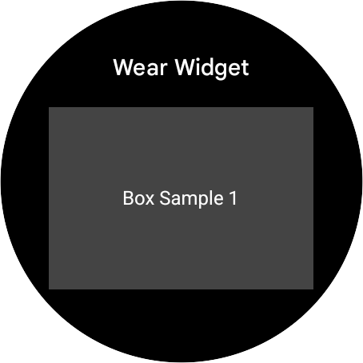

```kotlin
/**
 * UI on a black background. At the top, "Wear Widget" is centered in white. Below it, a large dark
 * grey rectangular box is centered horizontally with significant side margins, containing the white
 * text "Box Sample 1" in its center.
 */
@RemoteComposable
@Composable
fun BoxSample1() {
    // Simple Box with background color and centered text
    RemoteBox(
        modifier = RemoteModifier.fillMaxSize().background(Color.DarkGray),
        horizontalAlignment = RemoteAlignment.CenterHorizontally,
        verticalArrangement = RemoteArrangement.Center,
    ) {
        RemoteText(text = "Box Sample 1", color = RemoteColor(Color.White))
    }
}
```

## BoxSample2

"Wear Widget" header at the top on a black background. A central rectangle with
a thin red border contains the white text "Box Sample 2 (Border & Padding)". The
layout shows padding between the text and the red border, all horizontally
centered.

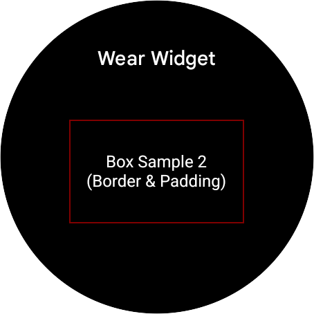

```kotlin
/**
 * "Wear Widget" header at the top on a black background. A central rectangle with a thin red border
 * contains the white text "Box Sample 2 (Border & Padding)". The layout shows padding between the
 * text and the red border, all horizontally centered.
 */
@RemoteComposable
@Composable
fun BoxSample2() {
    // Box with padding and border
    RemoteBox(
        modifier =
            RemoteModifier.fillMaxSize()
                .padding(20.dp)
                .border(width = 2.dp.asRdp(), color = Color.Red),
        horizontalAlignment = RemoteAlignment.CenterHorizontally,
        verticalArrangement = RemoteArrangement.Center,
    ) {
        RemoteText(
            text = "Box Sample 2\n(Border & Padding)",
            color = RemoteColor(Color.White),
            textAlign = TextAlign.Center,
        )
    }
}
```

## BoxSample3

Black background with white text "Wear Widget" at the top. Below, a solid blue
rectangular box contains yellow text in its bottom-right corner: "Box Sample 3
(Bottom End)".

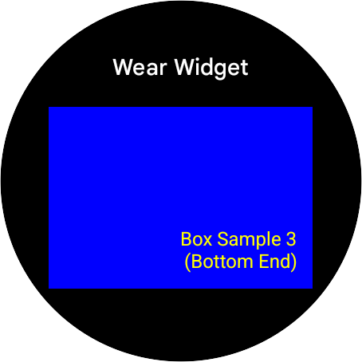

```kotlin
/**
 * Black background with white text "Wear Widget" at the top. Below, a solid blue rectangular box
 * contains yellow text in its bottom-right corner: "Box Sample 3 (Bottom End)".
 */
@RemoteComposable
@Composable
fun BoxSample3() {
    // Box with different alignment (BottomEnd)
    RemoteBox(
        modifier = RemoteModifier.fillMaxSize().background(Color.Blue),
        horizontalAlignment = RemoteAlignment.End,
        verticalArrangement = RemoteArrangement.Bottom,
    ) {
        RemoteText(
            modifier = RemoteModifier.padding(10.dp),
            text = "Box Sample 3\n(Bottom End)",
            color = RemoteColor(Color.Yellow),
            textAlign = TextAlign.End,
        )
    }
}
```

## TextSample1

UI screen with "Wear Widget" header on a black background. A central green
rectangle contains bold white "TextSample1", truncated light-grey text "This is
a long text that should wrap to multiple li...", and small cyan italicized
"Version 1.0" at the bottom.

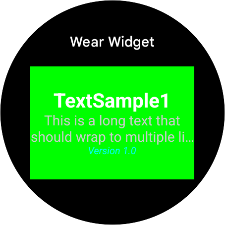

```kotlin
/**
 * UI screen with "Wear Widget" header on a black background. A central green rectangle contains
 * bold white "TextSample1", truncated light-grey text "This is a long text that should wrap to
 * multiple li...", and small cyan italicized "Version 1.0" at the bottom.
 */
@RemoteComposable
@Composable
fun TextSample1() {
    RemoteBox(
        modifier = RemoteModifier.fillMaxSize().background(Color(0xFF006400)),
        horizontalAlignment = RemoteAlignment.CenterHorizontally,
        verticalArrangement = RemoteArrangement.Center,
    ) {
        RemoteColumn(
            horizontalAlignment = RemoteAlignment.CenterHorizontally,
            verticalArrangement = RemoteArrangement.Center,
        ) {
            RemoteText(
                text = "TextSample1",
                color = RemoteColor(Color.White),
                fontSize = 20.sp,
                fontWeight = FontWeight.Bold,
            )
            RemoteText(
                text =
                    "This is a long text that should wrap to multiple lines to demonstrate the multi-line capability.",
                color = RemoteColor(Color.LightGray),
                fontSize = 14.sp,
                maxLines = 2,
                overflow = androidx.compose.ui.text.style.TextOverflow.Ellipsis,
                textAlign = androidx.compose.ui.text.style.TextAlign.Center,
            )
            RemoteText(
                text = "Version 1.0",
                color = RemoteColor(Color.Cyan),
                fontSize = 10.sp,
                fontStyle = FontStyle.Italic,
            )
        }
    }
}
```

## TextSample1WithMargin

Black background with white "Wear Widget" header. A central dark green rectangle
contains white text: "TextSampl" wrapped to "e1" on the second line. Below,
smaller text "This is a long" is partially clipped by the rectangle's bottom
edge.

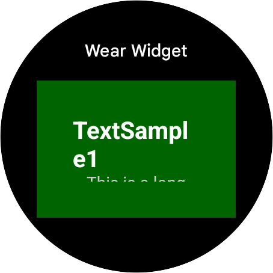

```kotlin
/**
 * Black background with white "Wear Widget" header. A central dark green rectangle contains white
 * text: "TextSampl" wrapped to "e1" on the second line. Below, smaller text "This is a long" is
 * partially clipped by the rectangle's bottom edge.
 */
@RemoteComposable
@Composable
fun TextSample1WithMargin() {
    RemoteBox(
        modifier = RemoteModifier.fillMaxSize().background(Color(0xFF006400)).padding(30.dp),
        horizontalAlignment = RemoteAlignment.CenterHorizontally,
        verticalArrangement = RemoteArrangement.Center,
    ) {
        RemoteColumn(
            horizontalAlignment = RemoteAlignment.CenterHorizontally,
            verticalArrangement = RemoteArrangement.Center,
        ) {
            RemoteText(
                text = "TextSample1",
                color = RemoteColor(Color.White),
                fontSize = 20.sp,
                fontWeight = FontWeight.Bold,
            )
            RemoteText(
                text =
                    "This is a long text that should wrap to multiple lines to demonstrate the multi-line capability.",
                color = RemoteColor(Color.LightGray),
                fontSize = 14.sp,
                maxLines = 2,
                overflow = androidx.compose.ui.text.style.TextOverflow.Ellipsis,
                textAlign = androidx.compose.ui.text.style.TextAlign.Center,
            )
            RemoteText(
                text = "Version 1.0",
                color = RemoteColor(Color.Cyan),
                fontSize = 10.sp,
                fontStyle = FontStyle.Italic,
            )
        }
    }
}
```

## RowSample1

"Wear Widget" header in white text centered at the top. Below, three horizontal
rectangles: red with white "Red", green with black "Green", and blue with white
"Blue". All elements centered on a black background with large margins.

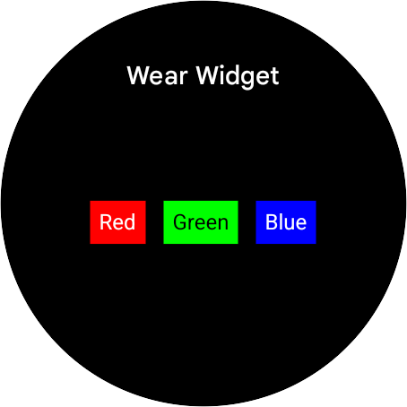

```kotlin
/**
 * "Wear Widget" header in white text centered at the top. Below, three horizontal rectangles: red
 * with white "Red", green with black "Green", and blue with white "Blue". All elements centered on
 * a black background with large margins.
 */
@RemoteComposable
@Composable
fun RowSample1() {
    RemoteBox(
        modifier = RemoteModifier.fillMaxSize().background(Color.Black),
        horizontalAlignment = RemoteAlignment.CenterHorizontally,
        verticalArrangement = RemoteArrangement.Center,
    ) {
        RemoteRow(
            modifier = RemoteModifier.fillMaxSize(),
            horizontalArrangement = RemoteArrangement.CenterHorizontally,
            verticalAlignment = RemoteAlignment.CenterVertically,
        ) {
            RemoteBox(modifier = RemoteModifier.padding(5.dp).background(Color.Red)) {
                RemoteText(
                    "Red",
                    color = RemoteColor(Color.White),
                    modifier = RemoteModifier.padding(5.dp),
                )
            }
            RemoteBox(modifier = RemoteModifier.padding(5.dp).background(Color.Green)) {
                RemoteText(
                    "Green",
                    color = RemoteColor(Color.Black),
                    modifier = RemoteModifier.padding(5.dp),
                )
            }
            RemoteBox(modifier = RemoteModifier.padding(5.dp).background(Color.Blue)) {
                RemoteText(
                    "Blue",
                    color = RemoteColor(Color.White),
                    modifier = RemoteModifier.padding(5.dp),
                )
            }
        }
    }
}
```

## RowSample2

White title "Wear Widget" centered at the top on a black background. Below, a
gray rectangle contains three horizontal labels: "Item 1" in white, "Item 2" in
yellow, and "Item 3" in light gray, centered with wide margins.

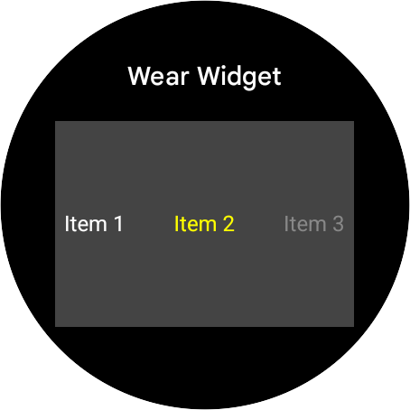

```kotlin
/**
 * White title "Wear Widget" centered at the top on a black background. Below, a gray rectangle
 * contains three horizontal labels: "Item 1" in white, "Item 2" in yellow, and "Item 3" in light
 * gray, centered with wide margins.
 *
 * WORKAROUND: Replaced RemoteCollapsibleRow with RemoteRow due to an "Invalid enum value:
 * Orientation" error when rendering the RemoteCollapsibleRow. It seems the RemoteCollapsibleRow's
 * orientation parameter was not being correctly handled by the renderer.
 */
@RemoteComposable
@Composable
fun RowSample2() {
    // WORKAROUND: Replaced RemoteCollapsibleRow with RemoteRow due to an "Invalid enum value:
    // Orientation"
    // error when rendering the RemoteCollapsibleRow. It seems the RemoteCollapsibleRow's
    // orientation parameter was not being correctly handled by the renderer.
    RemoteBox(
        modifier = RemoteModifier.fillMaxSize().background(Color.DarkGray),
        horizontalAlignment = RemoteAlignment.CenterHorizontally,
        verticalArrangement = RemoteArrangement.Center,
    ) {
        RemoteRow(
            modifier = RemoteModifier.fillMaxSize().padding(5.dp),
            horizontalArrangement = RemoteArrangement.SpaceBetween,
            verticalAlignment = RemoteAlignment.CenterVertically,
        ) {
            RemoteText("Item 1", color = RemoteColor(Color.White))
            RemoteText("Item 2", color = RemoteColor(Color.Yellow))
            RemoteText("Item 3", color = RemoteColor(Color.Gray))
        }
    }
}
```

## ButtonSample1

White text "Wear Widget" is at the top of a black background. A light lavender
rounded button is centered below, containing dark purple text "Simple Button."
The layout is minimalist with wide margins and a centered composition.

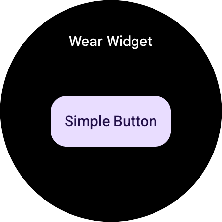

```kotlin
/**
 * White text "Wear Widget" is at the top of a black background. A light lavender rounded button is
 * centered below, containing dark purple text "Simple Button." The layout is minimalist with wide
 * margins and a centered composition.
 */
@RemoteComposable
@Composable
fun ButtonSample1() {
    RemoteBox(
        modifier = RemoteModifier.fillMaxSize(),
        horizontalAlignment = RemoteAlignment.CenterHorizontally,
        verticalArrangement = RemoteArrangement.Center,
    ) {
        RemoteButton(
            modifier = RemoteModifier.buttonSizeModifier(),
        ) {
            MaterialRemoteText("Simple Button".rs)
        }
    }
}
```

## ButtonSample2

A UI titled "Wear Widget" in white on a black background. Centered is a light
purple rounded button featuring a dark purple Android tag icon and the two-line
text "Button with Icon" in dark purple.

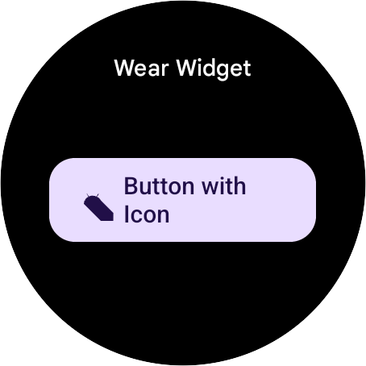

```kotlin
/**
 * A UI titled "Wear Widget" in white on a black background. Centered is a light purple rounded
 * button featuring a dark purple Android tag icon and the two-line text "Button with Icon" in dark
 * purple.
 */
@RemoteComposable
@Composable
fun ButtonSample2() {
    RemoteBox(
        modifier = RemoteModifier.fillMaxSize(),
        horizontalAlignment = RemoteAlignment.CenterHorizontally,
        verticalArrangement = RemoteArrangement.Center,
    ) {
        RemoteButton(
            modifier = RemoteModifier.buttonSizeModifier(),
            icon = {
                RemoteIcon(
                    imageVector = ImageVector.vectorResource(id = R.drawable.ic_launcher_foreground),
                    contentDescription = "Icon".rs,
                    modifier = RemoteModifier.size(RemoteButtonDefaults.IconSize),
                )
            },
            label = { MaterialRemoteText("Button with Icon".rs) },
        )
    }
}
```

## ButtonSample3

Black interface with white 'Wear Widget' text at the top. Centered is a light
purple rounded button featuring 'Primary Label' in bold dark purple and
'Secondary Label' in regular purple, stacked vertically.

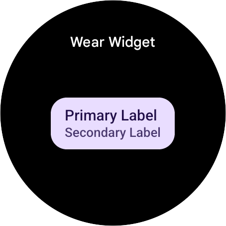

```kotlin
/**
 * Black interface with white 'Wear Widget' text at the top. Centered is a light purple rounded
 * button featuring 'Primary Label' in bold dark purple and 'Secondary Label' in regular purple,
 * stacked vertically.
 */
@RemoteComposable
@Composable
fun ButtonSample3() {
    RemoteBox(
        modifier = RemoteModifier.fillMaxSize(),
        horizontalAlignment = RemoteAlignment.CenterHorizontally,
        verticalArrangement = RemoteArrangement.Center,
    ) {
        RemoteButton(
            modifier = RemoteModifier.buttonSizeModifier(),
            secondaryLabel = { MaterialRemoteText("Secondary Label".rs) },
            label = { MaterialRemoteText("Primary Label".rs) },
        )
    }
}
```

## ButtonSample4

A UI screenshot on a black background. At the top, white text reads "Wear
Widget." Centered below is a large, bright red rounded button with bold yellow
text that reads "Custom Colors." Simple layout with generous margins.

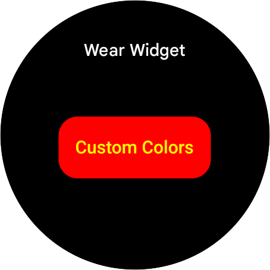

```kotlin
/**
 * A UI screenshot on a black background. At the top, white text reads "Wear Widget." Centered below
 * is a large, bright red rounded button with bold yellow text that reads "Custom Colors." Simple
 * layout with generous margins.
 */
@RemoteComposable
@Composable
fun ButtonSample4() {
    RemoteBox(
        modifier = RemoteModifier.fillMaxSize(),
        horizontalAlignment = RemoteAlignment.CenterHorizontally,
        verticalArrangement = RemoteArrangement.Center,
    ) {
        RemoteButton(
            modifier = RemoteModifier.buttonSizeModifier(),
            colors = RemoteButtonColors(
                containerColor = RemoteColor(Color.Red),
                contentColor = RemoteColor(Color.Yellow),
                secondaryContentColor = RemoteColor(Color.Yellow),
                iconColor = RemoteColor(Color.Yellow),
                disabledContainerColor = RemoteColor(Color.Gray),
                disabledContentColor = RemoteColor(Color.LightGray),
                disabledSecondaryContentColor = RemoteColor(Color.LightGray),
                disabledIconColor = RemoteColor(Color.LightGray)
            )
        ) {
            MaterialRemoteText("Custom Colors".rs)
        }
    }
}
```

## ButtonSample6

Black UI screen featuring white text at the top reading "Wear Widget". In the
center, a dark gray rounded rectangular button displays the text "Disabled
Button" in a light gray, muted font.

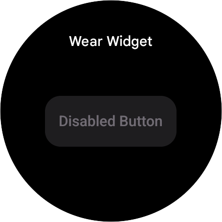

```kotlin
/**
 * Black UI screen featuring white text at the top reading "Wear Widget". In the center, a dark gray
 * rounded rectangular button displays the text "Disabled Button" in a light gray, muted font.
 */
@RemoteComposable
@Composable
fun ButtonSample6() {
    RemoteBox(
        modifier = RemoteModifier.fillMaxSize(),
        horizontalAlignment = RemoteAlignment.CenterHorizontally,
        verticalArrangement = RemoteArrangement.Center,
    ) {
        RemoteButton(
            modifier = RemoteModifier.buttonSizeModifier(),
            enabled = RemoteBoolean(false)
        ) {
            MaterialRemoteText("Disabled Button".rs)
        }
    }
}
```

## ButtonSample7

Black UI featuring "Wear Widget" in white text at the top. Two side-by-side,
light lavender pill-shaped buttons are centered below, labeled "Yes" and "No" in
dark purple text. Symmetrical layout with substantial black margins around the
elements.

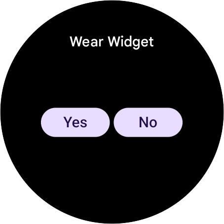

```kotlin
/**
 * Black UI featuring "Wear Widget" in white text at the top. Two side-by-side, light lavender
 * pill-shaped buttons are centered below, labeled "Yes" and "No" in dark purple text. Symmetrical
 * layout with substantial black margins around the elements.
 */
@RemoteComposable
@Composable
fun ButtonSample7() {
    RemoteBox(
        modifier = RemoteModifier.fillMaxSize(),
        horizontalAlignment = RemoteAlignment.CenterHorizontally,
        verticalArrangement = RemoteArrangement.Center,
    ) {
        RemoteRow(
            modifier = RemoteModifier.padding(horizontal = 11.dp),
            horizontalArrangement = RemoteArrangement.CenterHorizontally,
            verticalAlignment = RemoteAlignment.CenterVertically,
        ) {
             RemoteButton(
                 modifier = RemoteModifier.weight(1f)
             ) {
                 MaterialRemoteText("Yes".rs)
             }
             RemoteBox(RemoteModifier.size(4.dp.asRdp())) // Spacing
             RemoteButton(
                 modifier = RemoteModifier.weight(1f)
             ) {
                 MaterialRemoteText("No".rs)
             }
        }
    }
}
```

## ButtonSample8

"Wear Widget" white title on black. Below are two side-by-side light purple
rounded buttons with dark purple text. Left button: "Yes" above "Confir". Right
button: "No" above "Cancel". Centered layout.

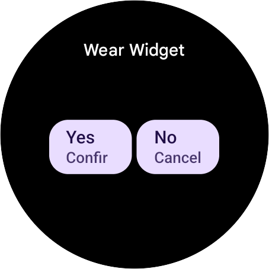

```kotlin
/**
 * "Wear Widget" white title on black. Below are two side-by-side light purple rounded buttons with
 * dark purple text. Left button: "Yes" above "Confir". Right button: "No" above "Cancel". Centered
 * layout.
 */
@RemoteComposable
@Composable
fun ButtonSample8() {
    RemoteBox(
        modifier = RemoteModifier.fillMaxSize(),
        horizontalAlignment = RemoteAlignment.CenterHorizontally,
        verticalArrangement = RemoteArrangement.Center,
    ) {
        RemoteButtonGroup {
             RemoteButton(
                 modifier = RemoteModifier.weight(1f),
                 label = { MaterialRemoteText("Yes".rs) },
                 secondaryLabel = { MaterialRemoteText("Confirm".rs) }
             )
             RemoteBox(RemoteModifier.size(RemoteButtonGroupDefaults.Spacing))
             RemoteButton(
                 modifier = RemoteModifier.weight(1f),
                 label = { MaterialRemoteText("No".rs) },
                 secondaryLabel = { MaterialRemoteText("Cancel".rs) }
             )
        }
    }
}
```

## ButtonSample9

"Wear Widget" interface featuring four rounded buttons: top-left (blue, yellow
wrapped "Toggle"), top-right (magenta, white "Shape"), bottom-left (dark gray,
white wrapped "Click Me"), and bottom-right (green, black "Fixed"). Black
background.

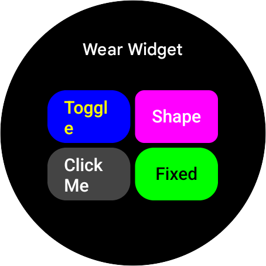

```kotlin
/**
 * "Wear Widget" interface featuring four rounded buttons: top-left (blue, yellow wrapped "Toggle"),
 * top-right (magenta, white "Shape"), bottom-left (dark gray, white wrapped "Click Me"), and
 * bottom-right (green, black "Fixed"). Black background.
 */
@RemoteComposable
@Composable
fun ButtonSample9() {
    val state = rememberRemoteIntValue { 0 }
    val isToggled = state eq RemoteInt(1)

    // Dynamic Color
    val containerColor = isToggled.select(RemoteColor(Color.Red), RemoteColor(Color.Blue))
    val contentColor = isToggled.select(RemoteColor(Color.White), RemoteColor(Color.Yellow))

    // Dynamic Shape (Radius)
    val radiusDp = RemoteDp(isToggled.select(50f.rf, 8f.rf))
    val dynamicShape = RemoteRoundedCornerShape(radiusDp)

    // Dynamic Text
    val button3Text = isToggled.select("Clicked!".rs, "Click Me".rs)

    RemoteBox(
        modifier = RemoteModifier.fillMaxSize().background(Color.Black),
        horizontalAlignment = RemoteAlignment.CenterHorizontally,
        verticalArrangement = RemoteArrangement.Center,
    ) {
        RemoteColumn(
            modifier = RemoteModifier.fillMaxSize().padding(10.dp),
            horizontalAlignment = RemoteAlignment.CenterHorizontally,
            verticalArrangement = RemoteArrangement.Center
        ) {
            // Row 1
            RemoteRow(
                modifier = RemoteModifier.weight(1f).fillMaxSize(),
                horizontalArrangement = RemoteArrangement.CenterHorizontally
            ) {
                // Button 1: Toggles State (Master Switch)
                RemoteButton(
                    modifier = RemoteModifier.weight(1f).fillMaxSize().animationSpec(enabled = true),
                    onClick = arrayOf(ValueChange(state, state xor RemoteInt(1))),
                    colors = RemoteButtonColors(
                        containerColor = containerColor,
                        contentColor = contentColor,
                        secondaryContentColor = contentColor,
                        iconColor = contentColor,
                        disabledContainerColor = RemoteColor(Color.Gray),
                        disabledContentColor = RemoteColor(Color.LightGray),
                        disabledSecondaryContentColor = RemoteColor(Color.LightGray),
                        disabledIconColor = RemoteColor(Color.LightGray)
                    )
                ) {
                    MaterialRemoteText("Toggle".rs)
                }
                RemoteBox(RemoteModifier.size(4.dp.asRdp()))
                // Button 2: Shape Shifter
                RemoteButton(
                    modifier = RemoteModifier.weight(1f).fillMaxSize().animationSpec(enabled = true),
                    shape = dynamicShape,
                    colors = RemoteButtonColors(
                        containerColor = RemoteColor(Color.Magenta),
                        contentColor = RemoteColor(Color.White),
                        secondaryContentColor = RemoteColor(Color.White),
                        iconColor = RemoteColor(Color.White),
                        disabledContainerColor = RemoteColor(Color.Gray),
                        disabledContentColor = RemoteColor(Color.LightGray),
                        disabledSecondaryContentColor = RemoteColor(Color.LightGray),
                        disabledIconColor = RemoteColor(Color.LightGray)
                    )
                ) {
                    MaterialRemoteText("Shape".rs)
                }
            }

            RemoteBox(RemoteModifier.size(4.dp.asRdp()))

            // Row 2
            RemoteRow(
                modifier = RemoteModifier.weight(1f).fillMaxSize(),
                horizontalArrangement = RemoteArrangement.CenterHorizontally
            ) {
                // Button 3: Text Change
                RemoteButton(
                    modifier = RemoteModifier.weight(1f).fillMaxSize().animationSpec(enabled = true),
                    colors = RemoteButtonColors(
                        containerColor = RemoteColor(Color.DarkGray),
                        contentColor = RemoteColor(Color.White),
                        secondaryContentColor = RemoteColor(Color.White),
                        iconColor = RemoteColor(Color.White),
                        disabledContainerColor = RemoteColor(Color.Gray),
                        disabledContentColor = RemoteColor(Color.LightGray),
                        disabledSecondaryContentColor = RemoteColor(Color.LightGray),
                        disabledIconColor = RemoteColor(Color.LightGray)
                    )
                ) {
                    MaterialRemoteText(button3Text)
                }
                RemoteBox(RemoteModifier.size(4.dp.asRdp()))
                // Button 4: Static
                RemoteButton(
                    modifier = RemoteModifier.weight(1f).fillMaxSize(),
                    colors = RemoteButtonColors(
                        containerColor = RemoteColor(Color.Green),
                        contentColor = RemoteColor(Color.Black),
                        secondaryContentColor = RemoteColor(Color.Black),
                        iconColor = RemoteColor(Color.Black),
                        disabledContainerColor = RemoteColor(Color.Gray),
                        disabledContentColor = RemoteColor(Color.LightGray),
                        disabledSecondaryContentColor = RemoteColor(Color.LightGray),
                        disabledIconColor = RemoteColor(Color.LightGray)
                    )
                ) {
                    MaterialRemoteText("Fixed".rs)
                }
            }
        }
    }
}
```

## CardSample1

A dark screen displays "Wear Widget" in white at the top. Below, a rounded dark
gray card contains a cyan Android-style icon on the left. To its right, white
text reads "Card Title" followed by "Subtitle goes here" on two lines. The
layout features generous margins within the card.

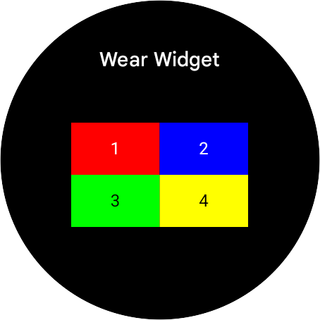

```kotlin
/**
 * A dark screen displays "Wear Widget" in white at the top. Below, a rounded dark gray card contains a cyan Android-style icon on the left. To its right, white text reads "Card Title" followed by "Subtitle goes here" on two lines. The layout features generous margins within the card.
 */
@RemoteComposable
@Composable
fun CardSample1() {
    RemoteBox(
        modifier = RemoteModifier.fillMaxSize().background(Color.Black),
        horizontalAlignment = RemoteAlignment.CenterHorizontally,
        verticalArrangement = RemoteArrangement.Center,
    ) {
        RemoteButton(
            modifier = RemoteModifier.fillMaxSize().padding(10.dp),
            enabled = RemoteBoolean(false), // act as container
            colors =
                RemoteButtonColors(
                    containerColor = RemoteColor(Color.DarkGray),
                    contentColor = RemoteColor(Color.White),
                    secondaryContentColor = RemoteColor(Color.LightGray),
                    iconColor = RemoteColor(Color.White),
                    disabledContainerColor = RemoteColor(Color.DarkGray),
                    disabledContentColor = RemoteColor(Color.White),
                    disabledSecondaryContentColor = RemoteColor(Color.LightGray),
                    disabledIconColor = RemoteColor(Color.White),
                ),
        ) {
            RemoteRow(verticalAlignment = RemoteAlignment.CenterVertically) {
                RemoteIcon(
                    imageVector =
                        ImageVector.vectorResource(id = R.drawable.ic_launcher_foreground),
                    contentDescription = "Card Icon".rs,
                    modifier = RemoteModifier.size(40.dp.asRdp()),
                    tint = RemoteColor(Color.Cyan),
                )
                RemoteBox(RemoteModifier.size(10.dp.asRdp()))
                RemoteColumn {
                    MaterialRemoteText("Card Title".rs)
                    MaterialRemoteText("Subtitle goes here".rs)
                }
            }
        }
    }
}
```

## CounterSample1

A UI mockup on a black background. At the top, white text reads "Wear Widget."
Below, a horizontal counter features a central white "0" on a red rectangular
background, flanked by light purple rounded square buttons containing a dark
purple minus sign on the left and a plus sign on the right.

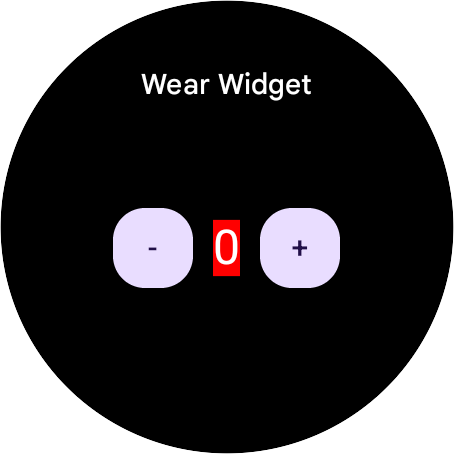

```kotlin
/**
 * A UI mockup on a black background. At the top, white text reads "Wear Widget." Below, a horizontal counter features a central white "0" on a red rectangular background, flanked by light purple rounded square buttons containing a dark purple minus sign on the left and a plus sign on the right.
 */
@RemoteComposable
@Composable
fun CounterSample1() {
    val count = rememberRemoteIntValue { 0 }
    RemoteBox(
        modifier = RemoteModifier.fillMaxSize().background(Color.Black),
        horizontalAlignment = RemoteAlignment.CenterHorizontally,
        verticalArrangement = RemoteArrangement.Center,
    ) {
        RemoteRow(
            verticalAlignment = RemoteAlignment.CenterVertically,
            horizontalArrangement = RemoteArrangement.CenterHorizontally
        ) {
            RemoteButton(
                onClick = arrayOf(ValueChange(count, count - 1)),
                modifier = RemoteModifier.size(40.dp.asRdp())
            ) {
                MaterialRemoteText("-".rs)
            }

            RemoteBox(RemoteModifier.size(10.dp.asRdp()))

            RemoteBox(modifier = RemoteModifier.background(Color.Red)) {
                RemoteText(
                    text = count.toRemoteString(10, TextFromFloat.PAD_PRE_NONE),
                    color = RemoteColor(Color.White),
                    fontSize = 24.sp
                )
            }

            RemoteBox(RemoteModifier.size(10.dp.asRdp()))
             RemoteButton(
                onClick = arrayOf(ValueChange(count, count + 1)),
                modifier = RemoteModifier.size(40.dp.asRdp())
            ) {
                MaterialRemoteText("+".rs)
            }
        }
    }
}
```
