# Widget Samples

## AnchoredTextSample

UI screen with an Android robot icon in a pink circle, above the white text
'Widget Catalog'. A large white rounded rectangular card, outlined in dark gray,
shows 'Left' (red, top-left), 'Center' (black), and 'Bottom' (blue,
bottom-right).

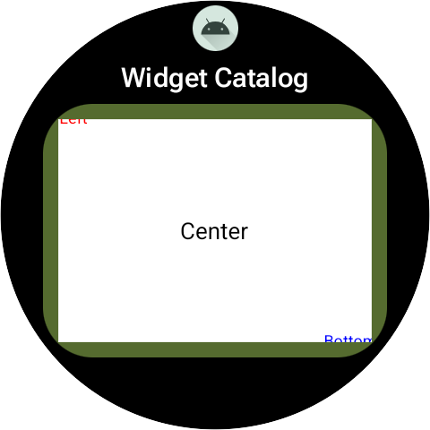

```kotlin
/**
 * UI screen with an Android robot icon in a pink circle, above the white text 'Widget Catalog'. A
 * large white rounded rectangular card, outlined in dark gray, shows 'Left' (red, top-left),
 * 'Center' (black), and 'Bottom' (blue, bottom-right).
 */
@RemoteComposable
@Composable
fun AnchoredTextSample() {
    RemoteBox(
        modifier = RemoteModifier.fillMaxSize().background(Color.White),
        contentAlignment = RemoteAlignment.Center,
    ) {
        RemoteCanvas(modifier = RemoteModifier.fillMaxSize()) {
            val width = remote.component.width
            val height = remote.component.height
            val centerX = width / 2f.rf
            val centerY = height / 2f.rf

            // 1. Center Text (pan 0 = center)
            drawAnchoredText(
                text = "Center".rs,
                anchorX = centerX,
                anchorY = centerY,
                flags = 0,
                paint =
                    RemotePaint().apply {
                        color = Color.Black.rc
                        textSize = 30f.rf
                    },
            )

            // 2. Top-Left Text
            // Anchor at absolute top-left (0,0)
            // panx = -1 (Left Align/Shift Right)
            // pany = 1 (Top Align/Shift Down - assumed based on v4 failure with -1)
            drawAnchoredText(
                text = "Top Left".rs,
                anchorX = 0f.rf,
                anchorY = 0f.rf,
                flags = 0,
                paint =
                    RemotePaint().apply {
                        color = Color.Red.rc
                        textSize = 20f.rf
                    },
            )

            // 3. Bottom-Right Text
            // Anchor at absolute bottom-right (w,h)
            // panx = 1 (Right Align/Shift Left)
            // pany = -1 (Bottom Align/Shift Up - assumed based on v4 failure with 1)
            drawAnchoredText(
                text = "Bottom Right".rs,
                anchorX = width,
                anchorY = height,
                flags = 0,
                paint =
                    RemotePaint().apply {
                        color = Color.Blue.rc
                        textSize = 20f.rf
                    },
            )
        }
    }
}
```

## AustralianThemeSample

Android logo above a screen titled "Widget Catalog". Below, a dark gray rounded
rectangle box contains the title "Aussie Theme", followed by two rounded
buttons: a blue one labeled "Primary (Blue)" and a red one labeled "Secondary
(Red)".

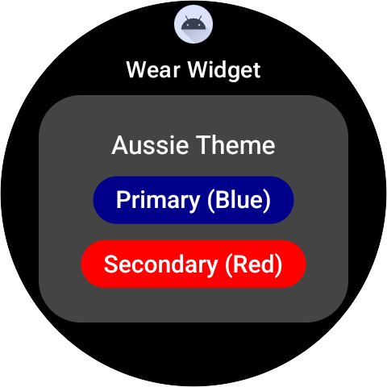

```kotlin
/**
 * Android logo above a screen titled "Widget Catalog". Below, a dark gray rounded rectangle box
 * contains the title "Aussie Theme", followed by two rounded buttons: a blue one labeled "Primary
 * (Blue)" and a red one labeled "Secondary (Red)".
 */
@RemoteComposable
@Composable
fun AustralianThemeSample() {
    val dummy = rememberMutableRemoteInt(0)
    val australianColorScheme =
        RemoteColorScheme()
            .copy(
                primary = Color(0xFF00008B).rc,
                onPrimary = Color.White.rc,
                secondary = Color(0xFFFF0000).rc,
                onSecondary = Color.White.rc,
                tertiary = Color.White.rc,
                onTertiary = Color.Black.rc,
            )

    RemoteMaterialTheme(colorScheme = australianColorScheme) {
        RemoteBox(
            modifier = RemoteModifier.fillMaxSize(),
            contentAlignment = RemoteAlignment.Center,
        ) {
            RemoteColumn(horizontalAlignment = RemoteAlignment.CenterHorizontally) {
                MaterialRemoteText("Aussie Theme".rs)
                RemoteBox(RemoteModifier.size(10.rdp))
                RemoteButton(onClick = ValueChange(dummy, 0.ri)) {
                    MaterialRemoteText("Primary (Blue)".rs)
                }
                RemoteBox(RemoteModifier.size(10.rdp))
                RemoteButton(
                    onClick = ValueChange(dummy, 0.ri),
                    colors =
                        RemoteButtonColors(
                            containerColor = australianColorScheme.secondary,
                            contentColor = australianColorScheme.onSecondary,
                            secondaryContentColor = australianColorScheme.onSecondary,
                            iconColor = australianColorScheme.onSecondary,
                            disabledContainerColor = Color.Gray.rc,
                            disabledContentColor = Color.LightGray.rc,
                            disabledSecondaryContentColor = Color.LightGray.rc,
                            disabledIconColor = Color.LightGray.rc,
                        ),
                ) {
                    MaterialRemoteText("Secondary (Red)".rs)
                }
            }
        }
    }
}
```

## BackgroundTreatmentsSample

A pink Android head icon and "Widget Catalog" title are above a dark gray
rounded container with 6 sections. Top row: red-orange vertical gradient
"Vertical", cyan-blue radial gradient "Radial". Middle row: magenta-green sweep
gradient "Sweep", image labeled "Bitmap". Bottom row: "Custom" with orange
circle, white-gray horizontal gradient "Horizontal".

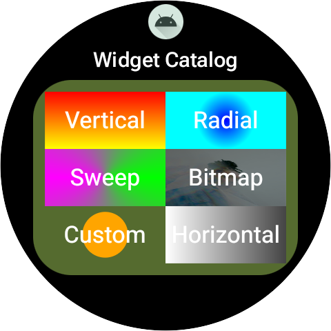

```kotlin
/**
 * A pink Android head icon and "Widget Catalog" title are above a dark gray rounded container with
 * 6 sections. Top row: red-orange vertical gradient "Vertical", cyan-blue radial gradient "Radial".
 * Middle row: magenta-green sweep gradient "Sweep", image labeled "Bitmap". Bottom row: "Custom"
 * with orange circle, white-gray horizontal gradient "Horizontal".
 */
@RemoteComposable
@Composable
fun BackgroundTreatmentsSample() {
    RemoteColumn(
        modifier = RemoteModifier.fillMaxSize(),
        horizontalAlignment = RemoteAlignment.CenterHorizontally,
        verticalArrangement = RemoteArrangement.Center
    ) {
        // Row 1: Vertical and Radial Gradients
        RemoteRow(
            modifier = RemoteModifier.weight(1f).fillMaxSize(),
            horizontalArrangement = RemoteArrangement.Center
        ) {
            // Vertical Gradient
            val vGradient =
                RemoteBrush.verticalGradient(colors = listOf(Color.Red.rc, Color.Yellow.rc))
            RemoteBox(
                modifier = RemoteModifier.weight(1f).fillMaxSize().background(brush = vGradient),
                contentAlignment = RemoteAlignment.Center,
            ) {
                MaterialRemoteText("Vertical".rs)
            }

            // Radial Gradient
            val rGradient =
                RemoteBrush.radialGradient(colors = listOf(Color.Blue.rc, Color.Cyan.rc))
            RemoteBox(
                modifier = RemoteModifier.weight(1f).fillMaxSize().background(brush = rGradient),
                contentAlignment = RemoteAlignment.Center,
            ) {
                MaterialRemoteText("Radial".rs)
            }
        }

        // Row 2: Sweep Gradient and Bitmap Background
        RemoteRow(
            modifier = RemoteModifier.weight(1f).fillMaxSize(),
            horizontalArrangement = RemoteArrangement.Center
        ) {
            // Sweep Gradient
            val sGradient =
                RemoteBrush.sweepGradient(
                    colors = listOf(Color.Green.rc, Color.Magenta.rc, Color.Green.rc)
                )
            RemoteBox(
                modifier = RemoteModifier.weight(1f).fillMaxSize().background(brush = sGradient),
                contentAlignment = RemoteAlignment.Center,
            ) {
                MaterialRemoteText("Sweep".rs)
            }

            // Bitmap Background (using background(RemotePainter))
            val bitmap = ImageBitmap.imageResource(id = R.drawable.photo_17).rb
            val painter = painterRemoteBitmap(bitmap)
            RemoteBox(
                modifier = RemoteModifier.weight(1f).fillMaxSize().background(painter),
                contentAlignment = RemoteAlignment.Center,
            ) {
                // Semi-transparent overlay to make text readable
                RemoteBox(
                    modifier =
                        RemoteModifier.fillMaxSize().background(Color.Black.copy(alpha = 0.5f))
                )
                MaterialRemoteText("Bitmap".rs)
            }
        }

        // Row 3: Custom Drawing and Horizontal Gradient
        RemoteRow(
            modifier = RemoteModifier.weight(1f).fillMaxSize(),
            horizontalArrangement = RemoteArrangement.Center
        ) {
            // Custom drawing
            RemoteBox(
                modifier =
                    RemoteModifier.weight(1f).fillMaxSize().drawWithContent {
                        // Custom background: orange circle
                        drawCircle(
                            paint = RemotePaint().apply { color = Color(0xFFFFA500).rc },
                            radius = (width.min(height) / 2.5f.rf)
                        )
                        drawContent()
                    },
                contentAlignment = RemoteAlignment.Center,
            ) {
                MaterialRemoteText("Custom".rs)
            }

            // Horizontal Gradient
            val hGradient =
                RemoteBrush.horizontalGradient(colors = listOf(Color.White.rc, Color.DarkGray.rc))
            RemoteBox(
                modifier = RemoteModifier.weight(1f).fillMaxSize().background(brush = hGradient),
                contentAlignment = RemoteAlignment.Center,
            ) {
                MaterialRemoteText("Horizontal".rs)
            }
        }
    }
}
```

## BitmapCanvasSample

Android logo in a pink circle, above "Widget Catalog" text. Below is a dark
gray-framed, rounded-corner image of white daisies in a golden sunlit field. The
overall screen background is black.

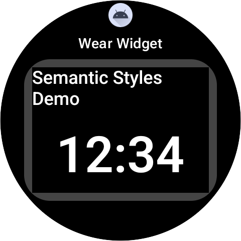

```kotlin
/**
 * Android logo in a pink circle, above "Widget Catalog" text. Below is a dark gray-framed,
 * rounded-corner image of white daisies in a golden sunlit field. The overall screen background is
 * black.
 */
@RemoteComposable
@Composable
fun BitmapCanvasSample() {
    val backgroundBitmap = ImageBitmap.imageResource(id = R.drawable.photo_14).rb

    RemoteBox(modifier = RemoteModifier.fillMaxSize()) {
        RemoteCanvas(modifier = RemoteModifier.fillMaxSize()) {
            drawScaledBitmap(
                image = backgroundBitmap,
                dstSize = RemoteSize(remote.component.width, remote.component.height),
                scaleType = ContentScale.Crop,
                contentDescription = "Background",
            )
        }
    }
}
```

## BoxReferenceSample1

A screen titled "Widget Catalog" with a pink circular Android logo at the top.
Below the title is a large, dark gray rounded rectangular box containing the
centered text "Box Sample 1".

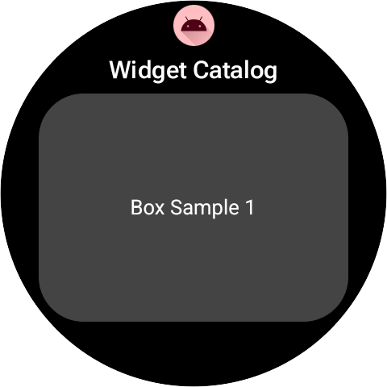

```kotlin
/**
 * A screen titled "Widget Catalog" with a pink circular Android logo at the top. Below the title is
 * a large, dark gray rounded rectangular box containing the centered text "Box Sample 1".
 */
@RemoteComposable
@Composable
fun BoxReferenceSample1() {
    RemoteBox(
        modifier = RemoteModifier.fillMaxSize(),
        contentAlignment = RemoteAlignment.Center,
    ) {
        RemoteText(text = "Box Sample 1", color = Color.White.rc)
    }
}
```

## BoxReferenceSample2

Widget Catalog screen on black background. Top: pink Android icon, white "Widget
Catalog" text. Below: large dark gray rounded rectangle. Inside, a red
rectangular border frames white text: "Box Sample 2" and "(Border & Padding)".

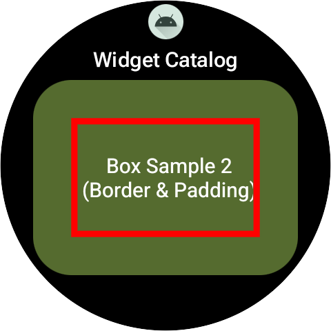

```kotlin
/**
 * Widget Catalog screen on black background. Top: pink Android icon, white "Widget Catalog" text.
 * Below: large dark gray rounded rectangle. Inside, a red rectangular border frames white text:
 * "Box Sample 2" and "(Border & Padding)".
 */
@RemoteComposable
@Composable
fun BoxReferenceSample2() {
    ProvideRemoteTextStyle(value = RemoteMaterialTheme.typography.bodyMedium) {
        RemoteBox(
            modifier =
                RemoteModifier.fillMaxSize()
                    .padding(20.rdp)
                    .border(width = 2.rdp, color = Color.Red.rc),
            contentAlignment = RemoteAlignment.Center,
        ) {
            MaterialRemoteText(
                text = "Box Sample 2\n(Border & Padding)".rs,
                color = Color.White.rc,
                textAlign = TextAlign.Center,
            )
        }
    }
}
```

## BoxReferenceSample3

A black screen displays a pink circular Android icon and the title "Widget
Catalog" in white. Below, a large, rounded rectangular container with a dark
gray border is filled with solid blue. Partial yellow text "Bo" and "(B" is
visible at the bottom right corner of the blue area.

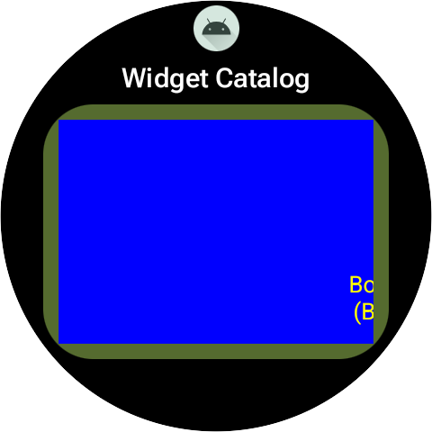

```kotlin
/**
 * A black screen displays a pink circular Android icon and the title "Widget Catalog" in white.
 * Below, a large, rounded rectangular container with a dark gray border is filled with solid blue.
 * Partial yellow text "Bo" and "(B" is visible at the bottom right corner of the blue area.
 */
@RemoteComposable
@Composable
fun BoxReferenceSample3() {
    RemoteBox(
        modifier = RemoteModifier.fillMaxSize().background(Color.Blue),
        contentAlignment = RemoteAlignment.BottomEnd,
    ) {
        RemoteText(
            modifier = RemoteModifier.padding(10.rdp),
            text = "Box Sample 3\n(Bottom End)",
            color = Color.Yellow.rc,
            textAlign = TextAlign.End,
        )
    }
}
```

## BoxReferenceSample4

A "Widget Catalog" screen with an Android icon above the title. Below, a large
blue rectangle within a dark gray rounded border displays white text: "State 0"
and "(Click to" (text appears cut off). The overall background is black.

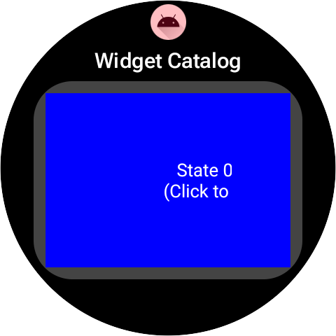

```kotlin
/**
 * A "Widget Catalog" screen with an Android icon above the title. Below, a large blue rectangle
 * within a dark gray rounded border displays white text: "State 0" and "(Click to" (text appears
 * cut off). The overall background is black.
 */
@RemoteComposable
@Composable
fun BoxReferenceSample4() {
    val state = rememberMutableRemoteInt(0)
    RemoteBox(
        modifier = RemoteModifier.fillMaxSize(),
        contentAlignment = RemoteAlignment.Center,
    ) {
        RemoteStateLayout(
            modifier = RemoteModifier.fillMaxSize(),
            state = state,
            states = intArrayOf(0, 1),
        ) { current ->
            if (current == 0) {
                RemoteBox(
                    modifier =
                        RemoteModifier.fillMaxSize()
                            .background(Color.Blue.rc)
                            .clickable(ValueChange(state, 1.ri)),
                    contentAlignment = RemoteAlignment.Center,
                ) {
                    RemoteText(
                        text = "State 0: Blue\n(Click to toggle)",
                        color = Color.White.rc,
                        textAlign = TextAlign.Center
                    )
                }
            } else {
                RemoteBox(
                    modifier =
                        RemoteModifier.fillMaxSize()
                            .background(Color.DarkGray.rc)
                            .clickable(ValueChange(state, 0.ri)),
                    contentAlignment = RemoteAlignment.Center,
                ) {
                    RemoteText(
                        text = "State 1: Gray\n(Click to toggle)",
                        color = Color.Green.rc,
                        textAlign = TextAlign.Center
                    )
                }
            }
        }
    }
}
```

## ButtonReferenceSample1

A mobile UI on a black background shows a pink Android logo icon and "Widget
Catalog" in white text. Below is a dark grey rounded rectangle, containing a
centered light pink rounded button labeled "Simple Button" in dark red text.

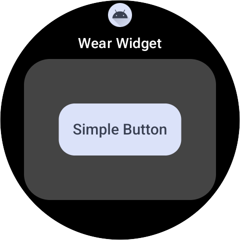

```kotlin
/**
 * A mobile UI on a black background shows a pink Android logo icon and "Widget Catalog" in white
 * text. Below is a dark grey rounded rectangle, containing a centered light pink rounded button
 * labeled "Simple Button" in dark red text.
 */
@RemoteComposable
@Composable
fun ButtonReferenceSample1() {
    val dummy = rememberMutableRemoteInt(0)
    RemoteBox(
        modifier = RemoteModifier.fillMaxSize(),
        contentAlignment = RemoteAlignment.Center,
    ) {
        RemoteButton(
            onClick = ValueChange(dummy, 0.ri),
            modifier = RemoteModifier.buttonSizeModifier(),
        ) {
            MaterialRemoteText("Simple Button".rs)
        }
    }
}
```

## ButtonReferenceSample2

A black screen with a small pink circular Android logo, centered above white
text "Widget Catalog". Below is a dark gray rounded rectangle. Inside, a light
pink rounded button shows a dark reddish-brown Android logo and stacked dark
reddish-brown text "Button with Icon".

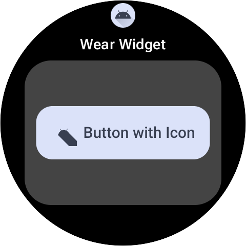

```kotlin
/**
 * A black screen with a small pink circular Android logo, centered above white text "Widget
 * Catalog". Below is a dark gray rounded rectangle. Inside, a light pink rounded button shows a
 * dark reddish-brown Android logo and stacked dark reddish-brown text "Button with Icon".
 */
@RemoteComposable
@Composable
fun ButtonReferenceSample2() {
    val dummy = rememberMutableRemoteInt(0)
    RemoteBox(
        modifier = RemoteModifier.fillMaxSize(),
        contentAlignment = RemoteAlignment.Center,
    ) {
        RemoteButton(
            onClick = ValueChange(dummy, 0.ri),
            modifier = RemoteModifier.buttonSizeModifier(),
            icon = {
                RemoteIcon(
                    imageVector = ImageVector.vectorResource(id = R.drawable.android_24px),
                    contentDescription = "Icon".rs,
                    modifier = RemoteModifier.size(RemoteButtonDefaults.IconSize),
                )
            },
            label = { MaterialRemoteText("Button with Icon".rs) },
        )
    }
}
```

## ButtonReferenceSample3

A "Widget Catalog" screen. Top center, a pink circular icon with an Android
logo. Below it, white "Widget Catalog" text. A large dark gray rounded rectangle
contains a smaller, nested pink rounded rectangle. Inside the pink, prominent
dark red "Primary Label" is above dark gray "Secondary Label".

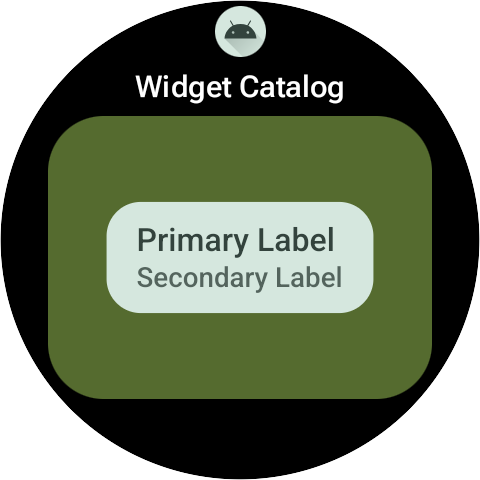

```kotlin
/**
 * A "Widget Catalog" screen. Top center, a pink circular icon with an Android logo. Below it, white
 * "Widget Catalog" text. A large dark gray rounded rectangle contains a smaller, nested pink
 * rounded rectangle. Inside the pink, prominent dark red "Primary Label" is above dark gray
 * "Secondary Label".
 */
@RemoteComposable
@Composable
fun ButtonReferenceSample3() {
    val dummy = rememberMutableRemoteInt(0)
    RemoteBox(
        modifier = RemoteModifier.fillMaxSize(),
        contentAlignment = RemoteAlignment.Center,
    ) {
        RemoteButton(
            onClick = ValueChange(dummy, 0.ri),
            modifier = RemoteModifier.buttonSizeModifier(),
            secondaryLabel = { MaterialRemoteText("Secondary Label".rs) },
            label = { MaterialRemoteText("Primary Label".rs) },
        )
    }
}
```

## ButtonReferenceSample4

A screen features a pink Android logo above "Widget Catalog" in white. Centered
below is a dark grey rounded rectangle enclosing a smaller red rounded rectangle
displaying "Custom Colors" in yellow.

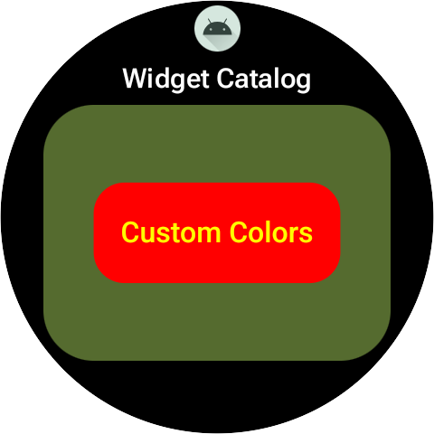

```kotlin
/**
 * A screen features a pink Android logo above "Widget Catalog" in white. Centered below is a dark
 * grey rounded rectangle enclosing a smaller red rounded rectangle displaying "Custom Colors" in
 * yellow.
 */
@RemoteComposable
@Composable
fun ButtonReferenceSample4() {
    val dummy = rememberMutableRemoteInt(0)
    RemoteBox(
        modifier = RemoteModifier.fillMaxSize(),
        contentAlignment = RemoteAlignment.Center,
    ) {
        RemoteButton(
            onClick = ValueChange(dummy, 0.ri),
            modifier = RemoteModifier.buttonSizeModifier(),
            colors =
                RemoteButtonColors(
                    containerColor = Color.Red.rc,
                    contentColor = Color.Yellow.rc,
                    secondaryContentColor = Color.Yellow.rc,
                    iconColor = Color.Yellow.rc,
                    disabledContainerColor = Color.Gray.rc,
                    disabledContentColor = Color.LightGray.rc,
                    disabledSecondaryContentColor = Color.LightGray.rc,
                    disabledIconColor = Color.LightGray.rc,
                ),
        ) {
            MaterialRemoteText("Custom Colors".rs)
        }
    }
}
```

## ButtonReferenceSample6

A screen titled "Widget Catalog" with a pink Android icon above it. Below, a
large dark grey rounded rectangle contains a lighter grey rounded button labeled
"Disabled Button".

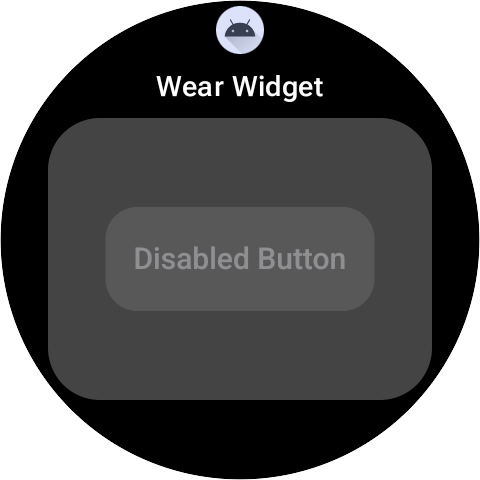

```kotlin
/**
 * A screen titled "Widget Catalog" with a pink Android icon above it. Below, a large dark grey
 * rounded rectangle contains a lighter grey rounded button labeled "Disabled Button".
 */
@RemoteComposable
@Composable
fun ButtonReferenceSample6() {
    val dummy = rememberMutableRemoteInt(0)
    RemoteBox(
        modifier = RemoteModifier.fillMaxSize(),
        contentAlignment = RemoteAlignment.Center,
    ) {
        RemoteButton(
            onClick = ValueChange(dummy, 0.ri),
            modifier = RemoteModifier.buttonSizeModifier(),
            enabled = false.rb,
        ) {
            MaterialRemoteText("Disabled Button".rs)
        }
    }
}
```

## ButtonReferenceSample7

A dark screen displays a pink circle with an Android logo, above white text
"Widget Catalog." Below, a dark gray rounded rectangle frames two horizontal,
pill-shaped pink buttons: "Yes" (left) and "No" (right), both with dark red
text.

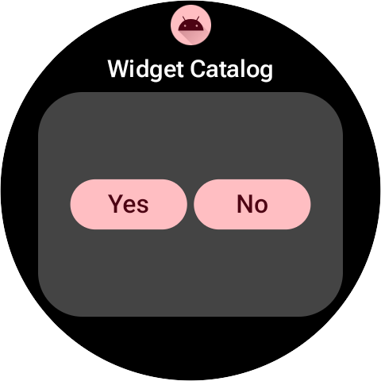

```kotlin
/**
 * A dark screen displays a pink circle with an Android logo, above white text "Widget Catalog."
 * Below, a dark gray rounded rectangle frames two horizontal, pill-shaped pink buttons: "Yes"
 * (left) and "No" (right), both with dark red text.
 */
@RemoteComposable
@Composable
fun ButtonReferenceSample7() {
    val dummy = rememberMutableRemoteInt(0)
    RemoteBox(
        modifier = RemoteModifier.fillMaxSize(),
        contentAlignment = RemoteAlignment.Center,
    ) {
        RemoteRow(
            modifier = RemoteModifier.padding(horizontal = 11.rdp),
            horizontalArrangement = RemoteArrangement.Center,
            verticalAlignment = RemoteAlignment.CenterVertically,
        ) {
            RemoteButton(
                onClick = ValueChange(dummy, 0.ri),
                modifier = RemoteModifier.weight(1f),
            ) {
                MaterialRemoteText("Yes".rs)
            }
            RemoteBox(RemoteModifier.size(4.rdp))
            RemoteButton(
                onClick = ValueChange(dummy, 0.ri),
                modifier = RemoteModifier.weight(1f),
            ) {
                MaterialRemoteText("No".rs)
            }
        }
    }
}
```

## ButtonReferenceSample8

A dark screen displays a pink Android logo and "Widget Catalog" title. Below, a
large dark grey rounded container features two side-by-side light pink rounded
buttons. The left button reads "Yes" and "Confir\nm" (Confirm is truncated). The
right button reads "No" and "Cancel". All button text is dark red.

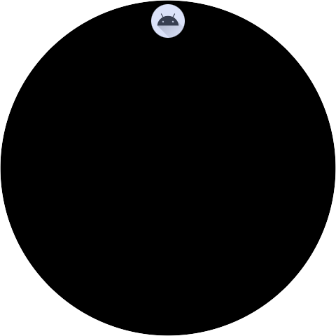

```kotlin
/**
 * A dark screen displays a pink Android logo and "Widget Catalog" title. Below, a large dark grey
 * rounded container features two side-by-side light pink rounded buttons. The left button reads
 * "Yes" and "Confir\nm" (Confirm is truncated). The right button reads "No" and "Cancel". All
 * button text is dark red.
 */
@RemoteComposable
@Composable
fun ButtonReferenceSample8() {
    val dummy = rememberMutableRemoteInt(0)
    RemoteBox(
        modifier = RemoteModifier.fillMaxSize(),
        contentAlignment = RemoteAlignment.Center,
    ) {
        RemoteButtonGroup {
            RemoteButton(
                onClick = ValueChange(dummy, 0.ri),
                modifier = RemoteModifier.weight(1f),
                label = { MaterialRemoteText("Yes".rs) },
                secondaryLabel = { MaterialRemoteText("Confirm".rs) },
            )
            RemoteBox(RemoteModifier.size(RemoteButtonGroupDefaults.Spacing))
            RemoteButton(
                onClick = ValueChange(dummy, 0.ri),
                modifier = RemoteModifier.weight(1f),
                label = { MaterialRemoteText("No".rs) },
                secondaryLabel = { MaterialRemoteText("Cancel".rs) },
            )
        }
    }
}
```

## ButtonReferenceSample9

Screen displaying "Widget Catalog" with an Android icon. A dark grey rounded
rectangle contains a 2x2 grid of elements: a blue "Toggl" button (yellow text),
a magenta "Shap" button (white text), white text "Click" directly on the grey
background, and a green "Fixed" button (white text).

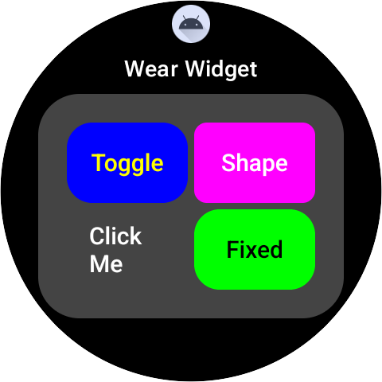

```kotlin
/**
 * Screen displaying "Widget Catalog" with an Android icon. A dark grey rounded rectangle contains a
 * 2x2 grid of elements: a blue "Toggl" button (yellow text), a magenta "Shap" button (white text),
 * white text "Click" directly on the grey background, and a green "Fixed" button (white text).
 */
@RemoteComposable
@Composable
fun ButtonReferenceSample9() {
    val state = rememberMutableRemoteInt(0)
    val isToggled = state eq 1.ri

    val containerColor = isToggled.select(Color.Red.rc, Color.Blue.rc)
    val contentColor = isToggled.select(Color.White.rc, Color.Yellow.rc)
    val radiusDp = isToggled.select(50f.rf, 8f.rf).asRemoteDp()
    val dynamicShape = RemoteRoundedCornerShape(radiusDp)
    val button3Text = isToggled.select("Clicked!".rs, "Click Me".rs)

    RemoteBox(
        modifier = RemoteModifier.fillMaxSize(),
        contentAlignment = RemoteAlignment.Center,
    ) {
        RemoteColumn(
            modifier = RemoteModifier.fillMaxSize().padding(10.rdp),
            horizontalAlignment = RemoteAlignment.CenterHorizontally,
            verticalArrangement = RemoteArrangement.Center,
        ) {
            RemoteRow(
                modifier = RemoteModifier.weight(1f).fillMaxSize(),
                horizontalArrangement = RemoteArrangement.Center,
            ) {
                RemoteButton(
                    modifier =
                        RemoteModifier.weight(1f).fillMaxSize().animationSpec(enabled = true),
                    onClick = ValueChange(state, state xor 1.ri),
                    colors =
                        RemoteButtonColors(
                            containerColor = containerColor,
                            contentColor = contentColor,
                            secondaryContentColor = contentColor,
                            iconColor = contentColor,
                            disabledContainerColor = Color.Gray.rc,
                            disabledContentColor = Color.LightGray.rc,
                            disabledSecondaryContentColor = Color.LightGray.rc,
                            disabledIconColor = Color.LightGray.rc,
                        ),
                ) {
                    MaterialRemoteText("Toggle".rs)
                }
                RemoteBox(RemoteModifier.size(4.rdp))
                RemoteButton(
                    onClick = ValueChange(rememberMutableRemoteInt(0), 0.ri),
                    modifier =
                        RemoteModifier.weight(1f).fillMaxSize().animationSpec(enabled = true),
                    shape = dynamicShape,
                    colors =
                        RemoteButtonColors(
                            containerColor = Color.Magenta.rc,
                            contentColor = Color.White.rc,
                            secondaryContentColor = Color.White.rc,
                            iconColor = Color.White.rc,
                            disabledContainerColor = Color.Gray.rc,
                            disabledContentColor = Color.LightGray.rc,
                            disabledSecondaryContentColor = Color.LightGray.rc,
                            disabledIconColor = Color.LightGray.rc,
                        ),
                ) {
                    MaterialRemoteText("Shape".rs)
                }
            }
            RemoteBox(RemoteModifier.size(4.rdp))
            RemoteRow(
                modifier = RemoteModifier.weight(1f).fillMaxSize(),
                horizontalArrangement = RemoteArrangement.Center,
            ) {
                RemoteButton(
                    onClick = ValueChange(rememberMutableRemoteInt(0), 0.ri),
                    modifier =
                        RemoteModifier.weight(1f).fillMaxSize().animationSpec(enabled = true),
                    colors =
                        RemoteButtonColors(
                            containerColor = Color.DarkGray.rc,
                            contentColor = Color.White.rc,
                            secondaryContentColor = Color.White.rc,
                            iconColor = Color.White.rc,
                            disabledContainerColor = Color.Gray.rc,
                            disabledContentColor = Color.LightGray.rc,
                            disabledSecondaryContentColor = Color.LightGray.rc,
                            disabledIconColor = Color.LightGray.rc,
                        ),
                ) {
                    MaterialRemoteText(button3Text)
                }
                RemoteBox(RemoteModifier.size(4.rdp))
                RemoteButton(
                    onClick = ValueChange(rememberMutableRemoteInt(0), 0.ri),
                    modifier = RemoteModifier.weight(1f).fillMaxSize(),
                    colors =
                        RemoteButtonColors(
                            containerColor = Color.Green.rc,
                            contentColor = Color.Black.rc,
                            secondaryContentColor = Color.Black.rc,
                            iconColor = Color.Black.rc,
                            disabledContainerColor = Color.Gray.rc,
                            disabledContentColor = Color.LightGray.rc,
                            disabledSecondaryContentColor = Color.LightGray.rc,
                            disabledIconColor = Color.LightGray.rc,
                        ),
                ) {
                    MaterialRemoteText("Fixed".rs)
                }
            }
        }
    }
}
```

## ButtonReferenceSample10

Screenshot shows an Android robot icon above "Component Catalog" on a black
background. Below, a light purple chat bubble features a circular profile
picture of a woman. Inside, text reads "Ali" and "2:03 PM", followed by "Dinner
in SF" and "Let's try that new restaurant."

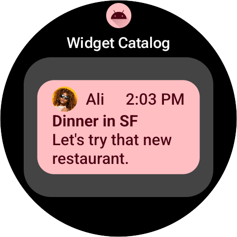

```kotlin
/**
 * Screenshot shows an Android robot icon above "Component Catalog" on a black background. Below, a
 * light purple chat bubble features a circular profile picture of a woman. Inside, text reads "Ali"
 * and "2:03 PM", followed by "Dinner in SF" and "Let's try that new restaurant."
 */
@RemoteComposable
@Composable
fun ButtonReferenceSample10() {
    val dummy = rememberMutableRemoteInt(0)
    RemoteBox(
        modifier = RemoteModifier.fillMaxSize(),
        contentAlignment = RemoteAlignment.Center,
    ) {
        RemoteButton(onClick = ValueChange(dummy, 0.ri)) {
            RemoteColumn {
                RemoteRow(verticalAlignment = RemoteAlignment.CenterVertically) {
                    RemoteImage(
                        bitmap = ImageBitmap.imageResource(id = R.drawable.ali),
                        contentDescription = "Avatar".rs,
                        contentScale = ContentScale.Crop,
                        modifier = RemoteModifier.size(24.rdp).clip(RemoteCircleShape),
                    )
                    RemoteBox(modifier = RemoteModifier.size(8.rdp))
                    MaterialRemoteText("Ali".rs)
                    RemoteBox(modifier = RemoteModifier.size(20.rdp))
                    MaterialRemoteText("2:03 PM".rs)
                }
                MaterialRemoteText(text = "Dinner in SF".rs, fontWeight = FontWeight.Bold)
                MaterialRemoteText(text = "Let's try that new restaurant.".rs)
            }
        }
    }
}
```

## ButtonReferenceSample11

Dark UI with an Android robot icon above "Component Catalog" text. A dark gray
rounded button below displays "Text Data" in light gray, stacked over "Content"
in white.

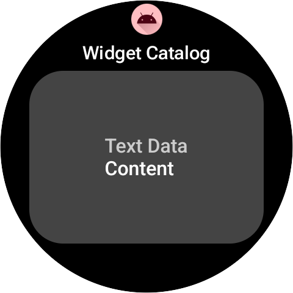

```kotlin
/**
 * Dark UI with an Android robot icon above "Component Catalog" text. A dark gray rounded button
 * below displays "Text Data" in light gray, stacked over "Content" in white.
 */
@RemoteComposable
@Composable
fun ButtonReferenceSample11() {
    val dummy = rememberMutableRemoteInt(0)
    RemoteBox(
        modifier = RemoteModifier.fillMaxSize(),
        contentAlignment = RemoteAlignment.Center,
    ) {
        RemoteButton(
            onClick = ValueChange(dummy, 0.ri),
            colors =
                RemoteButtonColors(
                    containerColor = Color.DarkGray.rc,
                    contentColor = Color.LightGray.rc,
                    secondaryContentColor = Color.White.rc,
                    iconColor = Color.White.rc,
                    disabledContainerColor = Color.DarkGray.rc,
                    disabledContentColor = Color.LightGray.rc,
                    disabledSecondaryContentColor = Color.White.rc,
                    disabledIconColor = Color.White.rc,
                ),
        ) {
            RemoteColumn {
                MaterialRemoteText("Text Data".rs)
                MaterialRemoteText(text = "Content".rs, color = Color.White.rc)
            }
        }
    }
}
```

## ButtonReferenceSample12

A dark mode screenshot displays a 'Widget Catalog'. At the top, a pink circle
with a white Android logo is centered above white text "Widget Catalog." Below,
a large dark gray rounded rectangular widget shows "Icon Data" (light gray text)
above "Content" (white text), with a message icon to its right.

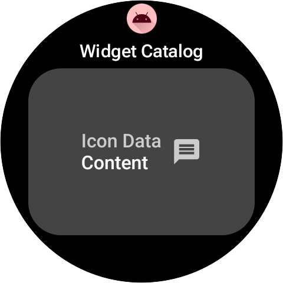

```kotlin
/**
 * A dark mode screenshot displays a 'Widget Catalog'. At the top, a pink circle with a white
 * Android logo is centered above white text "Widget Catalog." Below, a large dark gray rounded
 * rectangular widget shows "Icon Data" (light gray text) above "Content" (white text), with a
 * message icon to its right.
 */
@RemoteComposable
@Composable
fun ButtonReferenceSample12() {
    val dummy = rememberMutableRemoteInt(0)
    RemoteBox(
        modifier = RemoteModifier.fillMaxSize(),
        contentAlignment = RemoteAlignment.Center,
    ) {
        RemoteButton(
            onClick = ValueChange(dummy, 0.ri),
            colors =
                RemoteButtonColors(
                    containerColor = Color.DarkGray.rc,
                    contentColor = Color.LightGray.rc,
                    secondaryContentColor = Color.White.rc,
                    iconColor = Color.White.rc,
                    disabledContainerColor = Color.DarkGray.rc,
                    disabledContentColor = Color.LightGray.rc,
                    disabledSecondaryContentColor = Color.White.rc,
                    disabledIconColor = Color.White.rc,
                ),
        ) {
            RemoteColumn {
                MaterialRemoteText("Icon Data".rs)
                MaterialRemoteText(text = "Content".rs, color = Color.White.rc)
            }
            RemoteBox(modifier = RemoteModifier.size(8.rdp))
            RemoteIcon(
                imageVector =
                    androidx.compose.ui.graphics.vector.ImageVector.vectorResource(
                        id = R.drawable.ic_message_24
                    ),
                contentDescription = "Message".rs,
                modifier = RemoteModifier.size(RemoteButtonDefaults.SmallIconSize),
            )
        }
    }
}
```

## ButtonReferenceSample13

A dark screen with an Android robot icon at the top, followed by the white text
"Component Catalog". Below, a dark gray rounded button features a white running
person icon on the left and stacked white text "Graphic Data Content" on the
right.

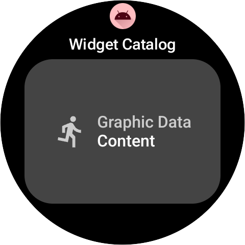

```kotlin
/**
 * A dark screen with an Android robot icon at the top, followed by the white text "Component
 * Catalog". Below, a dark gray rounded button features a white running person icon on the left and
 * stacked white text "Graphic Data Content" on the right.
 */
@RemoteComposable
@Composable
fun ButtonReferenceSample13() {
    val dummy = rememberMutableRemoteInt(0)
    RemoteBox(
        modifier = RemoteModifier.fillMaxSize(),
        contentAlignment = RemoteAlignment.Center,
    ) {
        RemoteButton(
            onClick = ValueChange(dummy, 0.ri),
            colors =
                RemoteButtonColors(
                    containerColor = Color.DarkGray.rc,
                    contentColor = Color.LightGray.rc,
                    secondaryContentColor = Color.White.rc,
                    iconColor = Color.White.rc,
                    disabledContainerColor = Color.DarkGray.rc,
                    disabledContentColor = Color.LightGray.rc,
                    disabledSecondaryContentColor = Color.White.rc,
                    disabledIconColor = Color.White.rc,
                ),
        ) {
            RemoteIcon(
                imageVector =
                    androidx.compose.ui.graphics.vector.ImageVector.vectorResource(
                        id = R.drawable.ic_run_24
                    ),
                contentDescription = "Run".rs,
                modifier = RemoteModifier.size(RemoteButtonDefaults.LargeIconSize),
            )
            RemoteBox(modifier = RemoteModifier.size(8.rdp))
            RemoteColumn {
                MaterialRemoteText("Graphic Data".rs)
                MaterialRemoteText(text = "Content".rs, color = Color.White.rc)
            }
        }
    }
}
```

## CanvasReferenceSample1

A dark background shows a pink circular Android icon, then white text "Widget
Catalog". Below, a large, dark grey rounded rectangle is centered, containing a
red circle centered above a blue horizontal rectangle.

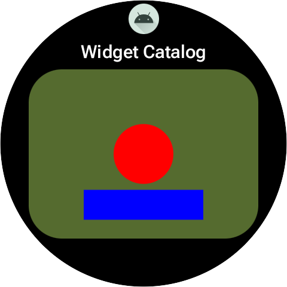

```kotlin
/**
 * A dark background shows a pink circular Android icon, then white text "Widget Catalog". Below, a
 * large, dark grey rounded rectangle is centered, containing a red circle centered above a blue
 * horizontal rectangle.
 */
@RemoteComposable
@Composable
fun CanvasReferenceSample1() {
    RemoteBox(
        modifier = RemoteModifier.fillMaxSize(),
        contentAlignment = RemoteAlignment.Center,
    ) {
        RemoteCanvas(modifier = RemoteModifier.fillMaxSize()) {
            val width = remote.component.width
            val height = remote.component.height
            val centerX = width / 2f.rf
            val centerY = height / 2f.rf

            // Draw a circle
            drawCircle(
                paint = RemotePaint().apply { color = Color.Red.rc },
                radius = 50f.rf,
                center = RemoteOffset(centerX, centerY),
            )

            // Draw a rect
            drawRect(
                paint = RemotePaint().apply { color = Color.Blue.rc },
                topLeft = RemoteOffset(centerX - 100f.rf, centerY + 60f.rf),
                size = RemoteSize(200f.rf, 50f.rf),
            )
        }
    }
}
```

## CanvasReferenceSample2

A dark UI with a pink circular Android icon above white text "Widget Catalog".
Below is a large, centered, dark gray rounded rectangle with a small yellow
triangular shape in its top-left corner, resembling a folded page or tag.

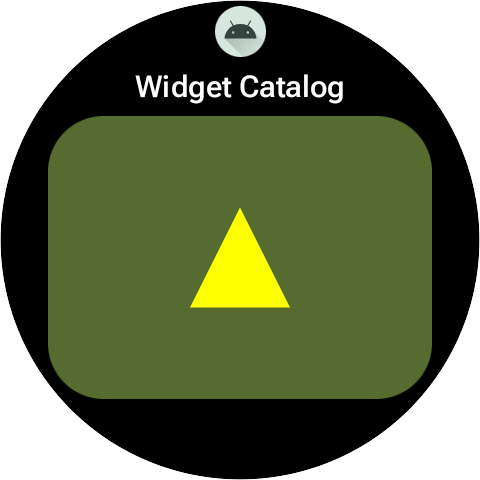

```kotlin
/**
 * A dark UI with a pink circular Android icon above white text "Widget Catalog". Below is a large,
 * centered, dark gray rounded rectangle with a small yellow triangular shape in its top-left
 * corner, resembling a folded page or tag.
 */
@RemoteComposable
@Composable
fun CanvasReferenceSample2() {
    RemoteBox(
        modifier = RemoteModifier.fillMaxSize(),
        contentAlignment = RemoteAlignment.Center,
    ) {
        RemoteCanvas(modifier = RemoteModifier.fillMaxSize()) {
            val width = remote.component.width
            val height = remote.component.height
            val centerX = width / 2f.rf
            val centerY = height / 2f.rf

            val path =
                androidx.compose.remote.creation.RemotePath().apply {
                    moveTo(0f, -50f)
                    lineTo(50f, 50f)
                    lineTo(-50f, 50f)
                    close()
                }

            translate(centerX, centerY) {
                drawPath(
                    path = path,
                    paint = RemotePaint().apply { color = Color.Yellow.rc },
                )
            }
        }
    }
}
```

## CanvasReferenceSample3

UI with a pink Android icon and "Widget Catalog" title. A large, dark grey
rounded rectangle dominates the screen. In its bottom-left corner, a bright
green rotated rectangle shows partial white text: "rotate...".

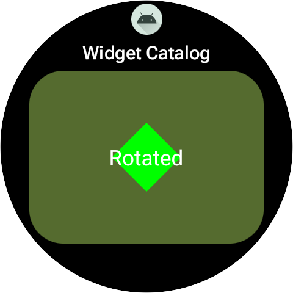

```kotlin
/**
 * UI with a pink Android icon and "Widget Catalog" title. A large, dark grey rounded rectangle
 * dominates the screen. In its bottom-left corner, a bright green rotated rectangle shows partial
 * white text: "rotate...".
 */
@RemoteComposable
@Composable
fun CanvasReferenceSample3() {
    RemoteBox(
        modifier = RemoteModifier.fillMaxSize(),
        contentAlignment = RemoteAlignment.Center,
    ) {
        RemoteCanvas(modifier = RemoteModifier.fillMaxSize()) {
            val width = remote.component.width
            val height = remote.component.height
            val centerX = width / 2f.rf
            val centerY = height / 2f.rf

            translate(centerX, centerY) {
                rotate(45f.rf) {
                    translate(-centerX, -centerY) {
                        drawRect(
                            paint = RemotePaint().apply { color = Color.Green.rc },
                            topLeft = RemoteOffset(centerX - 40f.rf, centerY - 40f.rf),
                            size = RemoteSize(80f.rf, 80f.rf),
                        )
                    }
                }
            }

            drawAnchoredText(
                text = "Rotated".rs,
                anchorX = centerX,
                anchorY = centerY,
                paint =
                    RemotePaint().apply {
                        color = Color.White.rc
                        textSize = 40f.rf
                    },
            )
        }
    }
}
```

## CanvasReferenceSample4

Android "Widget Catalog" screen with a pink Android logo icon. A dark gray
rounded card displays a red circular progress indicator showing 75% completion,
with white text "75%" above gray "Progress" text. The background is black.

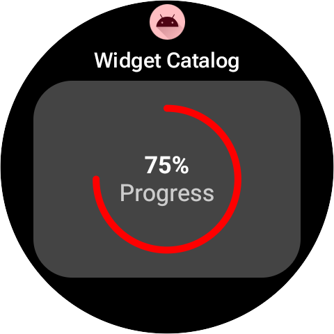

```kotlin
/**
 * Android "Widget Catalog" screen with a pink Android logo icon. A dark gray rounded card displays
 * a red circular progress indicator showing 75% completion, with white text "75%" above gray
 * "Progress" text. The background is black.
 */
@RemoteComposable
@Composable
fun CanvasReferenceSample4() {
    RemoteBox(
        modifier = RemoteModifier.fillMaxSize(),
        contentAlignment = RemoteAlignment.Center,
    ) {
        RemoteBox(modifier = RemoteModifier.size(100.rdp)) {
            RemoteCanvas(modifier = RemoteModifier.fillMaxSize()) {
                val width = remote.component.width
                val height = remote.component.height
                val centerX = width / 2f.rf
                val centerY = height / 2f.rf
                val strokeWidth = 10f
                val radius = (width / 2f.rf) - (strokeWidth / 2f).rf

                // Track
                drawCircle(
                    paint =
                        RemotePaint().apply {
                            color = Color.DarkGray.rc
                            style = PaintingStyle.Stroke
                            this.strokeWidth = strokeWidth.rf
                            isAntiAlias = true
                        },
                    center = RemoteOffset(centerX, centerY),
                    radius = radius,
                )

                // Progress (75% = 270 degrees)
                drawArc(
                    paint =
                        RemotePaint().apply {
                            color = Color.Red.rc
                            style = PaintingStyle.Stroke
                            this.strokeWidth = strokeWidth.rf
                            strokeCap = StrokeCap.Round
                            isAntiAlias = true
                        },
                    startAngle = -90f.rf,
                    sweepAngle = 270f.rf,
                    useCenter = false,
                    topLeft = RemoteOffset((strokeWidth / 2f).rf, (strokeWidth / 2f).rf),
                    size = RemoteSize(width - strokeWidth.rf, height - strokeWidth.rf),
                )
            }
            RemoteBox(
                modifier = RemoteModifier.fillMaxSize(),
                contentAlignment = RemoteAlignment.Center,
            ) {
                RemoteColumn(horizontalAlignment = RemoteAlignment.CenterHorizontally) {
                    MaterialRemoteText(
                        text = "75%".rs,
                        fontWeight = FontWeight.Bold,
                        color = Color.White.rc,
                    )
                    MaterialRemoteText(text = "Progress".rs, color = Color.LightGray.rc)
                }
            }
        }
    }
}
```

## CanvasReferenceSample5

A screen with a pink Android logo icon at the top, followed by "Widget Catalog"
in white text. Below is a dark gray rounded rectangle card containing a red
circular outline. Inside the circle, white text "3/5" is above gray text
"Segments".

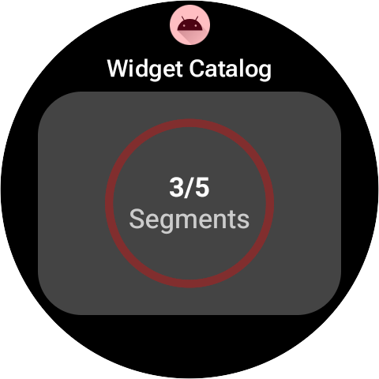

```kotlin
/**
 * A screen with a pink Android logo icon at the top, followed by "Widget Catalog" in white text.
 * Below is a dark gray rounded rectangle card containing a red circular outline. Inside the circle,
 * white text "3/5" is above gray text "Segments".
 */
@RemoteComposable
@Composable
fun CanvasReferenceSample5() {
    RemoteBox(
        modifier = RemoteModifier.fillMaxSize(),
        contentAlignment = RemoteAlignment.Center,
    ) {
        RemoteBox(modifier = RemoteModifier.size(100.rdp)) {
            RemoteCanvas(modifier = RemoteModifier.fillMaxSize()) {
                val width = remote.component.width
                val height = remote.component.height
                val strokeWidth = 10f
                val gap = 8f.rf
                val segments = 5f.rf
                val activeSegments = 3f.rf
                val totalSweep = 360f.rf
                val segmentSweep = (totalSweep - (gap * segments)) / segments

                // Active segments
                loop(0f.rf, activeSegments, 1f.rf) { i ->
                    val startAngle = -90f.rf + (i * (segmentSweep + gap))
                    drawArc(
                        paint =
                            RemotePaint().apply {
                                color = Color.Red.rc
                                style = PaintingStyle.Stroke
                                this.strokeWidth = strokeWidth.rf
                                strokeCap = StrokeCap.Round
                                isAntiAlias = true
                            },
                        startAngle = startAngle,
                        sweepAngle = segmentSweep,
                        useCenter = false,
                        topLeft = RemoteOffset((strokeWidth / 2f).rf, (strokeWidth / 2f).rf),
                        size = RemoteSize(width - strokeWidth.rf, height - strokeWidth.rf),
                    )
                }

                // Inactive segments
                loop(activeSegments, segments, 1f.rf) { i ->
                    val startAngle = -90f.rf + (i * (segmentSweep + gap))
                    drawArc(
                        paint =
                            RemotePaint().apply {
                                color = Color.DarkGray.rc
                                style = PaintingStyle.Stroke
                                this.strokeWidth = strokeWidth.rf
                                strokeCap = StrokeCap.Round
                                isAntiAlias = true
                            },
                        startAngle = startAngle,
                        sweepAngle = segmentSweep,
                        useCenter = false,
                        topLeft = RemoteOffset((strokeWidth / 2f).rf, (strokeWidth / 2f).rf),
                        size = RemoteSize(width - strokeWidth.rf, height - strokeWidth.rf),
                    )
                }
            }
            RemoteBox(
                modifier = RemoteModifier.fillMaxSize(),
                contentAlignment = RemoteAlignment.Center,
            ) {
                RemoteColumn(horizontalAlignment = RemoteAlignment.CenterHorizontally) {
                    MaterialRemoteText(
                        text = "3/5".rs,
                        fontWeight = FontWeight.Bold,
                        color = Color.White.rc,
                    )
                    MaterialRemoteText(text = "Segments".rs, color = Color.LightGray.rc)
                }
            }
        }
    }
}
```

## CardSample1

A black screen displays a pink circular icon with a dark red Android logo, above
white text 'Widget Catalog'. Below this is a large, dark gray rounded card.
Inside the card, a cyan Android logo is on the left, and white text 'Card
Title', 'Subtitle', 'goes', 'here' is stacked on the right.

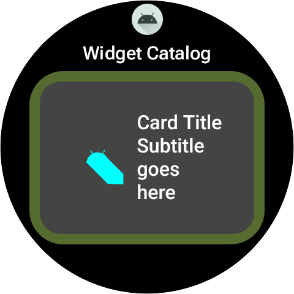

```kotlin
/**
 * A black screen displays a pink circular icon with a dark red Android logo, above white text
 * 'Widget Catalog'. Below this is a large, dark gray rounded card. Inside the card, a cyan Android
 * logo is on the left, and white text 'Card Title', 'Subtitle', 'goes', 'here' is stacked on the
 * right.
 */
@RemoteComposable
@Composable
fun CardSample1() {
    val dummy = rememberMutableRemoteInt(0)
    RemoteBox(
        modifier = RemoteModifier.fillMaxSize(),
        contentAlignment = RemoteAlignment.Center,
    ) {
        RemoteButton(
            onClick = ValueChange(dummy, 0.ri),
            modifier = RemoteModifier.fillMaxSize().padding(10.rdp),
            enabled = false.rb, // act as container
            colors =
                RemoteButtonColors(
                    containerColor = Color.DarkGray.rc,
                    contentColor = Color.White.rc,
                    secondaryContentColor = Color.LightGray.rc,
                    iconColor = Color.White.rc,
                    disabledContainerColor = Color.DarkGray.rc,
                    disabledContentColor = Color.White.rc,
                    disabledSecondaryContentColor = Color.LightGray.rc,
                    disabledIconColor = Color.White.rc,
                ),
        ) {
            RemoteRow(verticalAlignment = RemoteAlignment.CenterVertically) {
                RemoteIcon(
                    imageVector = ImageVector.vectorResource(id = R.drawable.android_24px),
                    contentDescription = "Card Icon".rs,
                    modifier = RemoteModifier.size(40.rdp),
                    tint = Color.Cyan.rc,
                )
                RemoteBox(RemoteModifier.size(10.rdp))
                RemoteColumn {
                    MaterialRemoteText("Card Title".rs)
                    MaterialRemoteText("Subtitle goes here".rs)
                }
            }
        }
    }
}
```

## CollapsibleColumnSample1

Android logo above "Wear Widget" text. Below, a rounded rectangular container
displays centered, vertically stacked text: "Top (High)" in red, "Middle (Low)"
in green, and "Bottom (High)" in blue. **KNOWN ISSUE (b/502649242):** This
widget currently crashes at runtime. `RemoteCollapsibleColumn` emits an
unsupported operation (233) that causes a `RuntimeException` when rendered on a
device or in headless previews. Do not use this layout primitive for Wear OS
Widgets until this issue is resolved.

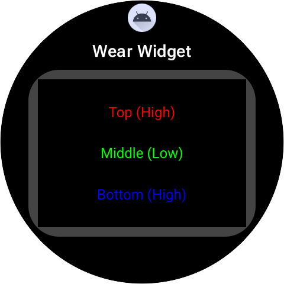

```kotlin
/**
 * Android logo above "Wear Widget" text. Below, a rounded rectangular container displays centered,
 * vertically stacked text: "Top (High)" in red, "Middle (Low)" in green, and "Bottom (High)" in
 * blue.
 *
 * **KNOWN ISSUE (b/502649242):** This widget currently crashes at runtime.
 * `RemoteCollapsibleColumn` emits an unsupported operation (233) that causes a `RuntimeException`
 * when rendered on a device or in headless previews. Do not use this layout primitive for Wear OS
 * Widgets until this issue is resolved.
 */
@RemoteComposable
@Composable
fun CollapsibleColumnSample1() {
    RemoteBox(
        modifier = RemoteModifier.fillMaxSize(),
        contentAlignment = RemoteAlignment.Center,
    ) {
        RemoteCollapsibleColumn(
            modifier = RemoteModifier.fillMaxSize(),
            horizontalAlignment = RemoteAlignment.CenterHorizontally,
            verticalArrangement = RemoteArrangement.SpaceEvenly,
        ) {
            RemoteText(
                "Top (High)",
                color = Color.Red.rc,
                modifier = RemoteModifier.priority(1.0f),
            )
            RemoteText(
                "Middle (Low)",
                color = Color.Green.rc,
                modifier = RemoteModifier.priority(0.1f),
            )
            RemoteText(
                "Bottom (High)",
                color = Color.Blue.rc,
                modifier = RemoteModifier.priority(1.0f),
            )
        }
    }
}
```

## ConditionalRadiusSample

A dark screen displays a pink circular icon with a dark Android logo at the top.
Below it, white text reads 'Widget Catalog'. A large, centered, rounded
rectangular container with a dark gray border and solid blue fill occupies the
lower part of the screen.

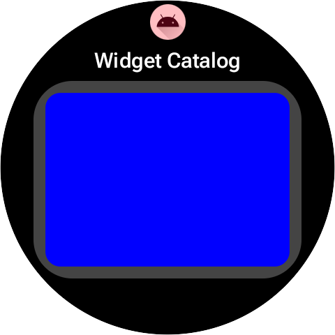

```kotlin
/**
 * A dark screen displays a pink circular icon with a dark Android logo at the top. Below it, white
 * text reads 'Widget Catalog'. A large, centered, rounded rectangular container with a dark gray
 * border and solid blue fill occupies the lower part of the screen.
 */
@RemoteComposable
@Composable
fun ConditionalRadiusSample() {
    RemoteBox(modifier = RemoteModifier.fillMaxSize()) {
        RemoteCanvas(modifier = RemoteModifier.fillMaxSize()) {
            // 1. Get Width and Density
            val widthPx = remote.component.width
            val density = remoteDensity.density

            // 2. Calculate Condition (Width > 200dp?)
            val widthDp = widthPx / density
            val isWide = widthDp.gt(200f.rf)

            // 3. Select Value (15dp if wide, 10dp if narrow) and convert to RemoteDp
            val radiusDp = isWide.select(15f.rf, 10f.rf).asRemoteDp()
            val radiusPx = radiusDp.toPx(remoteDensity)

            // 4. Use the value (Converting back to Px for drawing commands)
            drawRoundRect(
                paint = RemotePaint().apply { color = Color.Blue.rc },
                topLeft = RemoteOffset.Zero,
                size = RemoteSize(widthPx, remote.component.height),
                cornerRadius = RemoteOffset(radiusPx, radiusPx),
            )
        }
    }
}
```

## CounterSample1

Pink Android icon above "Widget Catalog" title. Below, a dark gray rounded
rectangle widget shows a horizontal row: a light pink minus button, a red "0"
display, and a light pink plus button.

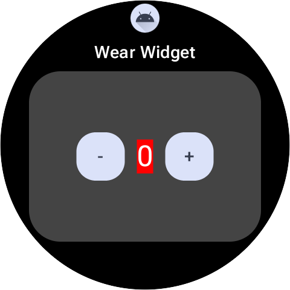

```kotlin
/**
 * Pink Android icon above "Widget Catalog" title. Below, a dark gray rounded rectangle widget shows
 * a horizontal row: a light pink minus button, a red "0" display, and a light pink plus button.
 */
@RemoteComposable
@Composable
fun CounterSample1() {
    val count = rememberMutableRemoteInt(0)
    RemoteBox(
        modifier = RemoteModifier.fillMaxSize(),
        contentAlignment = RemoteAlignment.Center,
    ) {
        RemoteRow(
            verticalAlignment = RemoteAlignment.CenterVertically,
            horizontalArrangement = RemoteArrangement.Center,
        ) {
            RemoteButton(
                onClick = ValueChange(count, count - 1.ri),
                modifier = RemoteModifier.size(40.rdp),
            ) {
                MaterialRemoteText("-".rs)
            }

            RemoteBox(RemoteModifier.size(10.rdp))

            RemoteBox(modifier = RemoteModifier.background(Color.Red)) {
                RemoteText(
                    text = count.toRemoteString(10, TextFromFloat.PAD_PRE_NONE),
                    color = Color.White.rc,
                    fontSize = 24.rsp,
                )
            }

            RemoteBox(RemoteModifier.size(10.rdp))
            RemoteButton(
                onClick = ValueChange(count, count + 1.ri),
                modifier = RemoteModifier.size(40.rdp),
            ) {
                MaterialRemoteText("+".rs)
            }
        }
    }
}
```

## CustomThemeSample

Dark theme UI with a pink Android icon and "Widget Catalog" text. Below, a dark
gray rounded card displays "Custom Theme" in white text. Inside the card,
there's a pink rounded button with "Primary Button" in darker pink text.

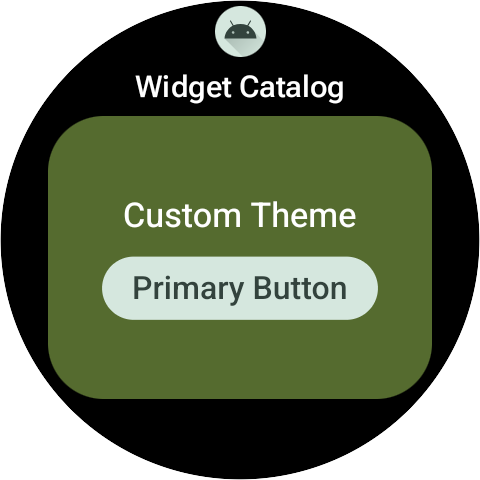

```kotlin
/**
 * Dark theme UI with a pink Android icon and "Widget Catalog" text. Below, a dark gray rounded card
 * displays "Custom Theme" in white text. Inside the card, there's a pink rounded button with
 * "Primary Button" in darker pink text.
 */
@RemoteComposable
@Composable
fun CustomThemeSample() {
    val dummy = rememberMutableRemoteInt(0)
    // Define a custom color scheme where primary is White.
    // This acts as the fallback when dynamic theming is disabled.
    val customColorScheme =
        RemoteColorScheme(
            colorScheme =
                ColorScheme(
                    primary = Color.White,
                    onPrimary = Color.Black,
                    primaryContainer = Color.White,
                    onPrimaryContainer = Color.Black
                )
        )

    RemoteMaterialTheme(colorScheme = customColorScheme) {
        RemoteBox(
            modifier = RemoteModifier.fillMaxSize(),
            contentAlignment = RemoteAlignment.Center,
        ) {
            RemoteColumn(horizontalAlignment = RemoteAlignment.CenterHorizontally) {
                MaterialRemoteText("Custom Theme".rs)
                RemoteBox(RemoteModifier.size(10.rdp))

                // Use the theme's colors.
                // If dynamic theming is ON, this will use system colors.
                // If dynamic theming is OFF, this will use our customColorScheme (White/Black).
                RemoteButton(onClick = ValueChange(dummy, 0.ri)) {
                    MaterialRemoteText("Primary Button".rs)
                }
            }
        }
    }
}
```

## DebugClickSample

An app screen with a black background. At the top, a pink circular Android icon
is centered above "Widget Catalog" text. Below, a large, dark gray rounded
rectangle widget houses a central red square with "Click Me" text in white.

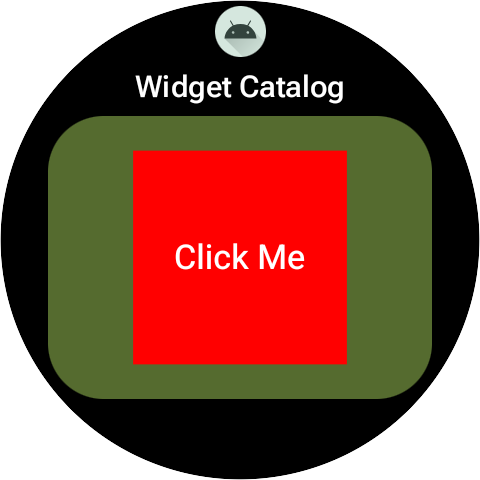

```kotlin
/**
 * An app screen with a black background. At the top, a pink circular Android icon is centered above
 * "Widget Catalog" text. Below, a large, dark gray rounded rectangle widget houses a central red
 * square with "Click Me" text in white.
 */
@RemoteComposable
@Composable
fun DebugClickSample() {
    val context = LocalContext.current
    val isInspectionMode = LocalInspectionMode.current
    val intent =
        remember(context) {
            Intent("com.google.example.wear_widget.DEBUG_CLICK_ACTION")
                .setPackage(context.packageName)
        }
    val pendingIntent =
        remember(context) {
            PendingIntent.getBroadcast(
                context,
                0,
                intent,
                PendingIntent.FLAG_IMMUTABLE or PendingIntent.FLAG_UPDATE_CURRENT
            )
        }

    RemoteBox(
        modifier = RemoteModifier.fillMaxSize(),
        contentAlignment = RemoteAlignment.Center,
    ) {
        RemoteBox(
            modifier =
                RemoteModifier.size(100.rdp).background(Color.Red.rc).clip(RemoteCircleShape).let {
                    if (isInspectionMode) {
                        it
                    } else {
                        it.clickable(pendingIntentAction(pendingIntent))
                    }
                },
            contentAlignment = RemoteAlignment.Center,
        ) {
            MaterialRemoteText("Click Me".rs)
        }
    }
}
```

## FullBleedImageButtonSample

Android logo in pink circle above white 'Widget Catalog' text. Below, a rounded
gray-bordered rectangle shows a blurry field of daisies. Centered on the field
is a circular cutout of a person with dreadlocks, wearing blue, against a light
background.

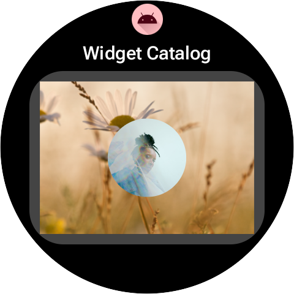

```kotlin
/**
 * Android logo in pink circle above white 'Widget Catalog' text. Below, a rounded gray-bordered
 * rectangle shows a blurry field of daisies. Centered on the field is a circular cutout of a person
 * with dreadlocks, wearing blue, against a light background.
 */
@RemoteComposable
@Composable
fun FullBleedImageButtonSample() {
    val backgroundBitmap = ImageBitmap.imageResource(id = R.drawable.photo_14).rb

    // Toggle state for click interaction
    val state = rememberMutableRemoteInt(0)
    val isToggled = state eq 1.ri

    // Overlay color: Semi-transparent Black when toggled, Transparent when not
    val overlayColor = isToggled.select(Color(0xAA000000).rc, Color.Transparent.rc)

    RemoteBox(modifier = RemoteModifier.fillMaxSize()) {
        // Background (Full Bleed Image) using RemoteCanvas to avoid RemoteImage conflict
        // (b/483291287)
        RemoteCanvas(modifier = RemoteModifier.fillMaxSize()) {
            drawScaledBitmap(
                image = backgroundBitmap,
                dstSize = RemoteSize(remote.component.width, remote.component.height),
                scaleType = ContentScale.Crop,
                contentDescription = "Background",
            )
        }

        // Overlay with Floating Image Button
        RemoteBox(
            modifier = RemoteModifier.fillMaxSize(),
            contentAlignment = RemoteAlignment.Center,
        ) {
            // The floating Image Button (using imageButton pattern but made clickable)
            RemoteBox(
                modifier =
                    RemoteModifier.size(60.rdp)
                        .clip(RemoteCircleShape)
                        .clickable(ValueChange(state, state xor 1.ri)),
                contentAlignment = RemoteAlignment.Center,
            ) {
                RemoteImage(
                    bitmap = ImageBitmap.imageResource(id = R.drawable.photo_17),
                    contentDescription = "Avatar".rs,
                    contentScale = ContentScale.Crop,
                    modifier = RemoteModifier.fillMaxSize(),
                )

                // Overlay to indicate click state
                RemoteBox(modifier = RemoteModifier.fillMaxSize().background(overlayColor))
            }
        }
    }
}
```

## TouchGestureSample1

A black screen displays a light pink circular icon at the top center. Inside the
circle is a darker pink Android robot head logo, presented with a subtle shadow
effect. **KNOWN ISSUE (b/502649242):** This widget currently crashes at runtime.
`RemoteModifier.onTouchDown` and `onTouchUp` emit unsupported operations
(219/220) that cause a `RuntimeException` when rendered on a device or in
headless previews. Do not use these modifiers for Wear OS Widgets until this
issue is resolved.


```kotlin
/**
 * A black screen displays a light pink circular icon at the top center. Inside the circle is a
 * darker pink Android robot head logo, presented with a subtle shadow effect.
 *
 * **KNOWN ISSUE (b/502649242):** This widget currently crashes at runtime.
 * `RemoteModifier.onTouchDown` and `onTouchUp` emit unsupported operations (219/220) that cause a
 * `RuntimeException` when rendered on a device or in headless previews. Do not use these modifiers
 * for Wear OS Widgets until this issue is resolved.
 */
@RemoteComposable
@Composable
fun TouchGestureSample1() {
    val downCounter = rememberMutableRemoteInt(0)
    val upCounter = rememberMutableRemoteInt(0)

    val onDownAction = ValueChange(downCounter, downCounter + 1)
    val onUpAction = ValueChange(upCounter, upCounter + 1)

    RemoteColumn(
        modifier = RemoteModifier.fillMaxSize(),
        horizontalAlignment = RemoteAlignment.CenterHorizontally,
        verticalArrangement =
            androidx.compose.remote.creation.compose.layout.RemoteArrangement.Center
    ) {
        RemoteText("Downs: ".rs + downCounter.toRemoteString(), color = Color.White.rc)
        RemoteText("Ups: ".rs + upCounter.toRemoteString(), color = Color.White.rc)

        RemoteBox(
            modifier =
                RemoteModifier.size(width = 120.rdp, height = 60.rdp)
                    .background(RemoteColor(Color.DarkGray))
                    .onTouchDown(onDownAction)
                    .onTouchUp(onUpAction),
            contentAlignment = RemoteAlignment.Center,
        ) {
            RemoteText("Hold & Release")
        }
    }
}
```

## GradientBackgroundSample

A screen shows a pink Android icon above "Widget Catalog" text. Below, a rounded
rectangle with a dark grey border features a red-to-purple-to-blue gradient
background. White text "Gradient Background" is centered within it.

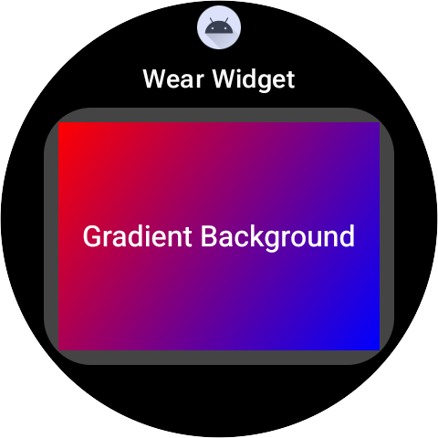

```kotlin
/**
 * A screen shows a pink Android icon above "Widget Catalog" text. Below, a rounded rectangle with a
 * dark grey border features a red-to-purple-to-blue gradient background. White text "Gradient
 * Background" is centered within it.
 */
@RemoteComposable
@Composable
fun GradientBackgroundSample() {
    val gradient =
        RemoteLinearGradient(
            colors = listOf(Color.Red.rc, Color.Blue.rc),
            start = RemoteOffset.Zero,
            end = null,
        )
    RemoteBox(
        modifier = RemoteModifier.fillMaxSize().background(brush = gradient),
        contentAlignment = RemoteAlignment.Center,
    ) {
        MaterialRemoteText("Gradient Background".rs)
    }
}
```

## GridSample1

A screen titled 'Widget Catalog' below a pink Android icon. A dark gray rounded
rectangle displays a 2x2 grid of smaller colored rectangles: red (1), blue (2),
green (3), and yellow (4), numbered top-left to bottom-right.

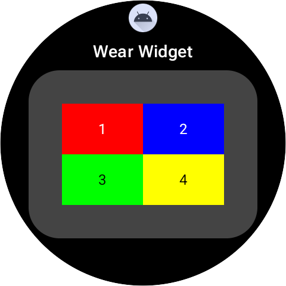

```kotlin
/**
 * A screen titled 'Widget Catalog' below a pink Android icon. A dark gray rounded rectangle
 * displays a 2x2 grid of smaller colored rectangles: red (1), blue (2), green (3), and yellow (4),
 * numbered top-left to bottom-right.
 */
@RemoteComposable
@Composable
fun GridSample1() {
    RemoteBox(
        modifier = RemoteModifier.fillMaxSize(),
        contentAlignment = RemoteAlignment.Center,
    ) {
        RemoteColumn(
            modifier = RemoteModifier.fillMaxSize().padding(20.rdp),
            verticalArrangement = RemoteArrangement.SpaceEvenly,
        ) {
            RemoteRow(modifier = RemoteModifier.weight(1f)) {
                RemoteBox(
                    modifier = RemoteModifier.weight(1f).fillMaxSize().background(Color.Red),
                    contentAlignment = RemoteAlignment.Center,
                ) {
                    RemoteText("1", color = Color.White.rc)
                }
                RemoteBox(
                    modifier = RemoteModifier.weight(1f).fillMaxSize().background(Color.Blue),
                    contentAlignment = RemoteAlignment.Center,
                ) {
                    RemoteText("2", color = Color.White.rc)
                }
            }
            RemoteRow(modifier = RemoteModifier.weight(1f)) {
                RemoteBox(
                    modifier = RemoteModifier.weight(1f).fillMaxSize().background(Color.Green),
                    contentAlignment = RemoteAlignment.Center,
                ) {
                    RemoteText("3", color = Color.Black.rc)
                }
                RemoteBox(
                    modifier = RemoteModifier.weight(1f).fillMaxSize().background(Color.Yellow),
                    contentAlignment = RemoteAlignment.Center,
                ) {
                    RemoteText("4", color = Color.Black.rc)
                }
            }
        }
    }
}
```

## IconSample1

UI screen with an Android robot icon in a pink circle, above the white text
'Widget Catalog'. A dark gray rounded rectangle displays three Android robot
heads: a small red one, a medium green one, and a large blue one, arranged
horizontally, increasing in size.

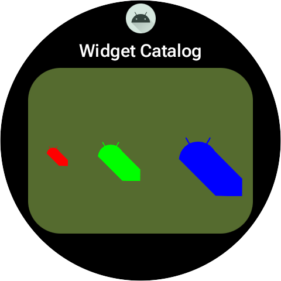

```kotlin
/**
 * UI screen with an Android robot icon in a pink circle, above the white text 'Widget Catalog'. A
 * dark gray rounded rectangle displays three Android robot heads: a small red one, a medium green
 * one, and a large blue one, arranged horizontally, increasing in size.
 */
@RemoteComposable
@Composable
fun IconSample1() {
    RemoteBox(
        modifier = RemoteModifier.fillMaxSize(),
        contentAlignment = RemoteAlignment.Center,
    ) {
        RemoteRow(
            verticalAlignment = RemoteAlignment.CenterVertically,
            horizontalArrangement = RemoteArrangement.Center,
        ) {
            RemoteIcon(
                imageVector = ImageVector.vectorResource(id = R.drawable.android_24px),
                contentDescription = "Small Red".rs,
                modifier = RemoteModifier.size(24.rdp),
                tint = Color.Red.rc,
            )
            RemoteBox(RemoteModifier.size(10.rdp))
            RemoteIcon(
                imageVector = ImageVector.vectorResource(id = R.drawable.android_24px),
                contentDescription = "Medium Green".rs,
                modifier = RemoteModifier.size(48.rdp),
                tint = Color.Green.rc,
            )
            RemoteBox(RemoteModifier.size(10.rdp))
            RemoteIcon(
                imageVector = ImageVector.vectorResource(id = R.drawable.android_24px),
                contentDescription = "Large Blue".rs,
                modifier = RemoteModifier.size(72.rdp),
                tint = Color.Blue.rc,
            )
        }
    }
}
```

## Material3ThemeSample

A pink circular Android robot icon sits above white text "Widget Catalog."
Below, a rounded rectangle displays a 5x4 grid of color swatches in various
shades of pink, peach, brown, and purple, with some black and white squares in
the bottom right.

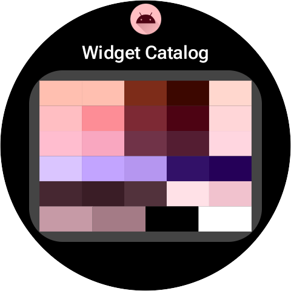

```kotlin
/**
 * A pink circular Android robot icon sits above white text "Widget Catalog." Below, a rounded
 * rectangle displays a 5x4 grid of color swatches in various shades of pink, peach, brown, and
 * purple, with some black and white squares in the bottom right.
 */
@RemoteComposable
@Composable
fun Material3ThemeSample() {
    RemoteColumn(modifier = RemoteModifier.fillMaxSize()) {
        RemoteColorRow {
            RemoteColorBox(RemoteMaterialTheme.colorScheme.error)
            RemoteColorBox(RemoteMaterialTheme.colorScheme.errorDim)
            RemoteColorBox(RemoteMaterialTheme.colorScheme.errorContainer)
            RemoteColorBox(RemoteMaterialTheme.colorScheme.onError)
            RemoteColorBox(RemoteMaterialTheme.colorScheme.onErrorContainer)
        }
        RemoteColorRow {
            RemoteColorBox(RemoteMaterialTheme.colorScheme.primary)
            RemoteColorBox(RemoteMaterialTheme.colorScheme.primaryDim)
            RemoteColorBox(RemoteMaterialTheme.colorScheme.primaryContainer)
            RemoteColorBox(RemoteMaterialTheme.colorScheme.onPrimary)
            RemoteColorBox(RemoteMaterialTheme.colorScheme.onPrimaryContainer)
        }
        RemoteColorRow {
            RemoteColorBox(RemoteMaterialTheme.colorScheme.secondary)
            RemoteColorBox(RemoteMaterialTheme.colorScheme.secondaryDim)
            RemoteColorBox(RemoteMaterialTheme.colorScheme.secondaryContainer)
            RemoteColorBox(RemoteMaterialTheme.colorScheme.onSecondary)
            RemoteColorBox(RemoteMaterialTheme.colorScheme.onSecondaryContainer)
        }
        RemoteColorRow {
            RemoteColorBox(RemoteMaterialTheme.colorScheme.tertiary)
            RemoteColorBox(RemoteMaterialTheme.colorScheme.tertiaryDim)
            RemoteColorBox(RemoteMaterialTheme.colorScheme.tertiaryContainer)
            RemoteColorBox(RemoteMaterialTheme.colorScheme.onTertiary)
            RemoteColorBox(RemoteMaterialTheme.colorScheme.onTertiaryContainer)
        }
        RemoteColorRow {
            RemoteColorBox(RemoteMaterialTheme.colorScheme.surfaceContainer)
            RemoteColorBox(RemoteMaterialTheme.colorScheme.surfaceContainerLow)
            RemoteColorBox(RemoteMaterialTheme.colorScheme.surfaceContainerHigh)
            RemoteColorBox(RemoteMaterialTheme.colorScheme.onSurface)
            RemoteColorBox(RemoteMaterialTheme.colorScheme.onSurfaceVariant)
        }
        RemoteColorRow {
            RemoteColorBox(RemoteMaterialTheme.colorScheme.outline)
            RemoteColorBox(RemoteMaterialTheme.colorScheme.outlineVariant)
            RemoteColorBox(RemoteMaterialTheme.colorScheme.background)
            RemoteColorBox(RemoteMaterialTheme.colorScheme.onBackground)
        }
    }
}
```

## MixedStyleSample

An app screen displays a pink circle with an Android icon and the title 'Widget
Catalog.' Below, a white rounded rectangle shows the text 'Mixed Styles,' with
'Mixed' in red and 'Styles' in blue.

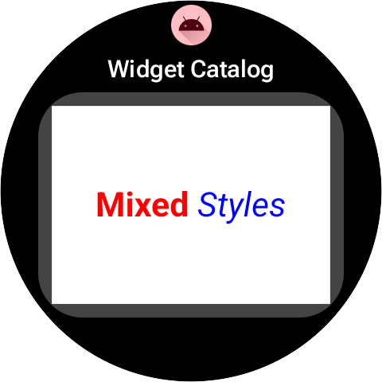

```kotlin
/**
 * An app screen displays a pink circle with an Android icon and the title 'Widget Catalog.' Below,
 * a white rounded rectangle shows the text 'Mixed Styles,' with 'Mixed' in red and 'Styles' in
 * blue.
 */
@RemoteComposable
@Composable
fun MixedStyleSample() {
    RemoteBox(
        modifier = RemoteModifier.fillMaxSize().background(Color.White),
        contentAlignment = RemoteAlignment.Center,
    ) {
        RemoteRow(
            verticalAlignment = RemoteAlignment.CenterVertically,
            horizontalArrangement = RemoteArrangement.Center,
        ) {
            // First part: Bold Red Text
            RemoteText(
                text = "Mixed ".rs,
                color = Color.Red.rc,
                fontSize = 20.rsp,
                fontWeight = FontWeight.Bold,
            )
            // Second part: Italic Blue Text
            RemoteText(
                text = "Styles".rs,
                color = Color.Blue.rc,
                fontSize = 20.rsp,
                fontStyle = FontStyle.Italic,
            )
        }
    }
}
```

## PendingIntentSample

A black background displays an Android icon in a pink circle, with white text
"Widget Catalog" below it. A large gray rounded rectangle contains a centered
pink rounded button with dark red text "Open App."

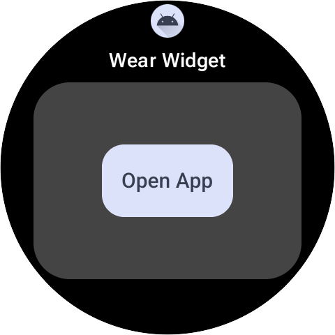

```kotlin
/**
 * A black background displays an Android icon in a pink circle, with white text "Widget Catalog"
 * below it. A large gray rounded rectangle contains a centered pink rounded button with dark red
 * text "Open App."
 */
@RemoteComposable
@Composable
fun PendingIntentSample() {
    val context = androidx.compose.ui.platform.LocalContext.current
    val isInspectionMode = LocalInspectionMode.current
    val dummy = rememberMutableRemoteInt(0)
    val intent =
        Intent(context, MainActivity::class.java).apply { flags = Intent.FLAG_ACTIVITY_NEW_TASK }
    val pendingIntent =
        PendingIntent.getActivity(
            context,
            0,
            intent,
            PendingIntent.FLAG_IMMUTABLE or PendingIntent.FLAG_UPDATE_CURRENT,
        )

    RemoteBox(
        modifier = RemoteModifier.fillMaxSize(),
        contentAlignment = RemoteAlignment.Center,
    ) {
        RemoteButton(
            modifier = RemoteModifier.buttonSizeModifier(),
            onClick =
                if (isInspectionMode) ValueChange(dummy, 0.ri)
                else pendingIntentAction(pendingIntent),
        ) {
            MaterialRemoteText("Open App".rs)
        }
    }
}
```

## CircularProgressIndicatorSample1

Android logo in a pink circle, above white "Widget Catalog" text. Below is a
dark grey rounded rectangle containing a segmented circular progress bar. It
features a dark reddish-pink segment in the upper left and a lighter pink
segment spanning the right and lower left, separated by a gap.


```kotlin
/**
 * Android logo in a pink circle, above white "Widget Catalog" text. Below is a dark grey rounded
 * rectangle containing a segmented circular progress bar. It features a dark reddish-pink segment
 * in the upper left and a lighter pink segment spanning the right and lower left, separated by a
 * gap.
 */
@RemoteComposable
@Composable
fun CircularProgressIndicatorSample1() {
    RemoteBox(
        modifier = RemoteModifier.fillMaxSize(),
        contentAlignment = RemoteAlignment.Center,
    ) {
        RemoteCircularProgressIndicator(progress = 0.75f.rf)
    }
}
```

## CircularProgressIndicatorSample2

Displays an Indeterminate progress indicator sequence loop continuously.


```kotlin
/** Displays an Indeterminate progress indicator sequence loop continuously. */
@RemoteComposable
@Composable
fun CircularProgressIndicatorSample2() {
    RemoteBox(
        modifier = RemoteModifier.fillMaxSize(),
        contentAlignment = RemoteAlignment.Center,
    ) {
        RemoteCircularProgressIndicator(progress = 0.5f.rf)
    }
}
```

## CircularProgressIndicatorSample3

Pink Android icon above "Widget Catalog" text. Below is a dark grey rounded
rectangle with a segmented circle inside. The circle's top-right section is
light pink, while the majority is a darker reddish-brown, suggesting a progress
or multi-part design.


```kotlin
/**
 * Pink Android icon above "Widget Catalog" text. Below is a dark grey rounded rectangle with a
 * segmented circle inside. The circle's top-right section is light pink, while the majority is a
 * darker reddish-brown, suggesting a progress or multi-part design.
 */
@RemoteComposable
@Composable
fun CircularProgressIndicatorSample3() {
    val progress = rememberMutableRemoteFloat { 0.25f.rf }
    val animatedProgress = animateRemoteFloat(0.25f) { progress }
    val toggleAction = ValueChange(progress, (progress + 0.25f.rf).createReference())

    RemoteBox(
        modifier = RemoteModifier.fillMaxSize(),
        contentAlignment = RemoteAlignment.Center,
    ) {
        RemoteCircularProgressIndicator(
            progress = animatedProgress,
            modifier = RemoteModifier.size(150.rdp).clickable(toggleAction)
        )
    }
}
```

## RotatedTextSample

A black screen displays a pink Android robot logo and "Widget Catalog" title.
Below, a large dark gray rounded rectangle contains a white strip with red
"Hello world!" text, rotated counter-clockwise.

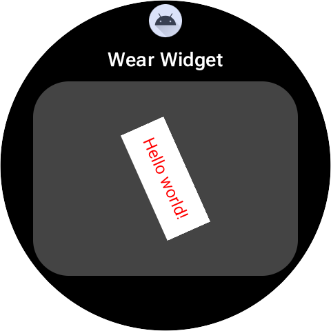

```kotlin
/**
 * A black screen displays a pink Android robot logo and "Widget Catalog" title. Below, a large dark
 * gray rounded rectangle contains a white strip with red "Hello world!" text, rotated
 * counter-clockwise.
 */
@RemoteComposable
@Composable
fun RotatedTextSample(modifier: RemoteModifier = RemoteModifier) {
    RemoteBox(
        modifier = modifier.fillMaxSize(),
        contentAlignment = RemoteAlignment.Center,
    ) {
        RemoteBox(
            modifier =
                RemoteModifier.background(Color.White)
                    .drawWithContent {
                        val width = remote.component.width
                        val height = remote.component.height
                        val centerX = width / 2f.rf
                        val centerY = height / 2f.rf
                        translate(centerX, centerY) {
                            rotate(66f.rf) { translate(-centerX, -centerY) { drawContent() } }
                        }
                    }
                    .padding(10.rdp),
            contentAlignment = RemoteAlignment.Center,
        ) {
            RemoteText(text = "Hello world!", color = Color.Red.rc)
        }
    }
}
```

## RowSample1

A screen displays "Widget Catalog" with a pink Android icon above. Below, a gray
rounded rectangle contains three horizontally arranged, equally spaced buttons:
a red button labeled "Red", a green button labeled "Green", and a blue button
labeled "Blue".

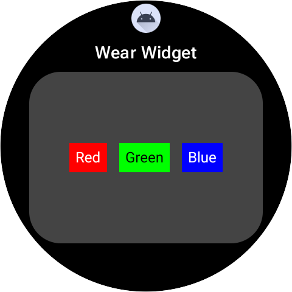

```kotlin
/**
 * A screen displays "Widget Catalog" with a pink Android icon above. Below, a gray rounded
 * rectangle contains three horizontally arranged, equally spaced buttons: a red button labeled
 * "Red", a green button labeled "Green", and a blue button labeled "Blue".
 */
@RemoteComposable
@Composable
fun RowSample1() {
    RemoteBox(
        modifier = RemoteModifier.fillMaxSize(),
        contentAlignment = RemoteAlignment.Center,
    ) {
        RemoteRow(
            modifier = RemoteModifier.fillMaxSize(),
            horizontalArrangement = RemoteArrangement.Center,
            verticalAlignment = RemoteAlignment.CenterVertically,
        ) {
            RemoteBox(modifier = RemoteModifier.padding(5.rdp).background(Color.Red)) {
                RemoteText(
                    "Red",
                    color = Color.White.rc,
                    modifier = RemoteModifier.padding(5.rdp),
                )
            }
            RemoteBox(modifier = RemoteModifier.padding(5.rdp).background(Color.Green)) {
                RemoteText(
                    "Green",
                    color = Color.Black.rc,
                    modifier = RemoteModifier.padding(5.rdp),
                )
            }
            RemoteBox(modifier = RemoteModifier.padding(5.rdp).background(Color.Blue)) {
                RemoteText(
                    "Blue",
                    color = Color.White.rc,
                    modifier = RemoteModifier.padding(5.rdp),
                )
            }
        }
    }
}
```

## RowSample2

A screen titled "Widget Catalog" in white text, below a pink circular Android
icon. A large dark gray rounded rectangle contains "Item 1" in white, "Item 2"
highlighted in yellow, and "Item 3" in light gray, arranged horizontally.

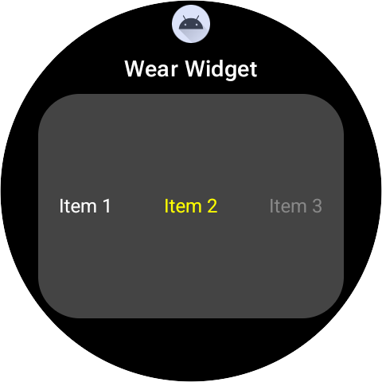

```kotlin
/**
 * A screen titled "Widget Catalog" in white text, below a pink circular Android icon. A large dark
 * gray rounded rectangle contains "Item 1" in white, "Item 2" highlighted in yellow, and "Item 3"
 * in light gray, arranged horizontally.
 */
@RemoteComposable
@Composable
fun RowSample2() {
    // WORKAROUND: Replaced RemoteCollapsibleRow with RemoteRow due to an "Invalid enum value:
    // Orientation"
    // error when rendering the RemoteCollapsibleRow. It seems the RemoteCollapsibleRow's
    // orientation parameter was not being correctly handled by the renderer.
    RemoteBox(
        modifier = RemoteModifier.fillMaxSize(),
        contentAlignment = RemoteAlignment.Center,
    ) {
        RemoteRow(
            modifier = RemoteModifier.fillMaxSize().padding(5.rdp),
            horizontalArrangement = RemoteArrangement.SpaceBetween,
            verticalAlignment = RemoteAlignment.CenterVertically,
        ) {
            RemoteText("Item 1", color = Color.White.rc)
            RemoteText("Item 2", color = Color.Yellow.rc)
            RemoteText("Item 3", color = Color.Gray.rc)
        }
    }
}
```

## SemanticStyleSample

A black screen displays a pink Android icon above "Widget Catalog" text. Below
is a dark gray rounded rectangle card. Inside the card, "Semantic Styles Demo"
is at the top left, and "12:34" is prominently displayed in a larger font at the
bottom.

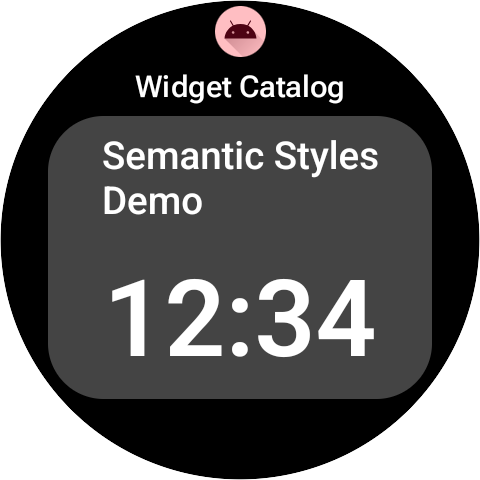

```kotlin
/**
 * A black screen displays a pink Android icon above "Widget Catalog" text. Below is a dark gray
 * rounded rectangle card. Inside the card, "Semantic Styles Demo" is at the top left, and "12:34"
 * is prominently displayed in a larger font at the bottom.
 */
@RemoteComposable
@Composable
fun SemanticStyleSample() {
    RemoteBox(
        modifier = RemoteModifier.fillMaxSize(),
        contentAlignment = RemoteAlignment.Center,
    ) {
        RemoteColumn(
            modifier = RemoteModifier.fillMaxWidth(),
            horizontalAlignment = RemoteAlignment.CenterHorizontally,
            verticalArrangement = RemoteArrangement.Center,
        ) {
            MaterialRemoteText(
                text = "Semantic Styles Demo".rs,
                style = RemoteMaterialTheme.typography.titleLarge,
            )

            RemoteBox(RemoteModifier.size(16.rdp))

            MaterialRemoteText(
                text = "12:34".rs,
                style = RemoteMaterialTheme.typography.numeralLarge
            )

            RemoteBox(RemoteModifier.size(12.rdp))

            MaterialRemoteText(
                text = "Session complete".rs,
                style = RemoteMaterialTheme.typography.titleMedium,
            )
        }
    }
}
```

## SystemThemeComparisonSample

Android Widget Catalog screen on a dark background. A pink Android icon and
"Widget Catalog" title are at the top. A dark gray rounded rectangle below
contains "System Theme" in white text, followed by two light pink rounded
buttons with dark red text: "Primary Button" and "Secondary Button".

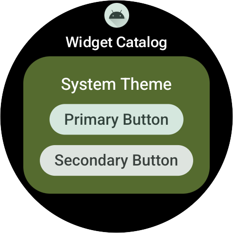

```kotlin
/**
 * Android Widget Catalog screen on a dark background. A pink Android icon and "Widget Catalog"
 * title are at the top. A dark gray rounded rectangle below contains "System Theme" in white text,
 * followed by two light pink rounded buttons with dark red text: "Primary Button" and "Secondary
 * Button".
 */
@RemoteComposable
@Composable
fun SystemThemeComparisonSample() {
    val dummy = rememberMutableRemoteInt(0)
    RemoteBox(
        modifier = RemoteModifier.fillMaxSize(),
        contentAlignment = RemoteAlignment.Center,
    ) {
        RemoteColumn(horizontalAlignment = RemoteAlignment.CenterHorizontally) {
            MaterialRemoteText("System Theme".rs)
            RemoteBox(RemoteModifier.size(10.rdp))
            RemoteButton(onClick = ValueChange(dummy, 0.ri)) {
                MaterialRemoteText("Primary Button".rs)
            }
            RemoteBox(RemoteModifier.size(10.rdp))
            RemoteButton(
                onClick = ValueChange(dummy, 0.ri),
                colors =
                    RemoteButtonColors(
                        containerColor = RemoteMaterialTheme.colorScheme.secondary,
                        contentColor = RemoteMaterialTheme.colorScheme.onSecondary,
                        secondaryContentColor = RemoteMaterialTheme.colorScheme.onSecondary,
                        iconColor = RemoteMaterialTheme.colorScheme.onSecondary,
                        disabledContainerColor = Color.Gray.rc,
                        disabledContentColor = Color.LightGray.rc,
                        disabledSecondaryContentColor = Color.LightGray.rc,
                        disabledIconColor = Color.LightGray.rc,
                    ),
            ) {
                MaterialRemoteText("Secondary Button".rs)
            }
        }
    }
}
```

## SystemThemeSample

A dark screen displays a pink circle with an Android logo, centered above white
text "Widget Catalog". Below is a dark grey rounded card with white text "System
Theme" and a light pink "Primary Button" with dark red text.

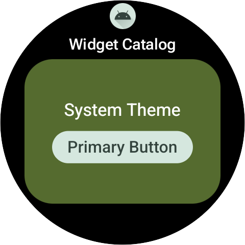

```kotlin
/**
 * A dark screen displays a pink circle with an Android logo, centered above white text "Widget
 * Catalog". Below is a dark grey rounded card with white text "System Theme" and a light pink
 * "Primary Button" with dark red text.
 */
@RemoteComposable
@Composable
fun SystemThemeSample() {
    val dummy = rememberMutableRemoteInt(0)
    RemoteBox(
        modifier = RemoteModifier.fillMaxSize(),
        contentAlignment = RemoteAlignment.Center,
    ) {
        RemoteColumn(horizontalAlignment = RemoteAlignment.CenterHorizontally) {
            MaterialRemoteText("System Theme".rs)
            RemoteBox(RemoteModifier.size(10.rdp))
            RemoteButton(onClick = ValueChange(dummy, 0.ri)) {
                MaterialRemoteText("Primary Button".rs)
            }
        }
    }
}
```

## TaskSample

Screenshot of a "Widget Catalog" screen. A pink circular Android logo is at the
top. Below it, white text reads "Widget Catalog". A dark gray rounded
rectangular widget displays progress: a pink checkmark in a circular progress
bar (approx. 20% complete), next to a large pink number "1" and text "of 5
tasks".

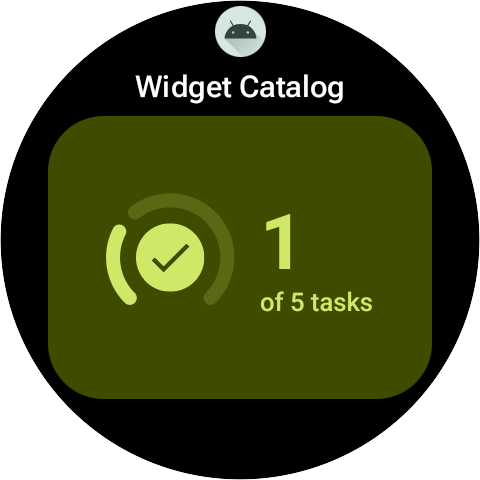

```kotlin
/**
 * Screenshot of a "Widget Catalog" screen. A pink circular Android logo is at the top. Below it,
 * white text reads "Widget Catalog". A dark gray rounded rectangular widget displays progress: a
 * pink checkmark in a circular progress bar (approx. 20% complete), next to a large pink number "1"
 * and text "of 5 tasks".
 */
@RemoteComposable
@Composable
fun TaskSample() {

    ProvideRemoteTextStyle(value = RemoteMaterialTheme.typography.bodyMedium) {
        RemoteBox(
            modifier = RemoteModifier.fillMaxSize(),
            contentAlignment = RemoteAlignment.Center,
        ) {
            RemoteRow(
                verticalAlignment = RemoteAlignment.CenterVertically,
                horizontalArrangement = RemoteArrangement.Center,
            ) {
                // Left Side: Circular Progress + Icon stacked
                RemoteBox(
                    modifier = RemoteModifier.padding(right = 12.rdp).size(60.rdp),
                    contentAlignment = RemoteAlignment.Center,
                ) {
                    // Custom Circular Progress Indicator using Canvas
                    val trackColor = RemoteMaterialTheme.colorScheme.surfaceContainerHigh
                    val progressColor = RemoteMaterialTheme.colorScheme.primary

                    RemoteCanvas(modifier = RemoteModifier.fillMaxSize()) {
                        val width = remote.component.width
                        val height = remote.component.height
                        val centerX = width / 2f.rf
                        val centerY = height / 2f.rf
                        val strokeWidth = 14f // Thicker stroke
                        val radius = (width / 2f.rf) - (strokeWidth / 2f).rf

                        val startAngle = 135f
                        val progressSweep = 72f
                        val gapAngle = 25f // Increased space between progress and track
                        val totalTrackSweep =
                            270f // Horseshoe style with a 90-degree gap at the bottom

                        // Track (Dark Green) - Incomplete section
                        val remainingSweep = totalTrackSweep - progressSweep - gapAngle
                        if (remainingSweep > 0) {
                            drawArc(
                                paint =
                                    RemotePaint().apply {
                                        color = trackColor
                                        style = PaintingStyle.Stroke
                                        this.strokeWidth = strokeWidth.rf
                                        strokeCap = StrokeCap.Round
                                        isAntiAlias = true
                                    },
                                startAngle = (startAngle + progressSweep + gapAngle).rf,
                                sweepAngle = remainingSweep.rf,
                                useCenter = false,
                                topLeft =
                                    RemoteOffset((strokeWidth / 2f).rf, (strokeWidth / 2f).rf),
                                size = RemoteSize(width - strokeWidth.rf, height - strokeWidth.rf),
                            )
                        }

                        // Progress (Light Green) - Completed section
                        drawArc(
                            paint =
                                RemotePaint().apply {
                                    color = progressColor
                                    style = PaintingStyle.Stroke
                                    this.strokeWidth = strokeWidth.rf
                                    strokeCap = StrokeCap.Round
                                    isAntiAlias = true
                                },
                            startAngle = startAngle.rf, // Start bottom-left
                            sweepAngle = progressSweep.rf,
                            useCenter = false,
                            topLeft = RemoteOffset((strokeWidth / 2f).rf, (strokeWidth / 2f).rf),
                            size = RemoteSize(width - strokeWidth.rf, height - strokeWidth.rf),
                        )
                    }

                    // Center Icon wrapped in a solid circle
                    RemoteBox(
                        modifier = RemoteModifier.size(32.rdp),
                        contentAlignment = RemoteAlignment.Center,
                    ) {
                        val iconBgColor = RemoteMaterialTheme.colorScheme.primary
                        val iconTintColor = RemoteMaterialTheme.colorScheme.onPrimary

                        RemoteCanvas(modifier = RemoteModifier.fillMaxSize()) {
                            val w = remote.component.width
                            val h = remote.component.height
                            drawCircle(
                                paint =
                                    RemotePaint().apply {
                                        color = iconBgColor
                                        style = PaintingStyle.Fill
                                        isAntiAlias = true
                                    },
                                center = RemoteOffset(w / 2f.rf, h / 2f.rf),
                                radius = w / 2f.rf
                            )
                        }

                        RemoteIcon(
                            imageVector = ImageVector.vectorResource(id = R.drawable.ic_check_24),
                            contentDescription = "Checkmark".rs,
                            modifier = RemoteModifier.size(24.rdp),
                            tint = iconTintColor // Dark green cutout equivalent
                        )
                    }
                }

                // Right Side: Typography
                RemoteColumn(
                    horizontalAlignment = RemoteAlignment.Start,
                    verticalArrangement = RemoteArrangement.Center,
                ) {
                    MaterialRemoteText(
                        text = "1".rs,
                        color = RemoteMaterialTheme.colorScheme.onPrimaryContainer,
                        fontSize = 42.rsp,
                        fontWeight = FontWeight.Bold
                    )
                    MaterialRemoteText(
                        text = "of 5 tasks".rs,
                        color = RemoteMaterialTheme.colorScheme.onPrimaryContainer,
                        fontSize = 14.rsp,
                        fontWeight = FontWeight.Medium
                    )
                }
            }
        }
    }
}
```

## TextSample1

A screen displays a pink Android icon and "Widget Catalog" title. Below, a dark
green rounded rectangle shows centered white text: "TextSample1" (large), "This
is a long text that should wrap to multiple l..." (smaller, truncated), and
"Version 1.0" (small, teal).

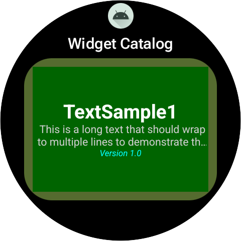

```kotlin
/**
 * A screen displays a pink Android icon and "Widget Catalog" title. Below, a dark green rounded
 * rectangle shows centered white text: "TextSample1" (large), "This is a long text that should wrap
 * to multiple l..." (smaller, truncated), and "Version 1.0" (small, teal).
 */
@RemoteComposable
@Composable
fun TextSample1() {
    ProvideRemoteTextStyle(value = RemoteMaterialTheme.typography.bodyMedium) {
        RemoteBox(
            modifier = RemoteModifier.fillMaxSize().background(Color(0xFF006400)),
            contentAlignment = RemoteAlignment.Center,
        ) {
            RemoteColumn(
                horizontalAlignment = RemoteAlignment.CenterHorizontally,
                verticalArrangement = RemoteArrangement.Center,
            ) {
                MaterialRemoteText(
                    text = "TextSample1".rs,
                    color = Color.White.rc,
                    fontSize = 20.rsp,
                    fontWeight = FontWeight.Bold,
                )
                MaterialRemoteText(
                    text =
                        "This is a long text that should wrap to multiple lines to demonstrate the multi-line capability."
                            .rs,
                    color = Color.LightGray.rc,
                    fontSize = 14.rsp,
                    maxLines = 2,
                    overflow = androidx.compose.ui.text.style.TextOverflow.Ellipsis,
                    textAlign = androidx.compose.ui.text.style.TextAlign.Center,
                )
                MaterialRemoteText(
                    text = "Version 1.0".rs,
                    color = Color.Cyan.rc,
                    fontSize = 10.rsp,
                    fontStyle = FontStyle.Italic,
                )
            }
        }
    }
}
```

## TextSample1WithMargin

A screen titled "Widget Catalog," featuring an Android icon. Below the title, a
dark green rounded rectangle displays "TextSample1" in large white text,
followed by "This is a long..." in smaller white text that is partially cut off
at the bottom.

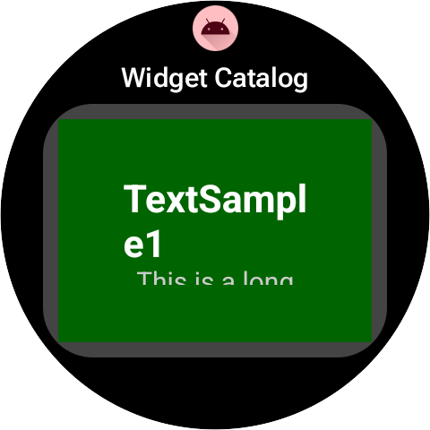

```kotlin
/**
 * A screen titled "Widget Catalog," featuring an Android icon. Below the title, a dark green
 * rounded rectangle displays "TextSample1" in large white text, followed by "This is a long..." in
 * smaller white text that is partially cut off at the bottom.
 */
@RemoteComposable
@Composable
fun TextSample1WithMargin() {
    RemoteBox(
        modifier = RemoteModifier.fillMaxSize().background(Color(0xFF006400)).padding(30.rdp),
        contentAlignment = RemoteAlignment.Center,
    ) {
        RemoteColumn(
            horizontalAlignment = RemoteAlignment.CenterHorizontally,
            verticalArrangement = RemoteArrangement.Center,
        ) {
            RemoteText(
                text = "TextSample1".rs,
                color = Color.White.rc,
                fontSize = 20.rsp,
                fontWeight = FontWeight.Bold,
            )
            RemoteText(
                text =
                    "This is a long text that should wrap to multiple lines to demonstrate the multi-line capability."
                        .rs,
                color = Color.LightGray.rc,
                fontSize = 14.rsp,
                maxLines = 2,
                overflow = androidx.compose.ui.text.style.TextOverflow.Ellipsis,
                textAlign = androidx.compose.ui.text.style.TextAlign.Center,
            )
            RemoteText(
                text = "Version 1.0".rs,
                color = Color.Cyan.rc,
                fontSize = 10.rsp,
                fontStyle = FontStyle.Italic,
            )
        }
    }
}
```

## TypographyScaleSample

A dark mode UI on a black background. At the top, a centered pink Android logo
above 'Widget Catalog' in white. Below, a large, dark gray rounded rectangle
widget displays three vertically stacked, center-aligned text lines: 'Title
Style' in large cyan, 'Default Body Style' in medium white, and 'Caption Style'
in small, italic dark gray.

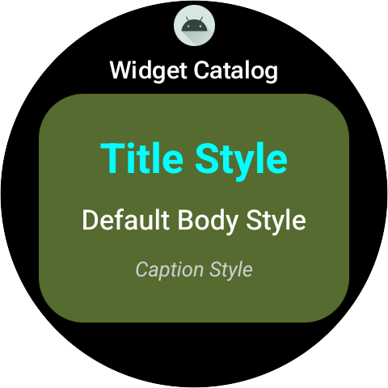

```kotlin
/**
 * A dark mode UI on a black background. At the top, a centered pink Android logo above 'Widget
 * Catalog' in white. Below, a large, dark gray rounded rectangle widget displays three vertically
 * stacked, center-aligned text lines: 'Title Style' in large cyan, 'Default Body Style' in medium
 * white, and 'Caption Style' in small, italic dark gray.
 */
@RemoteComposable
@Composable
fun TypographyScaleSample() {
    // Define our own "semantic" styles
    val myTitleStyle = TextStyle(fontSize = 24.sp, fontWeight = FontWeight.Bold, color = Color.Cyan)

    val myCaptionStyle =
        TextStyle(fontSize = 12.sp, fontStyle = FontStyle.Italic, color = Color.LightGray)

    RemoteBox(
        modifier = RemoteModifier.fillMaxSize(),
        contentAlignment = RemoteAlignment.Center,
    ) {
        RemoteColumn(horizontalAlignment = RemoteAlignment.CenterHorizontally) {
            // 1. Title style applied manually
            MaterialRemoteText(
                text = "Title Style".rs,
                fontSize = myTitleStyle.fontSize.asRemoteTextUnit(),
                fontWeight = myTitleStyle.fontWeight,
                color = myTitleStyle.color.rc,
            )

            RemoteBox(RemoteModifier.size(12.rdp))

            // 2. Default style (bodyLarge) provided by RemoteMaterialTheme
            MaterialRemoteText("Default Body Style".rs)

            RemoteBox(RemoteModifier.size(12.rdp))

            // 3. Caption style applied via 'style' parameter
            MaterialRemoteText(
                text = "Caption Style".rs,
                style = RemoteTextStyle.fromTextStyle(myCaptionStyle)
            )
        }
    }
}
```

## VerticalScrollSample

A UI displaying an Android logo and 'Widget Catalog' title. Below, a dark grey
rounded widget shows a vertical list of white text: 'Header', 'Item 0', 'Item
1', 'Item 2', 'Item 3', with 'Item 4' partially visible, indicating scrollable
content. **KNOWN ISSUE (b/502649242):** This widget currently crashes at
runtime. `RemoteModifier.verticalScroll` emits an unsupported operation (226)
that causes a `RuntimeException` when rendered on a device or in headless
previews. Do not use this modifier for Wear OS Widgets until this issue is
resolved.

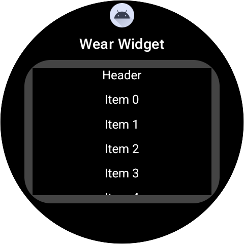

```kotlin
/**
 * A UI displaying an Android logo and 'Widget Catalog' title. Below, a dark grey rounded widget
 * shows a vertical list of white text: 'Header', 'Item 0', 'Item 1', 'Item 2', 'Item 3', with 'Item
 * 4' partially visible, indicating scrollable content.
 *
 * **KNOWN ISSUE (b/502649242):** This widget currently crashes at runtime.
 * `RemoteModifier.verticalScroll` emits an unsupported operation (226) that causes a
 * `RuntimeException` when rendered on a device or in headless previews. Do not use this modifier
 * for Wear OS Widgets until this issue is resolved.
 */
@RemoteComposable
@Composable
fun VerticalScrollSample() {
    val scrollState = rememberRemoteScrollState()
    RemoteBox(
        modifier = RemoteModifier.fillMaxSize(),
        contentAlignment = RemoteAlignment.TopCenter,
    ) {
        RemoteColumn(
            modifier = RemoteModifier.fillMaxWidth().verticalScroll(scrollState),
            horizontalAlignment = RemoteAlignment.CenterHorizontally,
            verticalArrangement = RemoteArrangement.Top,
        ) {
            MaterialRemoteText("Header".rs)
            RemoteBox(RemoteModifier.size(10.rdp))
            for (i in 0 until 10) {
                MaterialRemoteText(("Item " + i).rs)
                RemoteBox(RemoteModifier.size(10.rdp))
            }
            MaterialRemoteText("Footer".rs)
        }
    }
}
```
