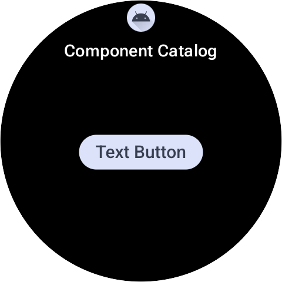
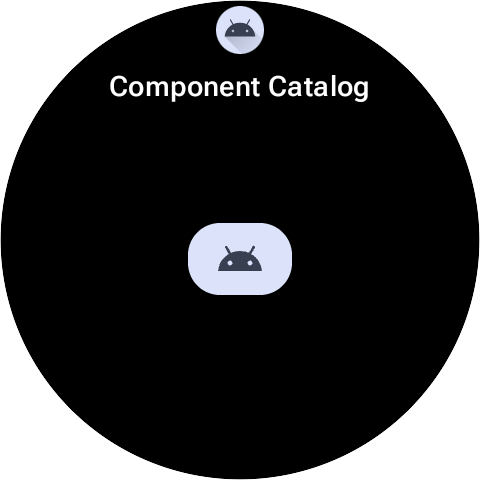
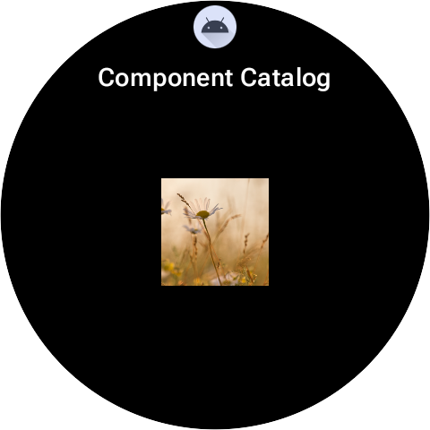
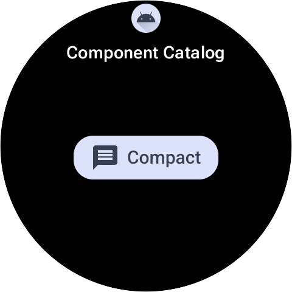
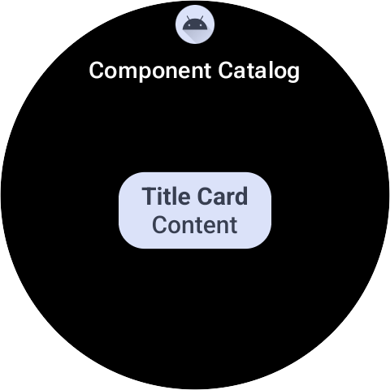
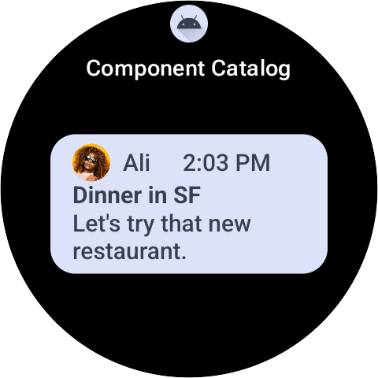
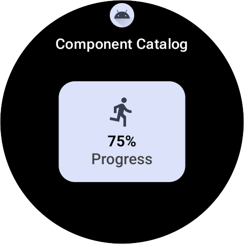
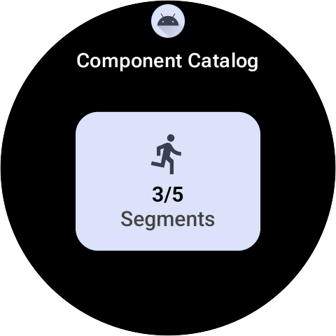
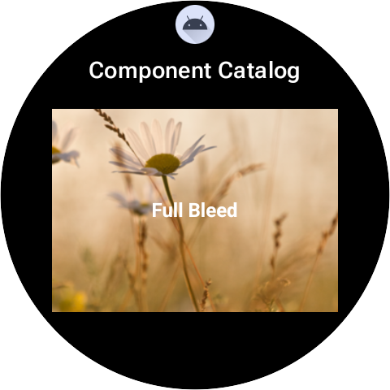
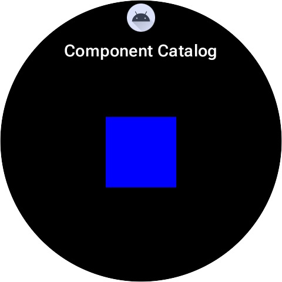

# Wear Widget UI Components Catalog

This catalog provides a visual reference and code samples for various UI components supported by Wear Widgets (Remote Compose).

## textButton



A simple button with a text label.

```kotlin
RemoteButton(onClick = arrayOf()) {
    MaterialRemoteText(text = "Text Button".rs)
}
```

## iconButton



A button containing an icon.

```kotlin
RemoteButton(
    onClick = arrayOf()
) {
    RemoteIcon(
        imageVector = ImageVector.vectorResource(id = R.drawable.android_24px),
        contentDescription = "Message".rs,
        modifier = RemoteModifier.size(RemoteButtonDefaults.SmallIconSize)
    )
}
```

## imageButton



A button with a background image.

```kotlin
RemoteBox(
    modifier = RemoteModifier
        .size(60.rdp)
        .clip(RoundedCornerShape(percent = 50)),
    horizontalAlignment = RemoteAlignment.CenterHorizontally,
    verticalArrangement = RemoteArrangement.Center
) {
     RemoteImage(
        bitmap = ImageBitmap.imageResource(id = R.drawable.photo_14),
        contentDescription = "Background".rs,
        contentScale = ContentScale.Crop,
        modifier = RemoteModifier.fillMaxSize()
    )
}
```

## compactButton



A compact button variant.

```kotlin
RemoteButton(
    onClick = arrayOf(),
     icon = {
        RemoteIcon(
            imageVector = ImageVector.vectorResource(id = R.drawable.ic_message_24),
            contentDescription = "Message".rs,
            modifier = RemoteModifier.size(RemoteButtonDefaults.SmallIconSize)
        )
    },
    label = { MaterialRemoteText("Compact".rs) }
)
```

## titleCard



A simple card with a title and content text.

```kotlin
RemoteButton(
    onClick = arrayOf(),
    modifier = RemoteModifier.padding(horizontal = 10.dp)
) {
    RemoteColumn(horizontalAlignment = RemoteAlignment.CenterHorizontally) {
        MaterialRemoteText(
            text = "Title Card".rs,
            fontWeight = FontWeight.Bold
        )
        MaterialRemoteText(
            text = "Content".rs
        )
    }
}
```

## appCard



A card displaying application-specific content, such as a message notification.

```kotlin
RemoteButton(
    onClick = arrayOf(),
    modifier = RemoteModifier.padding(horizontal = 10.dp)
) {
    RemoteColumn(modifier = RemoteModifier.padding(8.dp)) {
        RemoteRow(
            verticalAlignment = RemoteAlignment.CenterVertically,
            modifier = RemoteModifier.fillMaxWidth()
        ) {
            RemoteImage(
                bitmap = ImageBitmap.imageResource(id = R.drawable.ali),
                contentDescription = "Avatar".rs,
                contentScale = ContentScale.Crop,
                modifier = RemoteModifier.size(24.rdp).clip(RoundedCornerShape(percent = 50))
            )
            RemoteBox(modifier = RemoteModifier.size(8.rdp))
            MaterialRemoteText("Ali".rs)
            RemoteBox(modifier = RemoteModifier.size(20.rdp)) 
            MaterialRemoteText("2:03 PM".rs)
        }
        MaterialRemoteText(
            text = "Dinner in SF".rs,
            fontWeight = FontWeight.Bold
        )
        MaterialRemoteText(
            text = "Let's try that new restaurant.".rs
        )
    }
}
```

## circularProgressIndicator



A card displaying progress with an icon and percentage.

```kotlin
RemoteButton(
    onClick = arrayOf(),
    modifier = RemoteModifier.padding(horizontal = 10.dp)
) {
    RemoteColumn(
        horizontalAlignment = RemoteAlignment.CenterHorizontally,
        modifier = RemoteModifier.padding(8.dp)
    ) {
        RemoteIcon(
            imageVector = ImageVector.vectorResource(id = R.drawable.ic_run_24),
            contentDescription = "Run".rs,
            modifier = RemoteModifier.size(RemoteButtonDefaults.LargeIconSize)
        )
        RemoteBox(modifier = RemoteModifier.size(4.dp.asRdp()))
        MaterialRemoteText(
            text = "75%".rs,
            fontWeight = FontWeight.Bold,
            color = Color.Black.rc
        )
        MaterialRemoteText(
            text = "Progress".rs,
            color = Color.DarkGray.rc
        )
    }
}
```

## segmentedCircularProgressIndicator



A card displaying segmented progress.

```kotlin
RemoteButton(
    onClick = arrayOf(),
    modifier = RemoteModifier.padding(horizontal = 10.dp)
) {
    RemoteColumn(
        horizontalAlignment = RemoteAlignment.CenterHorizontally,
        modifier = RemoteModifier.padding(8.dp)
    ) {
        RemoteIcon(
            imageVector = ImageVector.vectorResource(id = R.drawable.ic_run_24),
            contentDescription = "Run".rs,
            modifier = RemoteModifier.size(RemoteButtonDefaults.LargeIconSize)
        )
        RemoteBox(modifier = RemoteModifier.size(4.dp.asRdp()))
        MaterialRemoteText(
            text = "3/5".rs,
            fontWeight = FontWeight.Bold,
            color = Color.Black.rc
        )
        MaterialRemoteText(
            text = "Segments".rs,
            color = Color.DarkGray.rc
        )
    }
}
```

## fullBleedImage



A background image filling the component with overlaid text.

```kotlin
RemoteBox(
    modifier = RemoteModifier.fillMaxSize()
) {
    RemoteImage(
        bitmap = ImageBitmap.imageResource(id = R.drawable.photo_14),
        contentDescription = "Background".rs,
        contentScale = ContentScale.Crop,
        modifier = RemoteModifier.fillMaxSize()
    )
    // Overlay Text
    RemoteBox(
        modifier = RemoteModifier.fillMaxSize(),
        horizontalAlignment = RemoteAlignment.CenterHorizontally,
        verticalArrangement = RemoteArrangement.Center
    ) {
         MaterialRemoteText(
            text = "Full Bleed".rs,
            color = Color.White.rc,
            fontWeight = FontWeight.Bold
        )
    }
}
```

## animatedBox



A box that animates between sizes and colors when clicked.

```kotlin
@RemoteComposable
@Composable
fun ComponentCatalogAnimatedBoxSample() {
    // Define a remote state key for toggling
    val state = rememberRemoteIntValue { 0 }
    val isToggled = state eq 1.ri

    // Derive animated properties based on the remote state
    val containerColor = isToggled.select(Color.Red.rc, Color.Blue.rc)
    val boxSize = isToggled.select(120f.rf, 60f.rf).asRemoteDp()

    RemoteBox(
        modifier = RemoteModifier.fillMaxSize(),
        horizontalAlignment = RemoteAlignment.CenterHorizontally,
        verticalArrangement = RemoteArrangement.Center,
    ) {
        RemoteBox(
            modifier = RemoteModifier
                // Apply the animated size
                .size(boxSize)
                // Enable tween animations for all property changes on this element
                .animationSpec(enabled = true)
                // Apply the animated color
                .background(containerColor)
                // Toggle the state key on click
                .clickable(
                    actions = arrayOf(ValueChange(state, state xor 1.ri))
                )
        )
    }
}
```
